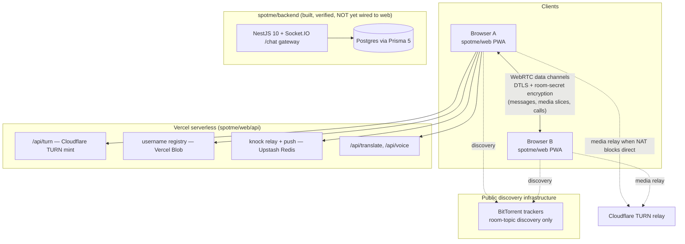
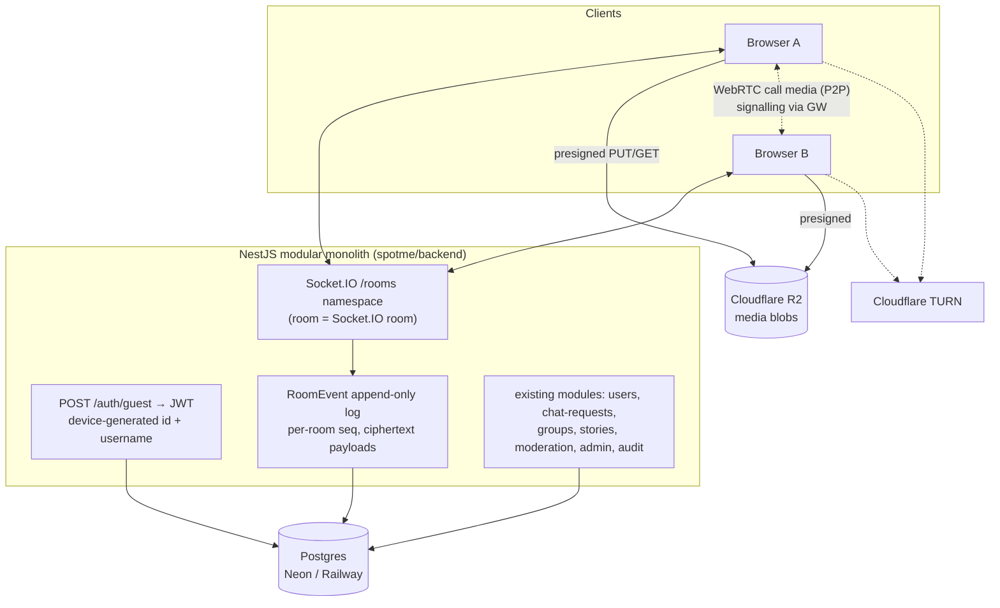
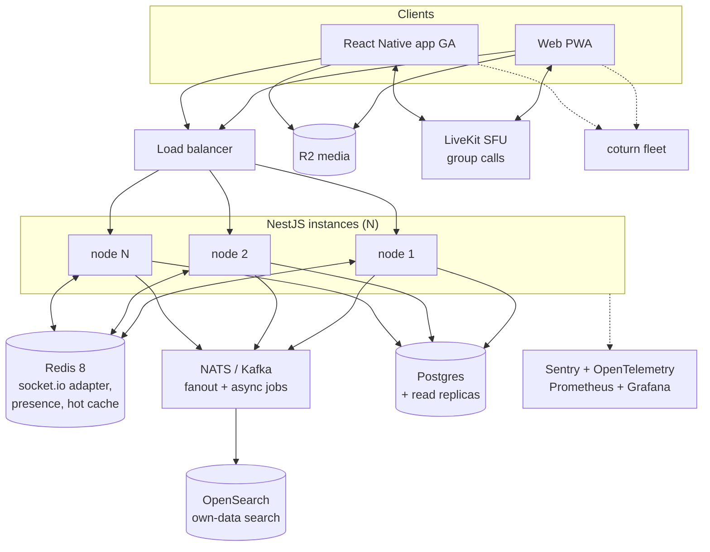
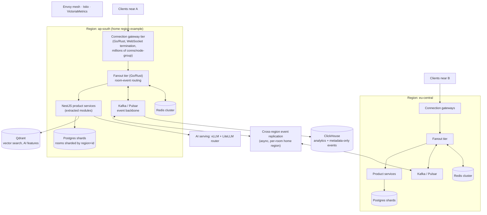

# Spot Me — Complete System Architecture

Status: working document for the migration from P2P prototype to server-backed
platform. Every claim about the current system is grounded in repo files cited
inline. Every forward-looking item is tagged **P1** (now), **P2** (100K–10M
users), or **P3** (10M–1B users). Items not yet built are labelled as targets,
not as facts.

---

## 1. What Spot Me Is (context for every decision below)

Spot Me is a proximity-first messenger with no account, password, or phone
number. Three chat modes: **meet** (username / invite link), **nearby**
(map + radar discovery), **bluetooth**. There is no accept gate — a "knock"
opens the chat on both sides. The product's differentiators that constrain
architecture:

- **Split-bubble translation** (original + translation always both visible)
  and transliteration across 10 Indian languages — implies a translation
  pipeline in the serving path of every message render.
- **Honesty rules are product law**: approximate distances, demo chips,
  cooperative-feature admissions, no fake states. Message info shows
  **Sent + Read only — no fake Delivered tier**. Architecture must never
  create states the UI would have to lie about.
- **Privacy promise**: message content is end-to-end unreadable by the server.
  This is the single non-negotiable invariant carried through all three phases.
- Rich media (photos, view-once photos, video, voice notes with cloned-voice
  option, documents, location, live location), reactions, disappearing
  messages, edit/delete, WebRTC voice/video calls.

One developer plus AI agents, budget-conscious. That rules out day-one AWS
EKS and rules in Neon/Railway/Fly/Hetzner-class hosting until scale forces
otherwise.

---

## 2. Current State (as built, before the Phase 1 migration)

### 2.1 Components in the repo

| Component | Path | Role today |
|---|---|---|
| Web PWA | `spotme/web/` | Vanilla JS + Vite. The live, feature-complete client. |
| P2P transport | `spotme/web/src/net.js` (263 lines) | Wraps Trystero 0.25 WebRTC rooms (`@trystero-p2p/torrent`, BitTorrent tracker discovery). ~15 action types: `msg`, `react`, `profile`, `history`, `bin`/`binack` (128 KB media slices with acks), `fetch`, `call`, `locup`, `del`, `edit`, `typing`, `read`, `seen`. |
| Knock protocol | `spotme/web/src/lib/reach.js` | Personal-inbox-room pattern: each user idles in a room derived from their own id; a knock joins it and delivers the chat-room credentials. |
| Room/store manager | `spotme/web/src/lib/rooms.js` | Connection lifecycle + local message store (IndexedDB via `lib/db.js`). |
| Serverless API | `spotme/web/api/` (Vercel) | TURN credential mint (Cloudflare), username registry (Vercel Blob), knock relay + push (Upstash Redis), translate, voice clone. |
| Backend | `spotme/backend/` | NestJS 10 + Prisma 5 + Postgres + Socket.IO. Modules: `auth`, `users`, `chat` (REST + `/chat` WS gateway), `chat-requests`, `groups`, `stories`, `moderation` (incl. `ncmec.service.ts`), `admin`, `audit` (`src/app.module.ts`). Schema is E2E-preserving: `Message.cipherText` is opaque, per-user `publicKey`, `Presence` is a single overwritten row, no location history. Verified running against local Docker Postgres; Dockerfile targets Railway/Fly. **Not yet the web client's transport.** |
| Admin dashboard | `spotme/admin-dashboard/` | Staff tooling against the backend. |
| Native tracks | `spotme/app/`, `spotme/mobile/`, `spotme/core/` | React Native / Capacitor tracks; `core` is a Hypercore P2P library for native. |

### 2.2 Current-state diagram

### 2.3 What the current architecture gets right and where it breaks

**Right:** content never touches a server (`net.js` header comment documents
the exact privacy boundary — trackers see room topics, never content; the room
secret lives in the URL fragment, which browsers never transmit). Calls are
peer-to-peer WebRTC with per-session Cloudflare TURN credentials minted by
`/api/turn` (measured working; the free ExpressTURN host measured dead — see
`net.js`).

**Breaks:**

- **No offline delivery.** History comes from whichever peer is online
  (`HISTORY_LIMIT = 100` in `net.js`); if every peer is offline the
  conversation is gone. `net.js` says this out loud in its header.
- **Video persistence was a P0 bug** in the P2P transport (large transfers
  dying mid-slice). Server persistence fixes the class of bug, but that fix
  must be re-verified after migration.
- Per-session Trystero peer ids mean no stable identity across sessions.
- Knock relay payloads are currently server-readable and contain the room
  secret (Upstash sees them). Fix scheduled for P2 (§5.6).
- The production Vercel deployment currently returns 404 and needs a redeploy.

---

## 3. Architectural Invariants (all phases)

1. **Server stores ciphertext only.** Message payloads are AES-GCM encrypted
   client-side with a key derived from the room secret; the secret travels in
   URL fragments / local storage and is never sent to the server.
2. **Call media never touches our servers** in 1:1 calls — WebRTC
   peer-to-peer, TURN relays are dumb byte pipes. (Group calls change this in
   P2 with an SFU; the trade-off is documented there, honestly, in the UI.)
3. **No location history server-side.** Presence is a single overwritten row
   (`spotme/backend/prisma` schema).
4. **No fake states.** Receipts are Sent + Read only. Architecture additions
   must not tempt the UI into a "Delivered" tier we cannot make truthful.
5. **Ephemeral stays ephemeral.** Typing, call signalling, live location, and
   RTC negotiation relay through the socket without persistence.

---

## 4. Phase 1 Target — Server-Backed Transport (P1, in progress now)

### 4.1 Shape

TypeScript/NestJS **modular monolith** — the existing `spotme/backend`
extended, not a new service. The web client swaps `net.js` for
`web/src/lib/socket-transport.js` (being implemented now), which exports the
same `joinRoom`/`selfId` surface Trystero exposed, so `rooms.js`, `reach.js`,
and every view keep working unchanged.

### 4.2 The RoomEvent log — the core P1 decision

Every **persistent** action (`msg`, `react`, `del`, `edit`, `read`, `seen`,
`bin` envelopes, knocks) is appended to a per-room event log in Postgres with
a monotonic sequence number. On join, the client sends its last seen seq and
the server replays everything after it. Payloads are ciphertext
(client-encrypted); the server sees action type, room id, sender id, seq,
timestamp — metadata, never content.

**Ephemeral** actions (`typing`, `call`, `locup`, RTC negotiation) relay
through the socket to room members without ever being written.

| Property | Why the event log wins |
|---|---|
| Latency | Online path is one socket hop: append + broadcast, single-region. No extra queue hop in P1. |
| Reliability | Offline delivery becomes trivial and truthful: replay from seq. This kills the P2P prototype's worst failure ("if every peer is offline the conversation is gone") and the P0 video-persistence bug class in one mechanism. Durable knocks fall out for free — a knock is just an event in the recipient's inbox room. |
| Cost | One Postgres table, no Kafka, no Redis required at P1 volumes. An append-only insert with a covering index on `(roomId, seq)` is the cheapest durable primitive available. |
| Migration honesty | It mirrors what `net.js` history already tried to do peer-side (`getHistory().slice(-HISTORY_LIMIT)`), so the mental model survives — the log is just a peer that is always online. |

### 4.3 Phase 1 decision table

| Decision | Choice | Latency | Reliability | Cost |
|---|---|---|---|---|
| App framework | NestJS modular monolith (**P1**) | In-process module calls; no network hops between "services". | One deployable, one failure domain, trivially debuggable by one developer. The backend already exists and was verified running — extending it is lower-risk than anything new. | One Railway/Fly/Hetzner instance. Modular structure (`src/app.module.ts` already splits 9 modules) keeps the P3 extraction path open without paying for it now. |
| Realtime | Socket.IO rooms on a `/rooms` namespace (**P1**) | WebSocket after upgrade; fallback long-polling for hostile networks (relevant on Indian carrier NAT, the same networks that forced TURN — see `net.js`). | Auto-reconnect + built-in acks; the existing `/chat` gateway (`src/chat/chat.gateway.ts`) already proves the JWT-on-handshake + room-join pattern. | Free (library). Single-node in P1; the Redis adapter is a one-line addition in P2, which is exactly why Socket.IO over raw `ws`. |
| Persistence | Postgres + Prisma (**P1**) | Single-digit-ms appends in-region; keep the app and DB in the same region. | ACID, point-in-time recovery on Neon/Railway managed Postgres. The Prisma schema is already E2E-preserving. | Managed Postgres free/hobby tiers carry P1 comfortably; no second datastore to operate. |
| Media | Cloudflare R2, presigned upload/download (**P1**) | Client-direct transfers; bytes never transit the app server. | Objects referenced from RoomEvent envelopes by key; blobs encrypted client-side before upload so R2 also stores ciphertext. | **R2 has zero egress fees** — decisive for a media-heavy chat app; S3-class egress pricing is the single largest cost trap at this layer (already recorded as a project decision: R2, not AWS). |
| Calls | WebRTC P2P + Cloudflare TURN, signalling over the socket (**P1**) | Direct media path is the lowest-latency option physically possible; TURN only engages when NAT forces it. | Cloudflare TURN measured working from this codebase; credentials minted per session (`web/api/` turn endpoint), nothing durable to leak in the bundle. | Media off our servers = near-zero serving cost for calls. TURN relay bandwidth is the only variable cost, paid only on the NAT-blocked fraction. |
| Identity | `POST /auth/guest` `{device-generated id, username, name}` → JWT (**P1**) | One HTTP call at first launch, then JWT on socket handshake (pattern already in `chat.gateway.ts`). | `selfId` becomes a stable user id, replacing per-session Trystero ids — prerequisite for replay, receipts, and blocking that survive reconnects. Usernames move from Vercel Blob to the backend `User` table: one source of truth. | No SMS/OTP vendor, no password infrastructure. Preserves the no-account product promise. |
| Validation | Zod-style schema validation at every socket action and REST DTO (**P1**) | Microseconds. | The server is now a trust boundary the P2P app never had; malformed or hostile payloads must die at the edge. | Free. |
| Translation | Existing pipeline + Sarvam/AI4Bharat for Indic (**P1**) | Async relative to message delivery — the split-bubble UI shows the original immediately and fills the translation when ready, so vendor latency never blocks send. | 7 open issues in the translation pipeline (known, tracked); vendor calls isolated behind one module so failures degrade to "original only", never to a blocked chat. | Per-call vendor pricing; no GPU serving in P1. |
| Deploy | Docker → Railway/Fly/Hetzner (**P1**) | Pick one region near the first user base; everything in-region. | Existing `spotme/backend` Dockerfile already targets these. | An order of magnitude cheaper than managed Kubernetes, and zero cluster operations for a solo developer. |

### 4.4 What Phase 1 explicitly does not do

- No Redis, no message queue, no SFU, no search cluster — every one of these
  is a P2 item with a trigger condition, not a P1 omission by accident.
- Knock payloads remain server-readable (they contain the room secret). The
  fix — encrypting knocks to the recipient's `publicKey`, a field already in
  the Prisma schema — is scheduled P2 and documented as a known exposure until
  then (§7).
- Group calls stay 1:1-mesh-or-nothing until the P2 SFU.

---

## 5. Phase 2 — 100K to 10M Users (P2)

Trigger discipline: each item below names the symptom that justifies it.
Nothing in this phase is built before its symptom appears.

| Item | Trigger symptom | Latency / reliability / cost reasoning |
|---|---|---|
| **Redis 8 + Socket.IO Redis adapter** (P2) | Second app instance needed; room members land on different nodes. | Cross-node broadcast via Redis pub/sub adds ~1 ms in-region — invisible next to WAN RTT. Presence moves from Postgres row-overwrite to Redis TTL keys: reliability improves (a crashed client's presence expires instead of sticking) and Postgres sheds its highest-churn write. One small Redis is cheap; it is the cheapest possible horizontal-scale unlock. |
| **NATS or Kafka for fanout and async work** (P2) | Large-group fanout, moderation scans, and translation jobs start competing with the send path for the same process. | Moves everything that is not "append + broadcast to this room" off the hot path, protecting p99 send latency. Durable consumers mean a crashed worker resumes instead of dropping work. NATS (with JetStream) preferred first: one small binary, a fraction of Kafka's operational weight; adopt Kafka only if retention/replay semantics demand it. |
| **LiveKit SFU for group calls** (P2) | Group calls: N-peer WebRTC mesh melts phone uplinks beyond ~4 participants (each phone uploads N−1 streams). | SFU = each client uploads once, server forwards. This is the first time call media touches our infrastructure — the honesty rules require the UI to say so for group calls. Self-hosted LiveKit on Hetzner-class metal keeps cost linear in concurrent-call minutes. 1:1 calls stay pure P2P. |
| **OpenSearch** (P2) | Users need search over their own conversations/contacts; Postgres `ILIKE` starts timing out. | Index scope is limited by E2E: the server can only index what it can read — usernames, group names, story text, and client-consented metadata — never message ciphertext. Client-side search of the local store remains the message-content search story. Sized accordingly (small). |
| **Observability: Sentry + OpenTelemetry + Prometheus + Grafana** (P2, start earliest) | First "it was slow last night" report that cannot be answered. | Cheapest reliability multiplier in the whole plan. Traces across socket → log append → fanout; RED metrics per action type; crash reporting for web + native (backend already has a `CrashReport` model). Self-hosted Grafana/Prometheus keeps cost near zero. |
| **Passkeys / OAuth 2.1 (optional upgrade)** (P2) | Users ask for multi-device and recoverable identity. | Layered on top of guest identity, never replacing it — the no-account cold start is the product. Passkeys give phishing-resistant upgrade with no password database to breach. |
| **Signal-protocol double-ratchet E2E upgrade** (P2) | Static room-secret AES-GCM has no forward secrecy; a leaked secret decrypts a room's whole history. | Double ratchet gives forward secrecy + post-compromise security. Server sees only an opaque blob either way — this upgrade is invisible to the architecture but decisive against the "device seized later" threat. Also the vehicle for encrypting knocks to the recipient's `publicKey` (field already in schema), closing the server-readable-knock exposure. |
| **coturn fleet** (P2) | Cloudflare TURN bandwidth pricing crosses self-host cost, or regional relay latency hurts. | Self-hosted coturn on cheap egress providers (Hetzner) with geo-DNS. Keep Cloudflare as fallback: relay reliability directly gates call success on carrier-NAT networks (the exact failure measured and documented in `net.js`). |
| **CI/CD: GitHub Actions + Trivy** (P2, start in P1 honestly) | More than one deployable artifact. | Image scanning (Trivy) before deploy; boring, cheap, prevents the class of incident that costs a weekend. |
| **React Native app GA** (P2) | Web PWA limits (background push, camera pipelines) bind. | Native tracks already exist in-repo (`spotme/app`, `spotme/mobile`, `spotme/core`); the server transport removes the P2P-on-mobile constraint that blocked parity. |

---

## 6. Phase 3 — 10M to 1B Users (P3)

This is the 1B-user shape. None of it is built until Phase 2's ceilings are
measured, but Phase 1 decisions were made so that nothing here requires a
rewrite of the client protocol: the client speaks "socket + seq-numbered room
events" in every phase.

### 6.1 Topology

### 6.2 Phase 3 decisions

| Item | Reasoning (latency / reliability / cost) |
|---|---|
| **Connection gateway tier in Go/Rust** (P3) | Node.js WebSocket termination tops out on connections-per-node long before CPU does (per-socket memory, GC pauses hitting p99). A thin Go/Rust gateway holds the sockets, authenticates JWTs, and forwards compact frames to fanout — connection count decouples from product-logic deploys, so shipping app code no longer drops a node's worth of connections. Fewer, cheaper nodes per million connections. |
| **Fanout tier (Go/Rust) + Kafka/Pulsar backbone** (P3) | Fanout is the hot loop of a messenger: route event → resolve members → deliver to N gateways. Isolating it lets it be optimized (batching, zero-copy) independently. Kafka/Pulsar gives replayable, partitioned durability so a fanout node crash loses nothing; consumer lag becomes the single truthful backpressure signal. |
| **Region sharding: every room has a home region** (P3) | Chat is latency-sensitive within a conversation, and most conversations are geographically local — a proximity-first messenger radically more so; nearby/bluetooth chats are local by construction. Room events commit in the home region (single-region write latency, no cross-region consensus in the send path) and replicate async for the rare cross-region member. Users connect to the nearest gateway regardless. |
| **Postgres shards for hot data** (P3) | Shard RoomEvent by (region, room id) — the log was append-only with per-room seq since P1, which is exactly the shape that shards cleanly (no cross-room transactions). Retention windows keep shard size bounded: old ciphertext events age to object storage; clients hold full history locally anyway (they always have, since the P2P era). |
| **CRDT-style sync for multi-device state** (P3) | Read positions, stars, drafts, settings across devices merge without a serialization point. Per-room event seq stays authoritative for ordering; CRDTs cover only user-state, so the honesty of receipts is untouched. |
| **ClickHouse analytics** (P3) | Product/ops analytics over event **metadata only** (counts, timings, action types — never ciphertext, never location history, honoring the invariants). Columnar compression makes billions of rows cheap; queries that would murder Postgres run in milliseconds. Feeds the moderation and reliability dashboards. |
| **Qdrant vector search** (P3) | Backing store for the AI platform (assistant memory, semantic search over user-consented content, moderation embeddings). Only ever indexes content the user has explicitly shared with an AI feature — E2E ciphertext is not indexable by definition, which is the correct constraint, not a limitation to engineer around. |
| **Multi-region K8s + Terraform + Helm + Istio + Envoy** (P3) | Adopted only here, when the fleet (gateways, fanout, services, SFUs, per region) genuinely exceeds what VM-per-service operations can manage. Terraform/Helm make regions reproducible — bringing up region N must be a pipeline, not a project. Envoy/Istio give mTLS between services and uniform retry/timeout policy, which at this scale is a reliability feature, not ceremony. |
| **VictoriaMetrics** (P3) | Prometheus-compatible but built for multi-region cardinality at a fraction of the storage cost; Grafana dashboards carry over unchanged from P2. |
| **AI serving: vLLM + LiteLLM router** (P3) | Self-hosted vLLM for high-volume, latency-sensitive inference (translation bridge, moderation) where per-token vendor pricing stops making sense; LiteLLM routes between self-hosted and vendor models (Claude/GPT/Gemini) per task, keeping vendor lock-in and cost both under control. Whisper/ElevenLabs for speech, Sarvam for Indic remain vendor-side until volume justifies otherwise. |

### 6.3 What survives from P1 at 1B users

The client protocol: authenticate, join rooms, send ciphertext events, replay
from seq. The RoomEvent log semantics, the E2E boundary, the P2P 1:1 call
path, and the honesty rules are all phase-invariant. Everything else —
process boundaries, languages, datastores — is an implementation detail behind
that contract, which is precisely why the P1 monolith is safe to build now.

---

## 7. Known Constraints and Open Risks (do not soften)

- **Video persistence** was a P0 bug in the P2P transport. Server persistence
  fixes the mechanism, but the fix is **unverified until re-tested** end-to-end
  on the new transport (P1 exit criterion).
- **Cloned voice** sends plaintext audio to the vendor — GDPR/BIPA exposure.
  Mitigation to document and implement: explicit consent gate, vendor DPA,
  retention limits. This is a compliance work item, not a marketing line.
- **Knock payloads are server-readable** (contain the room secret) until the
  P2 publicKey-encryption upgrade lands. Until then the knock relay must be
  treated as trusted infrastructure and the "What is actually private" card
  must reflect it.
- **Push is dormant** until 5 Vercel env vars are set (see `spotme/web`
  push docs); the previously screenshotted VAPID pair is burned and must be
  regenerated.
- **NCMEC/CSAM pipeline** (`spotme/backend/src/moderation/ncmec.service.ts`)
  needs a real API key before user media ships.
- **Translation pipeline has 7 open issues**; failure mode must remain
  "original only", never a blocked send.
- **Age-verification vendor is not wired.**
- **Prod Vercel deployment currently 404s** and needs a redeploy; the P1
  cutover plan must account for it rather than assume a live baseline.
- **One developer + AI agents.** Every P2/P3 adoption above is gated on a
  measured symptom precisely because operational capacity, not architecture
  diagrams, is the binding constraint.

---

## 8. Phase Summary

| | P1 (now) | P2 (100K–10M) | P3 (10M–1B) |
|---|---|---|---|
| App | NestJS modular monolith | Same, N instances | Go/Rust gateways + fanout; NestJS modules extracted to services |
| Realtime | Socket.IO `/rooms`, single node | + Redis adapter | Dedicated connection-gateway tier |
| Durability | Postgres RoomEvent log | + NATS/Kafka async | Kafka/Pulsar backbone, sharded Postgres, region homes |
| Media | R2 presigned, client-encrypted | same | same + regional buckets |
| Calls | WebRTC P2P + Cloudflare TURN | + LiveKit SFU (groups), coturn fleet | Regional SFU + relay fleets |
| Search | none (local client search) | OpenSearch (own-data scope) | + Qdrant (AI), ClickHouse (metadata analytics) |
| Identity | Guest JWT, stable user id | + Passkeys/OAuth 2.1 optional | same |
| E2E | AES-GCM, room-secret derived | Signal double ratchet, encrypted knocks | same + CRDT user-state sync |
| Observability | logs | Sentry + OTel + Prometheus/Grafana | Envoy/Istio mesh, VictoriaMetrics |
| Infra | Docker on Railway/Fly/Hetzner | + CI/CD, Trivy | Multi-region K8s, Terraform, Helm |
