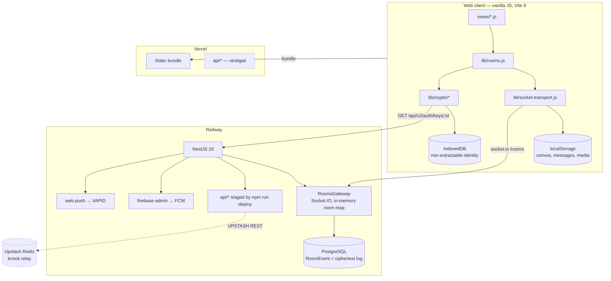

# Priority 0 — Repository Audit

**Date:** 2026-08-01 · **Commit audited:** `master` `33b1e25` · **Code changed: none.**

The migration plan's Priority 0 says *"Do NOT change any code during Priority 0.
Wait for approval before Priority 1."* This document is that deliverable. Every
number below was produced by running a command against the repository at that
commit, not recalled.

Companion documents: `09-TECH-STACK.md` (what the stack is), `adr/001` (V-19),
`adr/003` (key authentication).

---

## 1. Architecture as built



Dashed = declared but not carrying live traffic.

## 2. A message, end to end

```mermaid
sequenceDiagram
  participant A as Alice
  participant S as Railway (NestJS)
  participant DB as Postgres
  participant B as Bob

  A->>A: roomKeyForConvo() — X25519 ECDH + HKDF
  A->>A: AES-GCM seal → base64
  A->>S: action{roomId, type, payload}
  S->>S: joined? + policy (group) + DM gate
  S->>DB: append RoomEvent (ciphertext)
  alt Bob connected
    S-->>B: action frame
  else Bob absent
    S->>S: membersToNotify − connected
    S-->>B: FCM / Web Push (no text, tag = roomId)
  end
  B->>S: join{roomId, since, peerId}
  S-->>B: replay(events, envelopes, lastEventId)
  B->>B: AES-GCM open; on OperationError → refreshRoomKey, retry once
```

**The server holds ciphertext and metadata: who is in which room, and when.**

## 3. Risk register

| # | Risk | Severity | Status |
|---|---|---|---|
| R1 | No forward secrecy — one stolen device key opens that pair's whole v2 history | High | Open, **blocked on a licence decision** |
| R2 | Key authentication exists but is not persisted — no warning if a peer's key changes | High | Partly closed (ADR-003 + verify screen); no TOFU pinning |
| R3 | `e2e_v1` rooms remain server-recomputable | High | Accepted — migrating destroys their history |
| R4 | **No rate limiting anywhere** (0 references to throttle/rate-limit in `backend/src`) | High | Open |
| R5 | **Both JWT strategies share one secret** — `JWT_ACCESS_SECRET` in 4 files, defaulting to `'dev-only-secret'` | High | Open |
| R6 | Account deletion leaves tokens and live sockets working | Medium | Open |
| R7 | Single Socket.IO node holds connection state in an in-memory `Map` | Medium | Open — PR #2 has the seam |
| R8 | One global lobby room for presence | Medium | Open |
| R9 | **No security headers, no CSP, no helmet** (0 references) | Medium | Open |
| R10 | Media rides `RoomEvent` — no object storage in production | Medium | Open — PR #2 has the adapter |
| R11 | Real-device push never verified | Medium | Open |
| R12 | No TURN verification; calls never dialled end to end | Medium | Open |
| R13 | Knock relay silently inert if Upstash vars are unset — `redis()` returns `null`, `safe()` swallows | Medium | **Unverified in production** |

## 4. Security report

**Closed this cycle** (verified in `master`'s tree): V-19 key agreement (ADR-001);
five unauthenticated endpoints (#7); DM room authorisation (#10); web-push
registration and payload handling (#9); key authentication primitive and screen
(ADR-003, #12).

**Open, ranked:**

1. **No rate limiting.** Any authenticated user can hammer any endpoint or the
   gateway. Cheapest first win in the whole repo.
2. **Shared JWT secret with a hardcoded dev fallback.** `'dev-only-secret'` is
   the default in four files; if the env var is ever unset in production, every
   token is forgeable by anyone reading this repository.
3. **No CSP or security headers.** For an app whose threat model includes XSS
   exfiltrating an identity key, this is a material gap — the key is
   non-extractable, but session tokens and message plaintext are not.
4. **Account deletion is incomplete** — tokens and sockets outlive it.
5. **No forward secrecy.** See §7.

## 5. Scalability report

- **Connection state is an in-memory `Map<roomId, Map<userId, Set<Socket>>>`.**
  One node only. No Redis adapter, so horizontal scale is impossible today
  without losing fan-out.
- **Presence is one global lobby room.** Every participant sees every hello.
  This is O(n²) in the room and is the first thing to break under growth.
- **`ioredis`, `bullmq`, `prom-client` are declared and never imported** — zero
  import sites each. There is no queue, no cache and no metrics.
- **Media in `RoomEvent`** makes the message log grow with attachment bytes.
- Postgres schema carries **59 index/relation declarations and 4 `@@unique`
  constraints**; no obvious missing FK was found, but no query profiling was
  performed (no traffic to profile in this environment).

## 6. Technical debt

| Item | Evidence |
|---|---|
| **No lint, no typecheck in `web`** | No eslint config, no `typecheck` script. **The plan's completion checklist requires "Lint passes" — that item cannot pass today** |
| 14 zero-byte files tracked in `web/src` | `0)`, `x.id`, `b.ts`, `views/{,` … PowerShell debris, committed |
| `spotme/'` tracked at the repo root | Same cause |
| `app.js` is dead code | Nothing imports it; contains a second `createNet` call |
| `viewonce.test.js` at 17/21 on Linux | Pre-existing at four commits; undiagnosed |
| Two crypto stacks | `web` uses WebCrypto; `spotme/mobile` uses tweetnacl. Not interoperable |
| Vercel `api/*` duplicated | Vestigial on Vercel, live on Railway via `npm run deploy` |

## 7. Dependency report

**Live and load-bearing:** NestJS 10.4.6 · Prisma 5.22 · socket.io 4.8.1 ·
firebase-admin 14.2 · web-push 3.6.7 · argon2 · passport-jwt · Vite 8.1.5 ·
socket.io-client 4.8.3 · Capacitor 8.4.2.

**Declared, zero import sites:** `bullmq` · `ioredis` · `prom-client` · `cuid` ·
`@parse/node-apn`.

**Licence constraint that gates Priority 1:** **libsignal is AGPL-3.0.** ADR-001
already rejected it — linking it obliges Spot Me to publish its source. The
alternatives are a commercial licence (rarely granted) or hand-rolling a Double
Ratchet, which is how projects ship crypto that looks correct and is not.
**This is a decision for the owner and it blocks X3DH, prekeys, forward secrecy
and break-in recovery.**

## 8. Migration roadmap

Ordered by *value per unit of risk*, which differs from the plan's order:

| Order | Work | Why here |
|---|---|---|
| 1 | **Deploy Railway** (#7's backend half) | Merged code not running; the DM gate is inert until it lands |
| 2 | **Rate limiting + JWT secret split + CSP** | Cheapest real security wins in the repo; no migration, no protocol change |
| 3 | **TOFU key pinning** — store "verified at key X", warn on change | Completes ADR-003; small; makes verification durable rather than a moment |
| 4 | **Merge PR #2** — transport + storage seams | Already built and unmerged; prerequisite for Priorities 2 and 3 |
| 5 | **Media to R2** (Priority 2) | Uses #2's adapter; largest scalability win |
| 6 | **Realtime scale-out** (Priority 3) | Needs #2's seam; Dragonfly credential already provisioned |
| 7 | **Forward secrecy** (rest of Priority 1) | **Blocked** on the AGPL decision |
| 8 | Presence sharding, observability, iOS | After the above |

## 9. What this audit did NOT do

Stated so the checklist is not read as satisfied:

- **No load testing, no benchmarks, no query profiling.** There is no traffic
  and no production database reachable from this environment.
- **No penetration testing.** Findings are from source reading and targeted
  tests, not an active assessment.
- **No mobile audit.** No iOS project exists; the Android shell was not built
  or run here.
- **Production behaviour is unverified.** This container cannot reach
  `*.vercel.app` or `*.railway.app` (proxy 403), so nothing here is a statement
  about the running system — only about the code.
