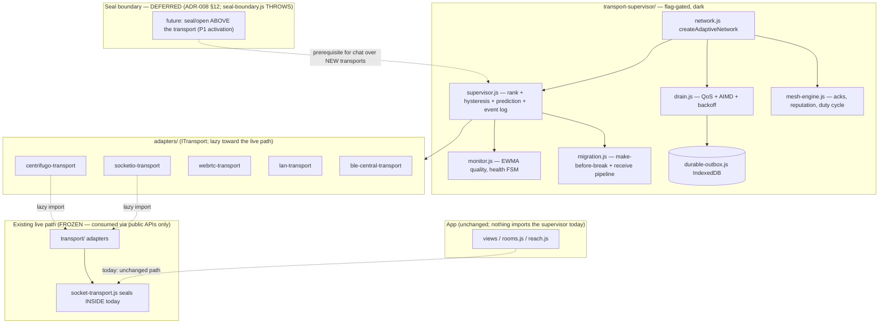
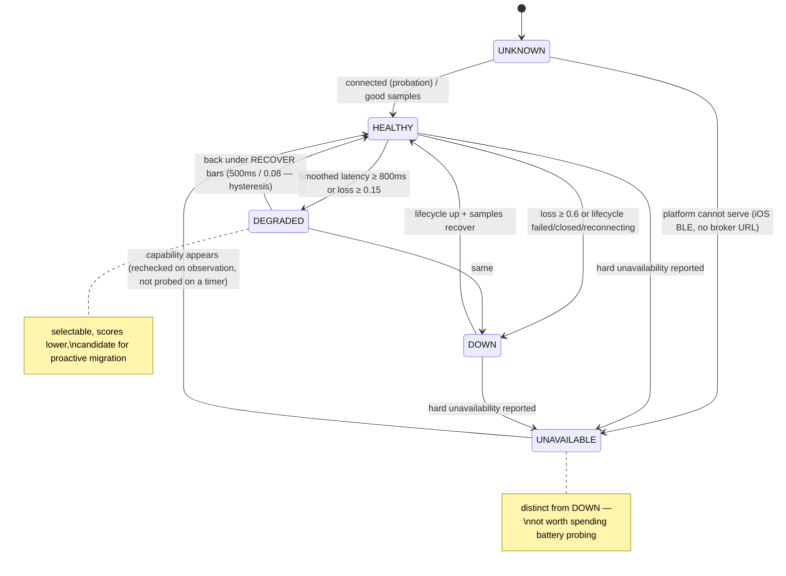
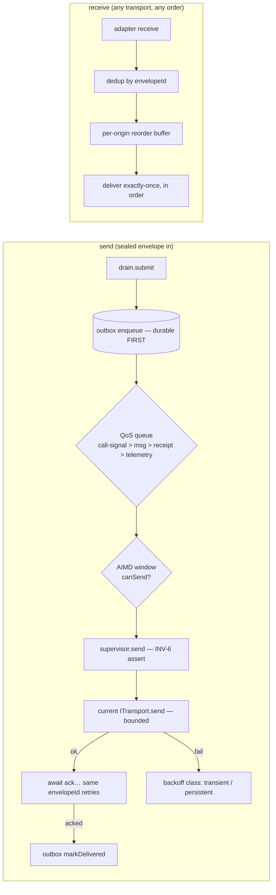

# Adaptive Communication Network — Architecture (as built)

**Scope:** the production layer under `web/src/lib/transport-supervisor/`
(ADR-012b), shipped **dark** (all flags false, wired into nothing).
**Read with:** ADR-012 (scaffolding), ADR-012a + `threat-model-update.md`
(security), `activation-guide.md` (how it ever turns on).

---

## 1. Layering



Key structural facts:

- **Opaque envelopes only.** Everything the layer moves is a `SealedEnvelope`
  whose ciphertext it cannot read; `assertSealedBeforeSend` (INV-6) runs at
  the supervisor's send choke point AND at every adapter edge.
- **The barrel is pure.** `index.js` imports no live-path module; adapters
  live behind their own barrel and reach `socket-transport.js`/`transport/*`
  only via lazy dynamic import inside `connect()` (fence-tested).
- **One factory.** `createAdaptiveNetwork` is the only composition point;
  master flag off ⇒ an inert stub with zero timers (tested with a clock that
  throws on use).

## 2. The supervisor loop

```mermaid
sequenceDiagram
  participant CK as clock (injected)
  participant MON as monitor
  participant T as each ITransport
  participant ENG as supervisor
  participant SEL as selector (scaffold hysteresis)
  participant MIG as migration executor
  CK->>MON: tick (2s)
  MON->>T: status() / quality() / costSignal()  — passive, throw-isolated
  MON->>MON: EWMA latency/loss/jitter/bw; health FSM; (every 3rd tick) trend prediction
  MON-->>ENG: snapshot
  ENG->>ENG: candidates = caps row + smoothed live + prediction penalty
  ENG->>SEL: chooseScored(scored, now)  — margin / dwell / stickiness
  alt no switch
    ENG->>ENG: log decision (reason, scores) — done
  else switch decided
    ENG->>MIG: execute(from → to)
    MIG->>MIG: connect(to) BOUNDED → attach receive → resend unacked (same envelopeIds) → grace → detach(from)
    ENG->>ENG: log migration report
  end
```

- **Prediction** is a least-squares slope over the smoothed series projected
  one horizon ahead; crossing the ceiling applies a bounded score penalty so
  the ordinary hysteresis machinery executes the early exit — no second
  decision path.
- **Decisions are serialized** on one promise chain: two ticks can never run
  two migrations concurrently.
- **Shadow mode** (`AUTO_TRANSPORT_ENABLED=false`): rank + log, never
  migrate — the staged-rollout posture.

## 3. Transport health state machine (as implemented)



Staleness rule: any state not refreshed within 45 s reads as UNKNOWN — a
confident answer nobody has checked is not an answer.

## 4. Send path and receive path



## 5. Mesh node (production behaviour over mesh.js)

```mermaid
flowchart TB
  IN[receiveFrom link] --> V{shape + TTL-forgery check}
  V -->|bad| M[reputation.misbehaved → drop]
  V --> D{seen-set}
  D -->|dup| X[drop duplicate]
  D --> P[deliver + END-TO-END ACK\nack floods back, frameId only]
  P --> F{relay? MULTIHOP + fanout}
  F -->|yes| O[forward() — payload BIT-IDENTICAL, hop+1\nto best neighbours by reputation, split horizon]
  ORIG[originate] --> TRACK[ack tracker: capped, jittered retransmit\nexhaustion surfaces to the outbox]
  TICK[clock tick] --> TRACK
  BATT[battery] --> DUTY[duty cycle: active/background/low/critical\ncritical = receive-only]
```

## 6. Where the platform ends (documented, not faked)

| Capability | Web today | Native (P10) |
|---|---|---|
| BLE central (GATT client, chunked writes, notifications, reconnect) | **Implemented** (`ble-central-transport.js`) | same protocol |
| BLE peripheral / GATT server / advertising | impossible on the web | implements `SPOTME_GATT` + discovery record |
| Background scanning / connections | impossible | duty-cycle schedules map onto real scan windows |
| RSSI | `watchAdvertisements` (Chromium, flagged) else null→neutral | always |
| Wi-Fi Direct / mDNS true-offline LAN | impossible — LAN = WebRTC host-candidates (signalling still online) | native transport |
| iOS Web Bluetooth | absent — adapter reports UNAVAILABLE with reason | native |
