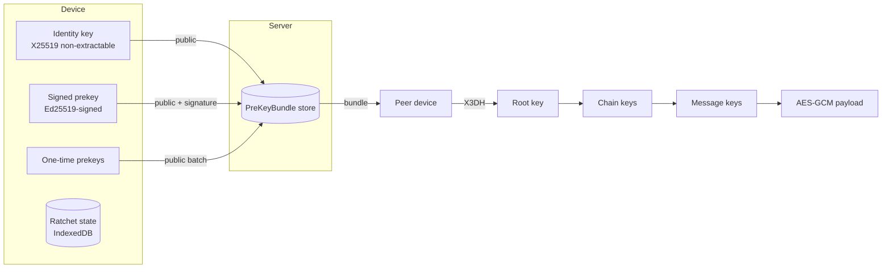

# ADR-004 — Forward secrecy: library selection and design

**Status: PROPOSED — awaiting approval. No production code has been written.**
**Date:** 2026-08-01 · **Follows:** ADR-001, ADR-003 · **Priority:** 1

Owner's constraint: **no AGPL-licensed code or dependencies.** That excludes
libsignal, whose licence was verified as AGPL-3.0 on 2026-08-01.

**This ADR's central question has been ANSWERED: Spot Me owns the ratchet
INTEGRATION — protocol behaviour, session lifecycle, persistence, transaction
boundaries, skipped keys, migration, recovery — and does NOT implement
cryptographic primitives.** No AES, Curve25519, signatures, HKDF, hashing, RNG
or constant-time arithmetic is written by hand; those come from WebCrypto. See
`004c` Q5 for the full definition, and note the ordering constraint: **identity
pinning lands before v3 is activated.**

**Companions**, all design-only. No implementation exists:

- `004a-e2e-v3-envelope-schema.md` — wire format, exact envelope sizes, canonical
  serialization, negotiation, downgrade rules, identity states, prekey-message
  and replay handling, legacy compatibility.
- `004b-e2e-v3-vector-package.md` — **every vector**: the framing/AAD/KDF ladder
  from `004a-e2e-v3-vectors.mjs`, and the ratchet conformance vectors from
  `004b-e2e-v3-ratchet-vectors.py` (output committed as
  `004b-e2e-v3-ratchet-vectors.json`). Also the compatibility test plan and the
  manifest mapping each test to the vector group that supplies its values.
- `004c-e2e-v3-decision-package.md` — **the decision record.** Five questions,
  approved with revisions, with pinned oracle versions and hashes.
- `004d-e2e-v3-seam-interactions.md` — three required design changes forced by
  the merged phase A/B/C seams.

---

## 1. Audit — what exists now

| Layer | Today |
|---|---|
| Agreement | X25519 ECDH (P-256 fallback) → HKDF-SHA256, bound to roomId + both public keys |
| Content | AES-GCM-256, non-extractable `CryptoKey` |
| Identity | **Non-extractable** X25519 pair in IndexedDB. The private key is a handle the page can compute with but *cannot serialise* |
| Authentication | Safety numbers + verify screen (ADR-003) |
| Legacy | `e2e_v1` cyrb53 rooms, server-recomputable, labelled, unmigrated |

**The gap:** static pairs. One stolen device key opens that pair's entire v2
history. No forward secrecy, no break-in recovery, no asynchronous session setup.

## 2. The constraint that decides this

**A WASM crypto library cannot use a non-extractable `CryptoKey`.**

WASM operates on bytes in linear memory. Handing vodozemac or OpenMLS our
identity key means exporting it as raw bytes — which requires generating it
`extractable: true` in the first place. ADR-001 chose non-extractable
deliberately: *"the `false` is the whole point... no bug, no XSS and no
malicious build can upload it."*

So adopting a WASM ratchet **trades a property we have for a property we want.**
That trade is the real decision here, and it is not visible from the feature
list alone.

## 3. Options compared

All facts below were verified against upstream on 2026-08-01, not recalled.

| | **libsignal** | **vodozemac** | **OpenMLS** | **Own implementation** |
|---|---|---|---|---|
| **Licence** | **AGPL-3.0** ❌ excluded | Apache-2.0 ✅ | MIT ✅ | n/a ✅ |
| **Protocol** | Signal (X3DH + Double Ratchet) | Olm (Double Ratchet) + Megolm | MLS, RFC 9420 | Double Ratchet + X3DH |
| **Maintenance** | Active | Crate active | Active — Phoenix R&D + Cryspen, ~1,946 commits | Ours |
| **JS/WASM bindings** | Node native only, no WASM | **Official bindings UNMAINTAINED** — repo states "no longer actively maintained… you will need to extract and update them on your own". Third-party forks exist (`@towns-protocol/vodozemac`, `vodozemac-wasm-bindings`) | `openmls-wasm` in-tree | Native WebCrypto |
| **Security maturity** | Highest; the reference | Crate audited by Least Authority, no significant findings | No audit found | **None — this is the risk** |
| **Adoption** | Signal, WhatsApp-scale derivatives | Matrix ecosystem | Growing; RFC-backed, pre-mass-adoption | n/a |
| **Performance** | Native | Rust/WASM, fast | Rust/WASM, fast | WebCrypto is native code; ratchet steps are HMAC/HKDF — cheap |
| **Non-extractable identity key** | ❌ lost | ❌ lost | ❌ lost | ✅ **preserved** |
| **New toolchain** | Rust + native build | Rust + wasm-pack | Rust + wasm-pack | none |
| **Migration complexity** | n/a | High — fork and maintain bindings ourselves | High — different protocol model, group-first | Medium — new envelope, same transport |
| **Sustainability** | n/a | **We inherit maintenance of an unmaintained binding layer** | Upstream healthy | We own it forever |

### Why each rejected option is rejected

**libsignal** — AGPL-3.0. Excluded by the owner. Not negotiable.

**vodozemac** — the crate is the strongest candidate on paper: Apache-2.0,
audited, Double Ratchet, Matrix-proven. But the *only* thing Spot Me could
consume is the JavaScript/WASM binding layer, and upstream has declared that
layer unmaintained. Adopting it means either forking and maintaining WASM
bindings to a Rust crate — permanently, for a security-critical dependency, with
no Rust expertise on the project — or depending on a third-party fork whose
longevity is unknown. **An audited crate behind an unmaintained binding is not
an audited dependency.**

**OpenMLS** — MIT, healthy, RFC-backed, and genuinely the direction the industry
is moving. Rejected *for now* on three grounds: MLS is group-first and its 1:1
story is heavier than X3DH; no security audit was found; and it forfeits the
non-extractable key for a protocol change larger than the problem being solved.
**Worth revisiting for group encryption**, which Spot Me has not solved either.

## 4. Recommendation

**Implement the Double Ratchet ourselves on WebCrypto — with the scope
deliberately narrowed and the risk explicitly bought down.**

This is not the comfortable answer and it deserves stating plainly: **hand-rolled
ratchets are how projects ship crypto that looks correct and is not.** The
recommendation rests on four things being true here:

1. **It is the only option that preserves the non-extractable identity key.**
   Every WASM path trades our strongest existing property away.
2. **The dangerous parts are avoidable.** The classic ratchet failure modes —
   header encryption, skipped-key storage, out-of-order handling — are mostly
   driven by the *asynchronous group* case. Spot Me needs 1:1 first.
3. **The primitives are not ours.** X25519, HKDF-SHA256, AES-GCM and Ed25519 are
   all native WebCrypto. Verified today: `Ed25519` generates in this runtime, so
   signed prekeys need no polyfill. We write the *state machine*, not the maths.
4. **It is testable against published vectors.** The ratchet is deterministic
   given its inputs, so correctness can be pinned rather than hoped for.

**If the owner is not comfortable owning a ratchet, the honest alternative is to
ship nothing here and keep ADR-003's authentication as the Priority 1 outcome.**
Forward secrecy done wrong is worse than forward secrecy deferred.

### Risk mitigations, non-negotiable if this is approved

- **Differential test vectors** from a reference implementation, checked in.
- **Fuzz the message-ordering state machine** — drops, duplicates, reorders,
  and gaps larger than the skipped-key bound.
- **A hard bound on stored skipped keys**, with a documented drop policy. This
  is the memory-exhaustion vector.
- **Ship behind a flag, `e2e_v3`, defaulting off.** v1 and v2 continue untouched.
- **No group ratchet.** 1:1 only. Groups stay as they are.

## 5. Design



```mermaid
sequenceDiagram
  participant A as Alice
  participant S as Server
  participant B as Bob (offline)
  B->>S: publish IK, SPK+sig, OPK batch
  A->>S: GET /api/v3/keys/:userId
  S-->>A: bundle (one OPK consumed)
  A->>A: X3DH -> root key; init sending chain
  A->>S: msg{header: EK, PN, N; ciphertext}
  Note over S: server stores ciphertext + header only
  B->>S: join / replay
  S-->>B: frames
  B->>B: X3DH from own keys -> same root
  B->>B: DH ratchet on header EK; derive message key
  Note over A,B: every message advances the chain;<br/>old keys are erased
```

## 6. Migration strategy

**Additive and versioned, exactly as ADR-001 was.** A room's `e2eVersion`
becomes one of `e2e_v1` (legacy) · `e2e_v2` (current, static ECDH) · `e2e_v3`
(ratchet). **Decided at creation, never migrated.** v1 and v2 rooms keep their
history and keep working, unchanged.

v3 is attempted only when: the flag is on, both devices publish a v3 bundle, and
agreement actually produces a session. Any failure falls back to v2 — visibly,
not silently, following the pattern already proven in `reach.js`.

## 7. Rollback

- **Before rollout:** delete the module and the flag. Nothing else references it.
- **After rollout:** set the flag off. New rooms resume at v2. Existing v3 rooms
  keep working, since their state is local and their code path stays in the
  bundle. **A v3 room cannot be downgraded to v2** — its history would be
  unreadable. Removing v3 code strands those rooms, so the flag is the rollback,
  not code removal.
- **Server:** the prekey tables are additive. Dropping them breaks new v3
  sessions only.

## 8. Changes required

**Database** — new tables, no changes to existing ones:
`SignedPreKey(userId, keyId, publicKey, signature, createdAt)` ·
`OneTimePreKey(userId, keyId, publicKey, consumedAt)` ·
`User.identityKeyEd25519` (nullable column).

**API** — new, versioned, additive:
`POST /api/v3/keys/bundle` (publish) · `GET /api/v3/keys/:userId` (fetch,
consuming one OPK atomically) · `GET /api/v3/keys/:userId/count` (replenishment).
**No existing endpoint changes.** OPK consumption must be a single transaction —
two callers must never receive the same one-time key.

**Client** — `lib/crypto/ratchet.js` (state machine) ·
`lib/crypto/x3dh.js` (session setup) · `lib/crypto/prekeys.js` (generation,
publication, replenishment) · a `sealForRoom`/`openForRoom` branch on
`e2eVersion` · ratchet state in IndexedDB beside the identity.

## 9. Testing strategy

| Layer | What |
|---|---|
| Unit | X3DH agreement, chain derivation, DH ratchet step, skipped-key handling |
| **Vectors** | Differential against a reference implementation's published vectors — the single most important test here |
| Property/fuzz | Random drop/reorder/duplicate/gap sequences; assert the transcript still decrypts or fails closed, never opens wrongly |
| Bounds | Skipped-key cap enforced; memory does not grow without limit |
| Integration | Two clients, real backend: async setup with the recipient offline, OPK exhaustion, concurrent sends both ways |
| Regression | Every existing suite green; v1 and v2 rooms unchanged |
| Benchmark | Per-message seal/open cost vs v2; session setup cost; **measured, not estimated** |
| Security | Old message keys erased after use; a stolen current key does not open earlier messages (that is the whole claim, so it gets a test) |

## 10. What this ADR does not decide

Multi-device sync · hardware-backed custody (no iOS project; Android is a
Capacitor WebView) · group forward secrecy · the MLS question, which should be
revisited on its own terms for groups.

---

**Awaiting approval on two questions:** (1) accept owning a ratchet
implementation, or defer forward secrecy and close Priority 1 at ADR-003?
(2) if accepted, is the additive `e2e_v3` migration shape agreed?

---

## Implementation status — Phase 3 (X3DH) · 2026-08-01

**IMPLEMENTED, behind the `spotme.e2e3` flag (absent by default), NOT wired in.**
This is the asynchronous handshake only; the Double Ratchet it seeds is Phase 4.

- **Client** `web/src/lib/crypto/x3dh.js` (PURE): the four DH in Signal order
  (DH1=IK_A·SPK_B, DH2=EK_A·IK_B, DH3=EK_A·SPK_B, DH4=EK_A·OPK_B), the HKDF
  root (`salt=0^32`, `info="spotme/e2e_v3/root"`), initiator and responder
  paths that provably converge, and signed-prekey verification against the
  peer's published signing key (#39). **Validated byte-for-byte against the
  reproducible 004a vectors** (`test/x3dh.test.js`, 13/13) — the DH outputs,
  the 128-byte shared secret, and the root key all match the spec's printed
  hex, not the implementation's own output.
- **Backend** `SignedPreKey` + `OneTimePreKey` tables (additive migration;
  no message-path change), and `/v2/auth/prekeys` — publish/refill (principal-
  keyed, key-shapes validated), OPK-pool count, and **atomic single-use
  bundle fetch**. The OPK row is deleted in the same transaction that serves
  it, proven under real concurrency (`test/prekeys.e2e-spec.ts`, 8/8,
  including a ten-way race with zero collisions). Exhaustion serves a bundle
  with `opk: null` (OPKID sentinel on the wire), never an error or a reuse.
  The server carries `sig` opaquely and **never verifies it** — the fetcher
  checks it against the peer's signing key, because the server is the
  adversary.
- **Benchmarks** (`test/bench/x3dh.bench.mjs`, WebCrypto X25519): initiator
  4-DH+HKDF ~0.60 ms median / p99 1.42 ms; no-OPK ~0.51 ms; responder ~0.68 ms.
  Real-device bundle-fetch round trip + IndexedDB read land in the Phase 6
  hardware pass.
- **Fence**: `test/e2e-v3-not-shipped.test.js` fails the build if any app
  module imports the e2e_v3 crypto or reads the rollout flag; the signing
  fence excludes the e2e_v3 foundation with rationale (one fenced module may
  consume another). Enforcement flag stays OFF.

**Still design-only:** the Double Ratchet (Phase 4, against the 004b vectors),
session persistence to IndexedDB, the v3 envelope on the wire, and version
negotiation in `reach.js`/`socket-transport.js`. §13's Q5 ("build the ratchet
or defer") is resolved by the owner's Priority 1 mandate: build it.

---

## Implementation status — Phase 4 (Double Ratchet) · 2026-08-01

**IMPLEMENTED, behind the `spotme.e2e3` flag, NOT wired in.** `web/src/lib/
crypto/ratchet.js` (PURE), seeded by the Phase 3 X3DH root.

- **The KDF ladder, byte-for-byte against the 004b oracle** (Syndace, 004c Q1):
  root/DH step `HKDF(salt=root, ikm=DH, info="spotme/e2e_v3/chain", 64) →
  root'‖chain`; message step `HKDF(salt=chain, ikm=0x01, info="spotme/e2e_v3/
  msg", 64) → chain'‖msgKey`. The initial root is the X3DH shared secret.
- **Wire format is 004a**: steady-state header (73 B), AAD binding version +
  room + full header, `MAGIC/VER/HDRLEN` framing, structural rejection before
  any key material is touched.
- **Conformance is against the spec, not itself** (`test/ratchet.test.js`,
  13/13). Tier 1 reproduces the oracle's `header_hex`, `ratchet_pub` and full
  `ciphertext_hex` for vectors 01/03/05 by injecting the oracle's
  deterministic keygen and its derived-IV AEAD — a wrong label, salt, counter
  or field order diverges the ciphertext. Tier 2 exercises every 004b
  scenario on the SHIPPED random-IV seams: out-of-order, skipped keys
  (structural count matches vector 07), duplicate/replay rejection (08),
  tamper + room-binding rejection (10/11), the MAX_SKIP_PER_CHAIN DoS refusal,
  serialization round-trip (09), forward secrecy and break-in recovery.
- **Bounds are message-loss policies, fail-closed** (004a §5): skipped keys
  FIFO-evicted at MAX_SKIPPED_STORED=2000, a gap beyond MAX_SKIP_PER_CHAIN=
  1000 REFUSED with a defined `RatchetError`, never an auto-reset (the
  tempting silent forward-secrecy downgrade).
- **Injected seams** keep the module pure and the shipped bytes testable:
  `keygen` (random X25519 in prod, counter-KDF in the vector test) and `aead`
  (random IV in prod, oracle's derived IV in the test).
- **Benchmarks** (`test/bench/ratchet.bench.mjs`, shipped seams): steady-state
  encrypt ~0.29 ms median / p99 1.06 ms; in-order decrypt ~0.23 ms; DH-ratchet
  decrypt ~0.91 ms; 50-key skip ~7.1 ms (linear, bounded at 1000).

**Still to wire (later PRs, still flag-gated):** session persistence to
IndexedDB (`spotme-e2e` v-bump considerations, 004a §5c), the X3DH prologue
header form combined with the ratchet, attachment per-message keys (004d),
and version negotiation in `reach.js`/`socket-transport.js`. Multi-device
(SDEV/RDEV fan-out) is Phase 5, gated on the ADR-008 §BLOCKING safety-number
decision.
