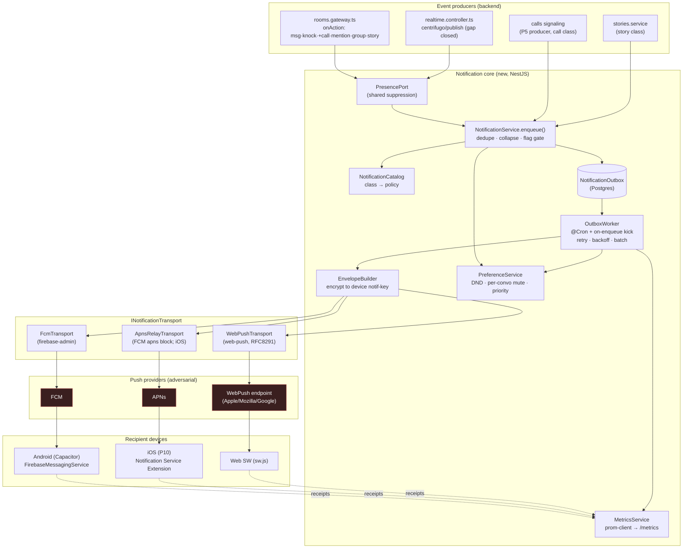
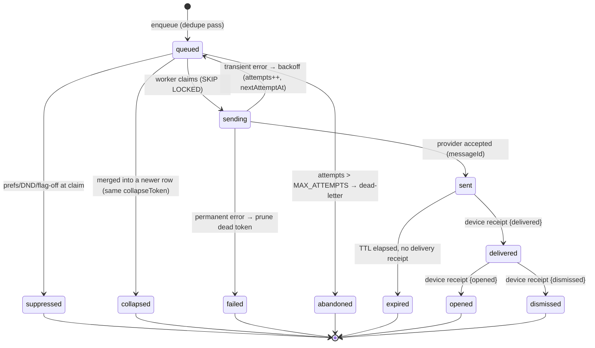
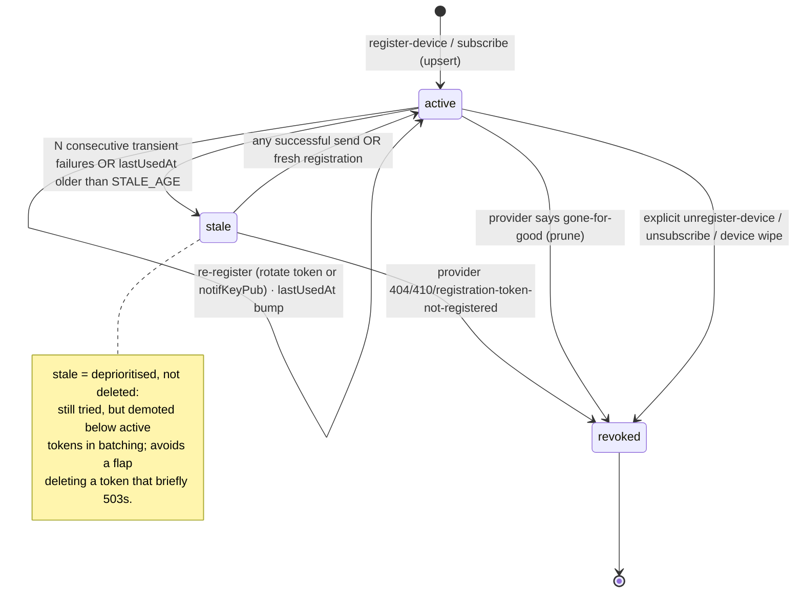

# Priority 2 · Workstream 1 — Push Notification Platform

**Status:** PLANNING ONLY — implementation-ready design brief. Nothing in this
document is code, migration, or flag. Nothing here activates during Priority 1.
**Parent ADR:** `spotme/docs/adr/009-push-notification-platform.md` (this
document is the detailed engineering plan that ADR-009 §"design to be
implemented when scheduled" points at; §16 below lists the concrete edits it
proposes back into ADR-009).
**Roadmap anchor:** Owner Amendment 2026-08-01 execution order, priority ①
("Push notifications — complete Android AND iOS push; background, terminated,
and foreground delivery; messages, calls, mentions, group events, and stories;
production-grade delivery").
**Threat model:** `17-CRYPTO-IMPLEMENTATION-GUIDE.md` §0 — *the server is the
adversary*, and so is every push transport (Apple, Google, Mozilla). Every
decision below is checked against that.
**Scope guard:** additive only. No Priority 1 file is touched. No signing key,
prekey, X3DH, or ratchet key is created, published, or read (ADR-008 §12 hard
stop is respected — see §4.4 and §18). No feature flag is flipped.

---

## Table of Contents

0. [Reading map & what is verifiably true today](#0-reading-map--what-is-verifiably-true-today)
1. [Executive summary, goals & non-goals](#1-executive-summary-goals--non-goals)
2. [Motivation](#2-motivation)
3. [Architecture (end-to-end)](#3-architecture-end-to-end)
4. [Encrypted notification model](#4-encrypted-notification-model)
5. [API contracts](#5-api-contracts)
6. [Sequence diagrams](#6-sequence-diagrams)
7. [State diagrams](#7-state-diagrams)
8. [Delivery semantics](#8-delivery-semantics)
9. [Quiet hours, mute model & priorities](#9-quiet-hours-mute-model--priorities)
10. [Deep linking](#10-deep-linking)
11. [Offline behaviour](#11-offline-behaviour)
12. [Database changes (planning only)](#12-database-changes-planning-only)
13. [Analytics, observability & monitoring](#13-analytics-observability--monitoring)
14. [Benchmark plan](#14-benchmark-plan)
15. [Rollout & rollback strategy](#15-rollout--rollback-strategy)
16. [ADR-009 improvements](#16-adr-009-improvements)
17. [Alternatives, trade-offs, scalability, testing, deployment, future](#17-alternatives-trade-offs-scalability-testing-deployment-future)
18. [Conflicts & review notes (owner decisions)](#18-conflicts--review-notes-owner-decisions)

---

## 0. Reading map & what is verifiably true today

This plan *extends reality*; it does not invent a greenfield system. The
following is read out of the tree, not assumed.

### 0.1 What already ships (do not rebuild)

| Component | File | What it does today |
|---|---|---|
| `PushService` | `backend/src/push/push.service.ts` | Web Push (VAPID) **and** FCM in parallel per `notify()`; dead-token pruning on both transports; content-less payload rule; a tuned `apns` block (`apns-priority:10`, `content-available:1`, `thread-id`) already rides every FCM send; `registerDevice` already accepts `platform:'ios'`. |
| `PushController` | `backend/src/push/push.controller.ts` | `GET /api/push` → `{enabled, publicKey, native}`; `POST /api/push` action envelope: `subscribe`, `unsubscribe`, `register-device`, `unregister-device`, `notify`(no-op). Owner derived from JWT, never the body (documented attack fixes). |
| Trigger | `backend/src/rooms/rooms.gateway.ts` | `pushForEvent(roomId,type,senderId)` (L118–137) fires **only** for `type==='msg' \|\| 'knock'` (L283). `connectedUsers()` (L101) is an in-memory socket map used to suppress push to anyone with a live socket. Push is never awaited by the send path. |
| Membership | `PushService.membersToNotify/remember/isMember` | `RoomMember` rows are learned from the join handshake — the only way the server knows whom to notify for an opaque room id. |
| Web receiver | `web/public/sw.js` | Service-worker `push` + `notificationclick` (focus/`navigate`). Renders generic text; `data.url` drives the tap route. |
| Web client | `web/src/lib/push.js` | `subscribePush()` (web + native), `registerNativePush()`, `attachPushHandlers({onForeground,onOpenRoom})`. `tag` carries `roomId` for tap routing. |
| Foreground | `web/src/lib/notify.js` | `alertMessage()` — tone + haptic + system notification when the app is open but the thread is not on screen; per-room throttle (`MESSAGE_THROTTLE_MS=1200`). |
| Cron precedent | `backend/src/storage/storage-cleanup.service.ts` | `@Cron(EVERY_HOUR)` with an overlap guard (`this.running`), bounded work per run (`MAX_SCAN/MAX_DELETES`), grace window. **This is the pattern the notification outbox reuses — no new infra.** |
| Models | `backend/prisma/schema.prisma` | `PushSubscription` (endpoint-unique), `DeviceToken` (token-unique, `platform`), `RoomMember`, `RoomEvent` (the durable append log; the append *is* the trigger). |

### 0.2 What is narrow, broken, or missing (the work)

- **Trigger is two events wide.** Only `msg`/`knock` push. Calls, mentions,
  group events, and stories do not (roadmap ① demands all five).
- **The HTTP publish path pushes nothing.** `realtime.controller.ts` (L98–103)
  states the KNOWN GAP explicitly: Centrifugo presence lives in the broker, not
  the gateway's in-memory map, so it cannot compute "who is absent" and skips
  push entirely. Any Centrifugo-carried message today is silent to absent
  members.
- **Transient failures are dropped.** A 5xx/429/timeout is a log line
  (`notifyNative`/`notifyWeb`); nothing retries. There is no outbox.
- **No delivery/open telemetry.** `notify()` returns per-call counts to its
  caller and nothing is persisted. `prom-client` is installed but **unused**;
  there is no `/metrics`.
- **No user notification preferences server-side.** Group `mutedUntil` is a
  *moderation* mute (cannot post), not a notification mute. Client
  `db.settings()` holds only `sound`/`vibrate` booleans in localStorage. There
  is no per-conversation notification mute and no DND window anywhere.
- **iOS has no path.** `@parse/node-apn` is a dead dependency (0 imports); there
  is no APNs credential and no iOS app (P10).
- **The on-wire payload leaks room-activity metadata.** `tag: roomId` travels
  in cleartext to Apple/Google/Mozilla — a live feed of which rooms are active
  and when. Flagged by the Product Audit (§1, §push). The encrypted model (§4)
  closes this.
- **Dead deps to reconcile** (V2 P2 "implement or remove"): `@parse/node-apn`
  (remove — iOS goes via the FCM APNs relay, §4.6/§17), `bullmq`+`ioredis`
  (remove — the outbox is Postgres, §17 records why), `prom-client` (**keep &
  wire** — it becomes `/metrics`, §13).

---

## 1. Executive summary, goals & non-goals

### 1.1 Summary

Spot Me already has a correct, privacy-respecting push *primitive*
(`PushService`) and a durable event log whose append is the natural trigger.
This workstream turns that primitive into a **production-grade notification
platform**: a typed event catalog driving a Postgres-backed **outbox** with
retry, exponential backoff, batching, dedup and collapse; a **transport
abstraction** over FCM, the FCM→APNs relay (iOS), and Web Push; an
**encrypted-envelope** model that lets notifications be *rich* (sender, kind,
count, even mention text) while the push providers — and the notification log —
stay blind; a **preferences layer** (per-conversation mute, per-account DND,
priority overrides); **deep linking** that lands a tap on the exact thread in
every app state; **delivery/open receipts** and a metrics surface; and a
per-class, default-OFF **flag + rollback** model in which nothing bites until it
is switched on, and switching it off drains the outbox and stops.

The design keeps every shipped behaviour working, adds only additive tables and
routes, isolates all new key material from the Priority-1 crypto programme, and
is engineered so that the first day an iOS app exists it delivers without a
server change.

### 1.2 Goals

- **G1 — Five event classes, production-grade.** message, chat-request (knock),
  **call**, **mention**, group event, story — each with its own priority, TTL,
  collapse behaviour, and default-OFF flag.
- **G2 — Three app states on two platforms.** foreground (in-app cue, no
  push), background/swiped, terminated — validated on Android **and** iOS,
  including the documented force-stopped exception.
- **G3 — Delivery you can trust.** at-least-once transport + client dedup =
  *effectively-once at the surface*; retry with exponential backoff + jitter;
  collapse to prevent notification storms; a dead-letter path with alarms.
- **G4 — Provider-blind by construction.** No push payload and no notification
  log row ever contains message content; the encrypted envelope keeps sender,
  room, kind and counts out of the providers' view; the room-activity metadata
  leak (`tag:roomId`) is closed.
- **G5 — User control.** per-conversation mute, per-account quiet hours,
  priority overrides (a call may pierce DND; a muted group never buzzes),
  evaluated server-side (untrusted client) with a client final-gate.
- **G6 — Observable.** send/deliver/open/fail rates, latency percentiles,
  provider error-code breakdowns, outbox depth, DLQ growth — dashboards +
  alerts, content-free.
- **G7 — Reversible.** every class behind a flag defaulting to its current
  behaviour; rollback = flag off; no schema change is destructive.

### 1.3 Non-goals (this workstream)

- **No message content in any payload, ever** (unchanged invariant).
- **No third-party push aggregators** (OneSignal/Airship/etc.) — §17 records
  why; providers stay FCM/APNs/WebPush direct.
- **No per-message read receipts *through push*** — receipts here are
  *delivery/open of the notification*, not message read-state (that stays on
  the socket).
- **No new realtime infrastructure** (no Redis/Dragonfly/BullMQ) — Priority 3
  owns that selection; the outbox is Postgres + `@nestjs/schedule`.
- **No change to the E2E boundary**, and **no Priority-1 crypto** (signing keys,
  prekeys, X3DH, ratchet) is created, published, or depended on.
- **No iOS *app* work** — that is Priority 10. This plan makes the *server* iOS-
  ready; PushKit/CallKit live-ring is called out as a P10 item, not assumed.
- **No live-voice / call-media work** — the *call notification* is in scope; the
  call itself is Priority 5.

---

## 2. Motivation

**Why now.** The Owner Amendment places push at priority ① — above translation,
live voice, and the remaining Priority-1 crypto — because it is the single
largest reliability gap between Spot Me and WhatsApp/Telegram/Signal, and it
gates two launch milestones: *Closed Beta* ("iOS/Android validation; reliable
push; core observability") and *Public Beta*. A messenger whose notifications
are two-events-wide, silent on the Centrifugo path, un-retried, un-measured, and
iOS-absent cannot be called production-grade.

**Product grounding (Product Audit §1, §16).** Push web + Android is ✅ but
"iOS ❌"; the investor table marks push production-ready *except iOS*. The audit's
Recommendations list iOS push under "Missing for MVP parity", and the
"High-risk" and "Cost" notes call out the absence of observability that this
workstream's metrics surface begins to close (V2 P9's first real feed, per
ADR-009 §4).

**Roadmap grounding.** V2 §5 Priority 2 lists "iOS push implementation and full
killed/background/foreground validation"; the Owner Amendment widens the event
set to messages, calls, mentions, group events, stories and demands
"production-grade delivery". V2 §2 Rule 6 (flags default safe + rollback), Rule 7
(security-sensitive state never logged/sent), and §8's completion checklist
(benchmarks, security review, rollback evidence) are the bar this plan is
written to clear.

**Engineering grounding.** The append-is-the-trigger architecture already
exists; the outbox pattern already exists (`storage-cleanup`); the APNs-relay
shape already exists in the FCM block; `prom-client` is already a dependency.
The cost of *not* doing this properly now is that every later priority
(calls, stories, communities) ships an event that should notify and silently
does not, and the debt compounds.

---

## 3. Architecture (end-to-end)

### 3.1 Principles

1. **The append is the trigger.** Notifications are derived from persisted
   `RoomEvent`s (and, for non-room events like calls, from a small set of typed
   producers), never from a sender-supplied "please notify X" (forgeable — the
   existing `notify` no-op documents exactly this).
2. **One catalog, not scattered call sites** (ADR-009 §1). Event class → policy
   (title template, body template that is *never content*, collapse strategy,
   priority class, TTL, deep-link route, default flag). Every producer emits a
   `NotificationEvent`; the catalog decides the rest.
3. **Enqueue, then fan out.** Producers do one cheap, idempotent thing: insert
   an outbox row (or no-op on the dedupe key). A worker owns retries, batching,
   transport selection, and receipts — off the request/socket path.
4. **Transport is an interface.** `INotificationTransport` with three
   implementations (FCM, APNs-via-FCM-relay, WebPush). This mirrors the existing
   `ITransportAdapter`/`IStorageAdapter` seams and satisfies V2 Rule 8 +
   Rule 10 (no provider is a hard dependency; fall back on availability).
5. **Presence is a shared query, not a private map.** The suppression check
   ("does this user have a live socket?") is factored out of the gateway's
   in-memory map into a `PresencePort` both the socket path and the HTTP publish
   path can call — closing the `realtime.controller` KNOWN GAP.

### 3.2 Component diagram



### 3.3 Request/data flow (happy path, one message)

1. Sender emits `msg` on the socket (`onAction`) — unchanged. `RoomsService.append`
   persists the `RoomEvent` (seq `N`) — unchanged.
2. Gateway calls `PresencePort.absentMembers(roomId, senderId)` (was the inline
   `membersToNotify` + `connectedUsers` filter). For every absent member,
   `NotificationService.enqueue({class:'message', roomId, eventSeq:N, actorId, recipientId})`.
3. `enqueue` resolves the catalog policy, checks the class flag and the
   recipient's preferences (mute/DND/level), computes `dedupeKey` and
   `collapseKey`, and upserts one outbox row (`ON CONFLICT (dedupeKey) DO
   NOTHING` → double-enqueue is a no-op). It returns immediately; the send path
   never waits.
4. `OutboxWorker` (kicked on enqueue, and swept by `@Cron` as a floor) claims
   due rows, groups them per (transport, priority), asks `EnvelopeBuilder` to
   produce the per-device encrypted payload, and calls the transport(s).
5. Transport result updates the row (`sent`/`failed`+`nextAttemptAt`), prunes
   dead tokens (existing logic), and emits metrics. Provider `accepted` is the
   first receipt; device `delivered`/`opened` receipts arrive later via
   `POST /api/notifications/receipts`.

### 3.4 How it plugs into NestJS & the socket/presence layer

- **Module.** A new `NotificationModule` (Global, like `PushModule`) provides
  `NotificationService`, `OutboxWorker`, `NotificationCatalog`,
  `EnvelopeBuilder`, `PreferenceService`, `PresencePort`, `MetricsService`.
  `PushService`'s transport internals move behind `INotificationTransport`
  implementations; its public token/subscription CRUD stays (wire-compatible).
- **Presence.** `PresencePort` has two implementations: `SocketPresence` (wraps
  the gateway's existing in-memory room map — zero behaviour change for the
  socket path) and, when `CENTRIFUGO_API_URL` is set, `BrokerPresence` (queries
  Centrifugo's `presence` API). The publish controller calls the port instead of
  skipping push. A composite `PresencePort` returns "live" if *any* source says
  so — a user on a socket **or** a broker channel is suppressed.
- **Scheduling.** `OutboxWorker` uses `@nestjs/schedule` (already in
  `app.module.ts` via `ScheduleModule.forRoot()`), reusing the
  `storage-cleanup` overlap-guard + bounded-batch shape verbatim.
- **Latency.** enqueue is one indexed upsert (sub-ms); the socket send path adds
  nothing measurable. Fan-out latency (enqueue→provider-accept) target: p50 <
  300 ms, p95 < 1 s under nominal load (§14).
- **Scalability.** The worker claims rows with `FOR UPDATE SKIP LOCKED` so N
  backend replicas share one outbox without double-sending; batching uses FCM's
  500-token multicast. Horizontal realtime scale (Redis/Dragonfly) is Priority 3
  and explicitly *not* required here.

---

## 4. Encrypted notification model

> This is the hard part. The server is the adversary for *content*; the push
> providers (Apple, Google, Mozilla) are the adversary for *everything in the
> payload*; the notification log is an adversary for anything we persist. The
> model below keeps all three blind to content and minimises metadata, while
> *enabling richer notifications than the codebase can show today*.

### 4.1 The threat surfaces, named

| Adversary | Sees today | Must not see | Unavoidably sees |
|---|---|---|---|
| **Push provider** (FCM/APNs) | full `notification`+`data` block, incl. `tag:roomId` | content, sender identity, which room, unread counts | that *a* push happened, to *a* device token, at time T, opaque collapse id |
| **WebPush endpoint** | encrypted body already (RFC 8291) | (already blind to body) | endpoint hit, timing, TTL/urgency headers |
| **Notification log (DB)** | n/a (nothing persisted yet) | message content, ever | recipient userId, roomId, class, timing — *all already known to the server via `RoomMember`* |
| **Spot Me server** | routing metadata (its job) | plaintext content (E2E boundary) | who/when/size — the metadata E2E already concedes |

Two concrete leaks in today's code the model fixes:

- **`tag: roomId` in cleartext** to the provider (Product Audit flags it): a
  per-room activity timeline handed to Google/Apple. → §4.5 keyed collapse
  pseudonym.
- **Content-poverty as the *only* privacy story.** Because there is no payload
  encryption to the device, the payload must stay generic ("New message"). WhatsApp
  and Signal show "Alice: 📷 Photo" *because* they decrypt on-device (NSE /
  data-only). The encrypted envelope is what buys rich notifications *without*
  conceding them to the provider. Privacy and product pull the same direction
  here.

### 4.2 The notification content key — a separate, isolated keyspace

**Design decision (load-bearing, and a §18 review item):** notification payload
encryption uses a **dedicated notification key per device**, generated at
registration, *entirely separate from the messaging identity, agreement,
signing, prekey, and ratchet keys*. It is:

- **Not** a signing key, prekey, X3DH key, or ratchet key → it does **not** touch
  the ADR-008 §12 publication hard stop or any Priority-1 crypto file. It is a
  parallel, additive keyspace with its own store, its own lifecycle, its own
  fences.
- **A wrapping keypair** (X25519, WebCrypto-native, consistent with the project's
  primitive choices in the crypto guide §3). The device generates
  `(notifPriv, notifPub)`; **only `notifPub` is registered** with the server. The
  server can *encrypt to* the device (ECDH → HKDF → AES-256-GCM, exactly the
  e2e_v2 shape) but can never decrypt — it never holds `notifPriv`.
- **Non-extractable where the platform allows.** Web: a non-extractable
  `CryptoKey` in an IndexedDB store distinct from `spotme-e2e` (never the
  messaging identity DB). Native: Android Keystore / iOS Keychain, surfaced to
  the Notification Service Extension / FirebaseMessagingService. Loss of the key
  is not identity loss — it degrades to the content-less fallback (§4.6), never a
  hard failure.

**Why a separate key and not the messaging key.** (a) The messaging identity is
under an active publication hard stop and a "do not touch during P1" rule;
coupling notifications to it would either violate that or block this workstream
on Priority 1. (b) The NSE / messaging service that decrypts a push runs in a
*different process/extension* than the app and should not be handed the message
identity. (c) Rotation cadence differs — a notification key can rotate on
reinstall without disturbing message history. (d) Blast radius: a compromised
notification key reveals *notification metadata* (who/kind/count), never message
plaintext, and never the ability to impersonate.

### 4.3 What the envelope contains and who can read it

The worker builds, per recipient device, a **NotificationEnvelope**:

```jsonc
// PLAINTEXT (device-side, after decryption) — never on the wire in the clear
{
  "v": 1,
  "class": "message",              // catalog class
  "room": "r_9f3…",                // real room id (for local routing)
  "actor": { "id": "u_…", "name": "Alice", "avatarKey": "…" }, // display only
  "preview": "1 new message",      // GENERIC by policy; NEVER decrypted content
  "count": 3,                       // unread-in-room, computed server-side
  "seq": 148,                       // RoomEvent seq for client dedup
  "route": "thread/r_9f3…",        // deep-link route (catalog)
  "sentAt": 1730500000
}
```

- **`preview` is never message plaintext.** The server cannot read content, so
  it *cannot* put it here even if it wanted to — this is enforced by
  construction, not policy. It is a class-derived string ("1 new message", "sent
  a photo" *only if the cleartext `meta.kind` says so*, "wants to chat"). Rich
  sender *identity* is available (the server knows room membership), so
  "Alice · 1 new message" is expressible; the words she typed are not.
- **Encryption.** `sealed = AES-256-GCM(HKDF(ECDH(serverEph, notifPub)),
  iv, plaintext, aad = v‖class‖deviceId)`. The wire carries
  `{ ephPub, iv, ct }` as an opaque base64 blob under a single data key. Only the
  device holding `notifPriv` opens it.
- **On the wire the provider sees:** the device token, an opaque ciphertext blob,
  an opaque collapse id (§4.5), a priority header, a TTL, and — for the
  content-less fallback only — a generic visible string. Nothing else.

### 4.4 Preserving every Priority-1 invariant

Checked against `17-CRYPTO-IMPLEMENTATION-GUIDE.md` §7:

| Invariant | How this model honours it |
|---|---|
| Private keys never extractable/serialized | `notifPriv` is non-extractable; only `notifPub` leaves the device. New fences (§4.7) forbid exporting it. |
| Server never vouches for a signature | The notification key is a *wrapping* key, not a signing key. The server does not sign or vouch; it only encrypts *to* a published public key. No PoP, no supersession, no publication endpoint that resembles the signing-key one. |
| Message key used once | Untouched — notification crypto never reads or advances the ratchet. |
| Bounds fail closed | Envelope decrypt failure → content-less fallback (defined, visible), never a silent retry that could leak. |
| AAD binds context | Envelope AAD binds version, class, and `deviceId`; a blob cannot be replayed onto another device/class. |
| Fences stay green | `signing-not-shipped` / `e2e-v3-not-shipped` are unaffected — no signing/ratchet symbol is imported by notification code. A new `notif-key-isolation.test` asserts the notification module imports nothing from `web/src/lib/crypto/` message identity. |
| No plaintext to server/analytics/logs | Envelope is built from metadata the server already holds; logs are counts/status only (§13, guide §11). |

**ADR-008 §12 hard stop is not engaged:** no signing key is generated,
persisted, published, or superseded; no prekey/X3DH/ratchet is created. The
notification wrapping key is a distinct construct. §18 flags this for security
review to *confirm* the isolation holds and to rule that a wrapping-key
publication is not "key publication" in the §12 sense.

### 4.5 Sealed-sender-style routing & collapse without leaking the room

The provider needs a **stable** collapse id to fold repeats into one tray entry
(FCM `collapse_key` / `android.collapseKey`, APNs `apns-collapse-id`). A raw
`roomId` there is the metadata leak. Resolution — a **keyed pseudonym**:

```
collapseToken = base64url( HMAC-SHA256(deviceCollapseSecret, class ‖ roomId) )[0:16]
```

- `deviceCollapseSecret` is a random 32-byte secret minted on the device at
  registration and **kept device-side** (the server stores nothing that maps a
  token→room). Wait — the *server* builds the push, so it must compute the token;
  therefore the secret is **registered like `notifPub`** but treated as
  write-only routing material, stored in a column the notification log never
  joins to content. Trade-off, stated: the server *can* compute the pseudonym
  (it must, to collapse), so the pseudonym hides the room from the **provider**,
  not from the server (which already knows the room). Cross-user correlation is
  broken (distinct secrets); cross-device correlation for one user is broken
  (per-device secret). The provider learns only "these pushes collapse
  together", never which conversation, never that two users are in the same room.
- The device does not need to reverse the token — it gets the real `room` from
  the decrypted envelope. The token is write-only on the wire.
- **Result:** stable collapse (provider requirement) **and** an opaque,
  per-device, non-correlatable id (privacy requirement). Strictly better than
  today's cleartext `tag:roomId`.

"Sealed-sender" in the Signal sense (server does not learn the sender) is *not*
fully achievable here because the server routes on server-known membership; what
is achievable and delivered is **provider-sealed**: Apple/Google learn neither
sender, room, kind, count, nor content — only an opaque blob to a token with an
opaque collapse id.

### 4.6 Graceful content-less fallback (the floor)

Three cases fall back to a generic, content-less notification — *exactly today's
shipped behaviour*, so the floor is never worse than production:

1. **No notification key registered** (old client, key generation unsupported,
   permission dance incomplete): the row has no `notifPub` → send a generic
   `notification` block ("Spot Me · New activity" / "New message") with the
   keyed collapse token. No `data` decryption expected.
2. **Decryption fails on device** (key rotated out from under an in-flight push,
   corrupt blob): the receiver renders the generic string it was given as the
   visible fallback and drops the `data` blob.
3. **Platform can't decrypt before display in this state** — see §4.8 Android
   force-stopped. The generic `notification` block is what shows.

The catalog marks each class with a `fallbackBody` (never content). The design
rule: **every encrypted push carries enough generic, provider-visible text to be
a valid, useful notification on its own; the encrypted `data` blob only ever
*upgrades* it.** This also satisfies Chrome/WebPush's "must show something" rule
(`sw.js` already relies on it) and iOS's requirement that a notification render
even if the NSE times out.

### 4.7 Web vs native asymmetry (be honest about the protocols)

- **Web Push is already provider-blind for the body** (RFC 8291: the server
  encrypts to the subscription's `p256dh`/`auth`; the push service relays
  ciphertext). So on web, the envelope's *transport-privacy* goal is already met
  by the protocol; we still route the generic-vs-rich distinction through the SW,
  but no separate `notifPub` is required for web. We *reuse* the existing
  `PushSubscription.p256dh/auth`.
- **FCM `data`/`notification` blocks are plaintext to Google**; **APNs `aps`
  payload is plaintext to Apple.** This is where the §4.3 envelope earns its
  keep — it is **native-only**. `notifPub`/`deviceCollapseSecret` live on
  `DeviceToken`, not `PushSubscription`.
- **New fences:** a test asserting no message-content field is ever placed in a
  `data`/`notification`/`aps` block; a test asserting `notifPriv` is
  non-extractable and never posted.

### 4.8 Platform delivery mechanics (state × platform)

| App state | Android (FCM) | iOS (APNs via FCM relay) | Web (SW) |
|---|---|---|---|
| **Foreground** | no push — `alertMessage()` in-app cue (shipped). `data` handled by `pushNotificationReceived`. | no push — in-app cue. | no push — `notify.js`. |
| **Background/swiped** | data-only high-priority → `FirebaseMessagingService.onMessageReceived` decrypts, posts local notification (rich). *Requires a native messaging service beyond today's Capacitor listener — a native-work item, §18.* Fallback: `notification`+`data` generic (today's shipped path). | `mutable-content:1` → **Notification Service Extension** decrypts before display (rich), even killed. *Requires the iOS app + NSE — P10.* | encrypted body → `sw.js` `push` handler renders rich; else generic. |
| **Terminated** | same as background *except* **force-stopped** = FCM delivers nothing (OS rule, already documented in `push.service.ts`; stated in support copy, not fought). | NSE still runs for `alert` pushes → rich even when the app was terminated. | SW is woken by the browser → renders. |
| **Silent sync** | data-only, `content-available`-style, **rate-budgeted** (both platforms throttle silent pushes) — badge counts, key prefetch, no UI. | `content-available:1`, no `alert` — background fetch; rate-budgeted. | data push with `userVisibleOnly` constraints — limited; prefer socket. |

**The Android rich-vs-generic decision** (a real trade-off, surfaced not
hidden): a message carrying *both* a `notification` block and a `data` block is
rendered by the system tray when backgrounded and does **not** reliably invoke
`onMessageReceived` for on-device decryption. To decrypt on-device in the
background you must send **data-only**, which the codebase measured shows nothing
*if no handler builds it* and nothing at all if force-stopped. So:

- **Phase 2a (this workstream, ship first):** keep the shipped
  `notification`+`data` generic path — guaranteed-visible, no native service,
  works today. Widen it to all five classes with correct priority/TTL/collapse.
- **Phase 2b (native-work, overlaps iOS P10):** add the Android
  `FirebaseMessagingService` + iOS NSE to upgrade background/terminated pushes to
  rich, decrypted content. Content-less remains the guaranteed floor.

This phasing is a §18 review note: rich Android/iOS content is gated on native
app work (P10), so **roadmap ①'s "production-grade" for rich content is
partially P10-coupled**; the *reliability, retry, coverage, and privacy* half is
fully deliverable now.

---

## 5. API contracts

All routes are additive. The existing `GET /api/push` and the
`POST /api/push` action envelope stay **wire-compatible** (the web client speaks
them unchanged); new fields are optional, new capabilities are new actions or new
routes under `/api/notifications`. All mutating routes require `JwtAuthGuard`;
**the acting user is always the JWT subject, never a body field** (the existing
controller's hard-won rule). Error model is the sanitised Nest shape the
controller already uses.

### 5.1 Conventions

- **Error envelope** (unchanged from today's controller): `{ "statusCode": 400,
  "error": "Bad Request", "message": "could not register this device" }` —
  messages are generic (no schema/field names; the controller already sanitises
  to avoid the documented schema-leak).
- **Idempotency.** Registration is upsert-idempotent on the natural key
  (token/endpoint). Enqueue is idempotent on `dedupeKey`. Receipts are
  idempotent on `(notifId, deviceId, event)`. Preference writes are full-resource
  PUTs (idempotent by definition). No client needs an `Idempotency-Key` header,
  but all POSTs accept and echo one for tracing.
- **Timestamps** are epoch ms. **Ids** are opaque strings.

### 5.2 Device / token registration & rotation

**Native token — extend the existing `register-device` action** (adds optional
`notifKeyPub`, `collapsePub`, `appVersion`; unchanged for old clients):

```jsonc
// POST /api/push        (JWT)   — wire-compatible superset
{
  "action": "register-device",
  "token": "fcm-or-apns-token",
  "platform": "ios",              // ios | android  (already supported)
  "notifKeyPub": "base64url(X25519 pub)",   // optional; absent → content-less
  "collapsePub": "base64url(32B routing secret)", // optional; §4.5
  "appVersion": "1.4.0"           // optional; for staged rollout targeting
}
// → 200
{ "ok": true, "deviceId": "dev_…", "encryptedCapable": true }
```

**Web subscription — extend `subscribe`** (unchanged shape; web needs no
`notifKeyPub`, §4.7):

```jsonc
// POST /api/push        (JWT)
{ "action": "subscribe",
  "subscription": { "endpoint": "https://…", "keys": { "p256dh": "…", "auth": "…" } },
  "appVersion": "1.4.0" }
// → 200 { "ok": true }
```

**Rotation.** FCM/APNs rotate a token by delivering a *new* token
(`onNewToken`); the client re-issues `register-device` with the new token — the
existing `upsert(where:{token})` makes this idempotent and moves ownership if the
device changed hands (already implemented). The old token is pruned lazily
(provider 404/410/`registration-token-not-registered`, existing paths) or
explicitly:

```jsonc
// POST /api/push  { "action": "unregister-device", "token": "old-token" }   (JWT)
// → 200 { "ok": true }
```

**Key rotation** (device regenerates `notifPriv`): the client re-registers the
same `token` with a new `notifKeyPub`; the upsert updates the column. In-flight
pushes encrypted to the prior key fall back per §4.6.

### 5.3 Notification send / fan-out (internal contract)

Not a public HTTP route (senders cannot address recipients — forgeable). The
**producer→core contract** is the `enqueue` call and the outbox row it writes:

```typescript
// NotificationService.enqueue(event): Promise<void>   — idempotent on dedupeKey
interface NotificationEvent {
  class: 'message'|'knock'|'call'|'mention'|'group'|'story'|'silent';
  recipientId: string;         // one row per recipient device is fanned later
  roomId?: string;             // routing (server-visible)
  eventSeq?: number;           // RoomEvent.id — dedupe + client ordering
  actorId?: string;            // display identity (server-known)
  meta?: { kind?: 'photo'|'voice'|'file'|'location'; callId?: string; storyAuthor?: string };
  // NO content field exists on this interface — enforced by type + fence.
}
```

Producers: `rooms.gateway.ts` (msg/knock/mention/group), `realtime.controller.ts`
(same, via `PresencePort`), calls signaling (call — P5 wires the producer), and
`stories.service` (story). Adding a class = one catalog entry + one producer
line; no new call-site notification logic.

### 5.4 Delivery / open receipts (device → server)

```jsonc
// POST /api/notifications/receipts     (JWT)
{
  "deviceId": "dev_…",
  "items": [
    { "notifId": "ntf_…", "event": "delivered", "ts": 1730500001000 },
    { "notifId": "ntf_…", "event": "opened",    "ts": 1730500020000, "route": "thread/r_9f3…" }
  ]
}
// → 200
{ "accepted": 2, "rejected": 0 }        // idempotent on (notifId, deviceId, event)
```

- `event ∈ { delivered, opened, dismissed }`. `delivered` is best-effort
  (Android `onMessageReceived`, iOS NSE, SW `push`); `opened` from
  `notificationclick`/`pushNotificationActionPerformed`.
- Contains **no content and no room text** — `notifId` is an opaque handle; the
  server already knows what it maps to. `route` is the catalog route, not a
  secret. Rejected items (unknown/expired `notifId`) are counted, not detailed.

### 5.5 Mute / quiet-hours / preferences

```jsonc
// GET /api/notifications/preferences    (JWT)
{
  "account": {
    "dnd": { "enabled": true, "start": 1320, "end": 420, "tz": "Asia/Kolkata",
             "allowCallsInDnd": true },   // start/end = minutes since local midnight
    "defaultLevel": "all"                 // all | mentions | none
  },
  "conversations": [
    { "roomId": "r_9f3…", "level": "mentions", "muteUntil": 1733000000000 },
    { "roomId": "r_ab1…", "level": "none",     "muteUntil": null }   // muted forever
  ]
}

// PUT /api/notifications/preferences     (JWT)  — full account object, idempotent
{ "dnd": { "enabled": true, "start": 1320, "end": 420, "tz": "Asia/Kolkata", "allowCallsInDnd": true },
  "defaultLevel": "all" }
// → 200 { "ok": true }

// PUT /api/notifications/preferences/conversations/:roomId   (JWT)
{ "level": "none", "muteUntil": null }     // muteUntil: epoch-ms | null(=forever if level=none) | omit(=clear)
// → 200 { "ok": true }
```

- `level`: `all` (every class per its own flag), `mentions` (only `mention` +
  `call`), `none` (suppress all but `call` when `allowCallsInDnd`). Server
  validates `roomId` membership (`RoomMember`) before storing — no writing prefs
  for rooms you are not in.
- Evaluated **server-side** in `enqueue` (untrusted client), with a **client
  final-gate** for the case where a pref changed after enqueue but before render
  (the client re-checks on receipt, like `alertMessage({muted})` does today).

### 5.6 Analytics ingestion

Delivery/open analytics are *derived from receipts* (§5.4) — no separate
client analytics upload (Rule 7: never route notification metadata through a
generic analytics channel). Server-side counters are exposed to operators:

```
GET /metrics                    (Prometheus text; internal/admin-scoped)   — §13
GET /api/notifications/health   (JWT admin) → { outboxDepth, dlqDepth, oldestQueuedMs,
                                                sentRate1m, deliverRate1m, providerErrors }
```

No per-user content, no message correlation — counts and classes only (ADR-009
§4). The receipts endpoint is rate-limited per device to prevent a compromised
client inflating metrics.

---

## 6. Sequence diagrams

### 6.1 Token registration (native, with notification key)

```mermaid
sequenceDiagram
  autonumber
  participant App as Device app (Capacitor)
  participant KS as Keystore/Keychain
  participant OS as FCM/APNs SDK
  participant API as PushController (/api/push)
  participant DB as Postgres (DeviceToken)

  App->>OS: requestPermissions()
  OS-->>App: granted
  App->>KS: generate (notifPriv, notifPub) non-extractable
  App->>KS: generate deviceCollapseSecret (32B)
  App->>OS: register()
  OS-->>App: registration token (async event)
  App->>API: POST {action:register-device, token, platform,<br/>notifKeyPub, collapsePub, appVersion} (JWT)
  API->>API: userId = JWT.sub (never body)
  API->>DB: upsert DeviceToken on token<br/>(set userId, platform, notifKeyPub, collapsePub, lastUsedAt)
  DB-->>API: ok
  API-->>App: {ok:true, deviceId, encryptedCapable:true}
  Note over App,DB: notifPriv NEVER leaves the device; server holds only public halves.
```

### 6.2 Encrypted send → delivery → open with deep link

```mermaid
sequenceDiagram
  autonumber
  participant S as Sender socket
  participant GW as rooms.gateway
  participant PP as PresencePort
  participant NS as NotificationService
  participant OX as Outbox (PG)
  participant WK as OutboxWorker
  participant EB as EnvelopeBuilder
  participant FCM as FCM/APNs (adversary)
  participant D as Recipient device
  participant RX as Receipts API

  S->>GW: action {type:msg, roomId, payload=ciphertext}
  GW->>GW: RoomsService.append → seq N (persist)
  GW->>PP: absentMembers(roomId, senderId)
  PP-->>GW: [uB]  (uB has no live socket/broker channel)
  GW->>NS: enqueue{class:message, recipient:uB, roomId, seq:N, actor:uA}
  NS->>NS: catalog policy · flag on? · prefs(uB): not muted, not DND
  NS->>OX: INSERT ... ON CONFLICT(dedupeKey) DO NOTHING
  NS-->>GW: return (send path never waits)
  WK->>OX: claim due rows (FOR UPDATE SKIP LOCKED)
  WK->>EB: build envelope for uB's device(s)
  EB->>EB: seal = AES-GCM(HKDF(ECDH(eph, notifPub)), iv, {class,room,actor,preview:"1 new message",count,route:"thread/rID",seq:N})
  EB-->>WK: {ephPub, iv, ct} + collapseToken=HMAC(secret, class‖room) + generic fallback
  WK->>FCM: send(token, data:{blob}, notification:{generic}, collapse:collapseToken, priority:high, ttl)
  FCM-->>WK: accepted(messageId)   %% sees only opaque blob + opaque collapse id
  WK->>OX: status=sent; receipt(accepted)
  FCM->>D: deliver
  D->>D: NSE/onMessageReceived: decrypt blob → "Alice · 1 new message"
  D->>RX: POST receipts {notifId, delivered}
  Note over D: user taps
  D->>D: notificationclick → route "thread/rID"
  D->>RX: POST receipts {notifId, opened, route}
  D->>GW: (app opens) join(roomId, since=N-…) → replay real content over socket
```

### 6.3 Retry after failure with exponential backoff + jitter

```mermaid
sequenceDiagram
  autonumber
  participant WK as OutboxWorker
  participant OX as Outbox (PG)
  participant FCM as FCM/APNs
  participant AL as Alerts

  WK->>OX: claim row (attempts=0)
  WK->>FCM: send
  FCM-->>WK: 503 / 429 / timeout (transient)
  WK->>OX: attempts=1, status=queued,<br/>nextAttemptAt = now + min(cap, base*2^1) ± jitter
  Note over WK,OX: base=2s, cap=5m, full jitter: delay=rand(0, min(cap, base*2^n))
  WK-->>WK: ... next tick / kick ...
  WK->>OX: claim row where nextAttemptAt<=now (attempts=1)
  WK->>FCM: send (same collapseToken → no stacked tray entry)
  FCM-->>WK: 503 again
  WK->>OX: attempts=2 ... attempts=n
  alt permanent error (404/410/registration-token-not-registered)
    WK->>OX: status=failed; prune dead token (existing path)
  else attempts > MAX_ATTEMPTS (e.g. 6)
    WK->>OX: status=abandoned → dead-letter
    WK->>AL: increment dlq_total{class,transport}
  end
```

### 6.4 Collapse-key replacement (burst folds to one tray entry)

```mermaid
sequenceDiagram
  autonumber
  participant NS as NotificationService
  participant OX as Outbox
  participant WK as OutboxWorker
  participant FCM as FCM/APNs
  participant D as Device tray

  NS->>OX: enqueue msg seq N   (collapseToken = T = HMAC(secret, "message‖room"))
  NS->>OX: enqueue msg seq N+1 (same T)
  NS->>OX: enqueue msg seq N+2 (same T)
  Note over NS,OX: coalescing window (e.g. 1.5s): rows for same (recipient,collapseToken)<br/>merge to the latest seq + count; earlier rows → status=collapsed
  WK->>OX: claim merged row (seq N+2, count=3)
  WK->>FCM: send(collapse_key=T, data:{blob count:3})
  FCM->>D: replaces prior T entry → ONE line "Alice · 3 new messages"
  Note over D: renotify=true → the replacement still announces once, not 3 buzzes
```

---

## 7. State diagrams

### 7.1 Notification lifecycle



### 7.2 Token / subscription state



---

## 8. Delivery semantics

### 8.1 Guarantee: at-least-once transport + client dedup = effectively-once at the surface

- **Transport is at-least-once.** FCM/APNs/WebPush may deliver a push more than
  once (retries, multi-registration). The outbox may also re-send after a
  crash between "provider accepted" and "status=sent".
- **The client dedups** on `seq` (RoomEvent id) + `notifId`: a notification whose
  `seq` is already reflected in the local store (or already shown for this
  `collapseToken`) updates in place rather than stacking. `renotify` controls
  whether the replacement re-announces. Net user-visible effect: **each event
  yields at most one live tray entry per device** — effectively-once at the
  surface.
- **Exactly-once is not attempted** on the wire (impossible across these
  providers); it is *manufactured at the edge* by dedup, which is the honest and
  standard approach.

### 8.2 Retry, backoff, jitter

- **Classify** provider errors: *transient* (5xx, 429, network/timeout) → retry;
  *permanent* (400 invalid, 404/410, `registration-token-not-registered`,
  `invalid-argument`) → prune + `failed`, never retry (extends the existing prune
  logic).
- **Backoff:** exponential with **full jitter** —
  `delay = rand(0, min(cap, base·2^attempts))`, `base=2s`, `cap=5m`,
  `MAX_ATTEMPTS=6` (≈ up to ~10 min of attempts) → then `abandoned`/DLQ. Full
  jitter (not equal jitter) because a provider outage that recovers must not
  produce a synchronised retry stampede from every backend replica.
- **TTL interacts with retry:** a row past its class TTL is not retried — it is
  `expired`. A call (TTL ~30 s) gets at most 1–2 fast attempts; a message (TTL
  hours) gets the full ladder. FCM `ttl`/APNs `apns-expiration` are set to match
  so the provider also drops a stale push instead of delivering a call five
  minutes late.

### 8.3 Batching

- **FCM multicast:** `sendEachForMulticast` (already used) takes up to **500
  tokens** per call. The worker groups due rows by (transport, priority, payload-
  shape) and sends in ≤500-token batches, mapping per-token results back to rows
  (the existing per-index success/error handling generalises).
- **Web Push has no multicast** — parallelised with a bounded concurrency pool
  (e.g. 50) to avoid head-of-line blocking, as `notifyWeb` already parallelises.
- **Coalescing precedes batching:** the 1.5 s coalescing window (§8.5) collapses
  a burst *before* it becomes 20 provider calls.

### 8.4 Dedup keys

- **`dedupeKey = \`${recipientId}:${roomId}:${eventSeq}:${class}\``** with a
  UNIQUE constraint → the socket path and any retry/replay produce **one** row.
  Calls (no `eventSeq`) use `callId`; stories use `storyId`.
- This is what makes enqueue safe to call from both the socket producer and the
  HTTP publish producer for the same event without double-notifying.

### 8.5 Collapse keys

- **On the wire:** `collapseToken = HMAC(deviceCollapseSecret, class‖roomId)`
  (§4.5) → provider folds repeats; opaque + non-correlatable.
- **In the outbox:** a **coalescing window** (default 1.5 s, per class) merges
  rows sharing `(recipientId, collapseToken)` into the latest `seq` with a
  running `count`; superseded rows → `collapsed`. This turns "10 messages typed
  fast" into "3 new messages", matching the shipped `notify.js` throttle
  philosophy but server-side and cross-device.
- **Per-class collapse strategy** (catalog):

  | Class | Collapse grouping | Effect |
  |---|---|---|
  | message | per room | one line per conversation |
  | knock | per requester | one line per pending request |
  | call | **never collapse** | a call is not a "3 missed" summary while ringing; a *missed*-call notice is a separate, collapsible class |
  | mention | per room | "2 mentions in #room" |
  | group | per room + subtype | joins/leaves fold; a role change is its own line |
  | story | per author | "Alice posted 3 stories" |

### 8.6 Priorities & the FCM/APNs mapping

| Catalog priority | FCM (`android.priority`, `android.notification.priority`) | APNs (`apns-priority`, `interruption-level`) | Web Push (`Urgency`) | Semantics |
|---|---|---|---|---|
| **max** (call) | `high`, `PRIORITY_MAX`, category `call` | `10`, `time-sensitive` (or `critical` only with Apple entitlement — §18) | `high` | wakes screen, may pierce DND per §9 |
| **high** (message, knock, mention) | `high`, `PRIORITY_HIGH` | `10`, `active` | `high` | today's behaviour, kept; lights screen, does not bypass DND |
| **normal** (group event) | `high` deliver, `PRIORITY_DEFAULT` | `10`, `passive` | `normal` | delivered promptly, quiet |
| **low** (story) | `normal`, `PRIORITY_LOW` | `5`, `passive` | `low` | battery-friendly, batchable, deliverable late |
| **silent** (sync) | `normal`, data-only, no UI | `5`, `content-available:1`, no `alert` | n/a | rate-budgeted; badge/prefetch only |

The current code sends everything at `high`/`10` — correct for messages, wrong
for stories (battery) and insufficient for calls (no time-sensitive marker). The
catalog makes priority a per-class property. Note today's deliberate choice —
Android `notification.priority:'high'` not `max` — is preserved for `message`;
only `call` earns `max`/`time-sensitive`.

---

## 9. Quiet hours, mute model & priorities

### 9.1 The three controls and how they compose

1. **Per-conversation level/mute** (`ConversationNotifPref`): `all` |
   `mentions` | `none`, plus a `muteUntil` timestamp (temporary mute) or `none`
   forever. This is the WhatsApp "mute this chat 8h / 1w / always".
2. **Per-account DND window** (`NotificationPreference`): a daily quiet window
   `[start,end)` in the user's IANA timezone (crossing midnight supported), plus
   `defaultLevel` for conversations with no explicit pref.
3. **Priority override:** `allowCallsInDnd` (default true) lets the **call**
   class (and only it) pierce DND and per-account `none` — never a muted-forever
   *conversation* unless that conversation is where the call is (a call in a
   muted group still rings if `allowCallsInDnd`; a *message* in it does not).

### 9.2 Evaluation order (server-side, in `enqueue`)

```
suppress if class flag is OFF
else resolve level = conversationPref.level (or account.defaultLevel)
  if level == none:      suppress   unless (class==call and allowCallsInDnd)
  if level == mentions:  suppress   unless class in {mention, call}
  if conversation muteUntil > now:  suppress unless (class==call and allowCallsInDnd)
  if account.dnd active for recipient-local now:
        suppress         unless (class==call and allowCallsInDnd)
        else if class in {message,knock,mention}: downgrade to normal priority (deliver quietly),
             OR hold-until-window-end for {group,story} (batched digest at DND end)
emit
```

- **DND downgrade vs hold:** high-value classes during DND are *delivered
  quietly* (normal priority, no sound) rather than dropped — a user in DND still
  wants the message waiting, just not buzzing. Low-value classes (group/story)
  are *held* and released as a single digest when the window ends, saving wakeups.
- **Timezone correctness:** `dndTz` is stored; the window is evaluated against
  the recipient's local clock, not the server's. A user who never sets a tz gets
  DND disabled (safe default), not UTC surprises.

### 9.3 Trust boundary

- **Server-side is authoritative** — the client cannot be trusted to honour its
  own mute (the exact reasoning the gateway uses for group mute/ban
  enforcement). A muted conversation produces no outbox row at all → no metadata
  even reaches the provider.
- **Client final-gate** handles the race where a pref changed after enqueue: the
  receiver re-checks local mute on `pushNotificationReceived`/`push` and can
  suppress the *render* (as `alertMessage({muted})` already does). Belt and
  suspenders; the server gate is the real one.

### 9.4 Security/privacy of preferences

- Prefs are per-user rows keyed by the JWT subject; you can only read/write your
  own, and only for rooms you are a member of (`RoomMember` check). No
  cross-user pref disclosure. Prefs contain no content and are safe to store
  server-side (they are routing policy, not secrets — Rule 7 is about
  *security-sensitive* state; a mute flag is not key material).

---

## 10. Deep linking

### 10.1 Route scheme

- **Web:** hash routes the app already uses — `/#/thread/:roomId`,
  `/#/call/:callId`, `/#/story/:author` — carried in `data.url`
  (`sw.js` `notificationclick` already reads `data.url` and `navigate()`s).
- **Native:** a custom scheme `spotme://` + the app's universal/App Link domain,
  mapping `spotme://thread/:roomId` etc. The catalog's `route` is the single
  source; the client maps route→(hash|deep-link) per platform.
- **The envelope carries `route` (decrypted), not a bare URL on the wire.** The
  provider never sees the route; the device derives the tap target from the
  decrypted envelope, falling back to opening the app on the inbox if the blob
  couldn't be decrypted.

### 10.2 Cold-start vs warm

- **Warm (app alive):** `attachPushHandlers({onOpenRoom})`
  (`pushNotificationActionPerformed`) / SW `notificationclick` focuses the
  existing window and routes — already implemented for `tag`; generalised to
  `route`.
- **Cold (app terminated):** the tap launches the app with the route in the
  launch intent/notification payload; the router reads it on boot and navigates
  after auth restore. The SW `openWindow(target)` path already covers the web
  cold case. Native cold-start requires the app to read the initial notification
  (`getDeliveredNotifications`/launch options) — a P10 client item, noted.

### 10.3 Security of deep-link payloads

- **A route is not a capability.** Landing on `thread/:roomId` does **not** grant
  access; the app still performs the normal `join` handshake, which runs the
  full DM/group authorisation (`verifyDmJoin`/`authorizeJoin`). A forged or
  replayed route can at most open a screen the user is already entitled to (or
  get refused at join). This is the critical property: **deep links carry
  routing, never authorisation.**
- **No secrets in the route.** `roomId` is already a public-derived id for DMs
  and an opaque id for groups; putting it in the decrypted envelope leaks nothing
  the recipient does not already hold. It is never in cleartext on the wire
  (§4.5).
- **Validation on open:** the router validates the `roomId` shape and membership
  before rendering; an unknown room routes to the inbox with a toast, never a
  crash or a blank privileged screen.

---

## 11. Offline behaviour

### 11.1 Server-side queueing & coalescing

- The **outbox is the offline queue.** A recipient with no reachable device (all
  tokens stale/absent) keeps a `queued` row that the worker retries within the
  class TTL. Past TTL → `expired` (a message notification that is hours late is
  noise; the *message itself* is safe in `RoomEvent` and replays on reconnect).
- **Coalescing** (§8.5) means an offline user who missed 40 messages across 5
  rooms is woken by ≤5 collapsed notifications on reconnect-of-device, not 40
  buzzes.

### 11.2 Delivery on reconnect (the socket is the real content path)

- Push **announces**; the socket **delivers**. When the device comes back and the
  app opens, the existing `join → replay(roomId, since)` hands over every event
  above the client's cursor over the encrypted channel. Push never carries the
  content, so "offline delivery" of *content* is entirely the existing replay —
  unchanged and already correct.
- **Suppression on reconnect:** the moment a socket (or broker channel) is live,
  `PresencePort` reports the user present and `enqueue` stops producing rows for
  them — no push for what they are actively receiving (the shipped rule,
  generalised across transports).

### 11.3 Interaction with presence/socket layer

- **Foreground/connected:** no push (in-app cue only) — shipped behaviour,
  preserved.
- **Backgrounded-but-socket-alive** (brief): treated as present → suppressed;
  the in-app path handles it. This avoids the double-notify the current code
  already guards against.
- **The Centrifugo gap closed:** `PresencePort` composite means a user present
  *only* on the broker is correctly suppressed, and a user absent on *both* is
  correctly notified — fixing the `realtime.controller` KNOWN GAP without a
  second, drifting authorisation/notification path.
- **Silent-sync class** can nudge a backgrounded device to open a socket and
  pull queued events proactively (badge accuracy), rate-budgeted so it never
  becomes a battery drain (§8.6 silent row).

---

## 12. Database changes (planning only)

> **Proposal only — not applied.** All changes are **additive** (new tables, new
> nullable columns, new indexes) and **reversible** in the operational sense:
> new tables/columns can be dropped with no data loss to existing features, and
> every new read is behind a flag so an un-applied or rolled-back migration
> degrades to today's behaviour. Prisma migrations are forward-only in this repo
> (single `migration.sql` per folder, no down file); reversibility is therefore
> achieved by *additivity + flag-gated reads*, and each migration ships with a
> written, tested manual rollback (drop statements) per V2 §8. Nothing here is
> created until the owner schedules implementation.

### 12.1 New tables

```prisma
// The offline queue + fan-out ledger. Reuses the storage-cleanup cron shape.
model NotificationOutbox {
  id            BigInt   @id @default(autoincrement())
  recipientId   String                       // user to notify
  roomId        String?                      // routing (server-visible; opaque)
  eventSeq      Int?                         // RoomEvent.id — dedupe + client ordering
  eventClass    String                       // message|knock|call|mention|group|story|silent
  actorId       String?                      // display identity (server-known)
  dedupeKey     String   @unique             // `${recipientId}:${roomId}:${eventSeq}:${class}`
  collapseKey   String                       // server-side coalescing group (recipient+collapseToken)
  priority      String                       // max|high|normal|low|silent
  ttlSeconds    Int
  status        String   @default("queued")  // queued|sending|sent|delivered|opened|dismissed|failed|abandoned|collapsed|suppressed|expired
  count         Int      @default(1)         // coalesced event count
  attempts      Int      @default(0)
  nextAttemptAt DateTime @default(now())
  lastError     String?                      // provider code only — never content
  createdAt     DateTime @default(now())
  updatedAt     DateTime @updatedAt
  // NO content column exists. By construction, never by policy.

  @@index([status, nextAttemptAt])           // worker claim scan
  @@index([recipientId, collapseKey, status]) // coalescing window
  @@index([createdAt])                        // retention sweep
}

// Delivery/open receipts. Idempotent on (outboxId, deviceId, event).
model NotificationReceipt {
  id         BigInt   @id @default(autoincrement())
  outboxId   BigInt
  deviceId   String                          // DeviceToken.id or PushSubscription.id
  transport  String                          // fcm|apns|webpush
  event      String                          // accepted|delivered|opened|dismissed
  providerId String?                         // provider message id (accepted)
  ts         DateTime @default(now())

  @@unique([outboxId, deviceId, event])
  @@index([outboxId])
}

// Per-account notification preferences (DND + default level).
model NotificationPreference {
  userId          String  @id
  dndEnabled      Boolean @default(false)
  dndStart        Int?                        // minutes since local midnight
  dndEnd          Int?
  dndTz           String?                     // IANA tz; null → DND disabled
  allowCallsInDnd Boolean @default(true)
  defaultLevel    String  @default("all")     // all|mentions|none
  updatedAt       DateTime @updatedAt
}

// Per-(user,conversation) notification level + temporary mute.
model ConversationNotifPref {
  userId    String
  roomId    String
  level     String   @default("default")      // all|mentions|none|default
  muteUntil DateTime?                          // null = per level (none=forever)
  updatedAt DateTime @updatedAt

  @@id([userId, roomId])
  @@index([userId])
}
```

### 12.2 Additive columns on existing tables

```prisma
// DeviceToken (native): add notification-key + health, all nullable.
//   notifKeyPub   String?    // base64url X25519 public wrapping key (§4.2); null → content-less
//   collapsePub   String?    // base64url routing secret for keyed collapse pseudonym (§4.5)
//   appVersion    String?    // staged-rollout targeting
//   staleAt       DateTime?  // marked stale after repeated transient failures / age
//   failCount     Int  @default(0)

// PushSubscription (web): add health only (web reuses p256dh/auth for encryption).
//   appVersion    String?
//   staleAt       DateTime?
//   failCount     Int  @default(0)
```

No column is dropped; no existing column changes type or nullability. The
`Device` model (which already carries `pushToken`/`platform`/`appVersion` but is
*not* used by the push path — see §18 duplication note) is left untouched; this
plan builds on `DeviceToken`/`PushSubscription`, the tables the push code
actually uses.

### 12.3 Retention & indexes

- **Outbox retention:** a reuse of the `@Cron(EVERY_HOUR)` sweep drops terminal
  rows (`sent`/`opened`/`failed`/`abandoned`/`expired`/`collapsed`/`suppressed`)
  older than a window (e.g. 30 days for opened/failed analytics, 24 h for
  suppressed/collapsed), bounded per run — the exact `storage-cleanup` shape.
- **Indexes** as annotated above. `@@index([status, nextAttemptAt])` is the hot
  path (worker claim); it must exist before the worker runs at load, or the claim
  scan degrades — a §14 benchmark checkpoint.

---

## 13. Analytics, observability & monitoring

### 13.1 Metrics (Prometheus via the already-installed `prom-client`)

Wire `prom-client` (currently a dead dep) to a `/metrics` endpoint — one of the
Product Audit's explicit quick wins, and ADR-009 §4's "first real feed for the
observability gap".

| Metric | Type | Labels | Meaning |
|---|---|---|---|
| `notif_enqueued_total` | counter | class | rows created (post-dedupe) |
| `notif_suppressed_total` | counter | class, reason (`mute`,`dnd`,`flag`,`present`) | never sent, by why |
| `notif_sent_total` | counter | class, transport | provider-accepted |
| `notif_delivered_total` | counter | class, transport | device receipt |
| `notif_opened_total` | counter | class, transport | tap receipt |
| `notif_failed_total` | counter | class, transport, code | permanent failures by provider code |
| `notif_retried_total` | counter | class, transport | transient retries |
| `notif_abandoned_total` | counter | class, transport | DLQ entries |
| `notif_tokens_pruned_total` | counter | transport, reason | dead-token pruning |
| `notif_fanout_latency_seconds` | histogram | class, transport | enqueue→provider-accept (p50/p95/p99) |
| `notif_outbox_depth` | gauge | status | queue depth by status |
| `notif_outbox_oldest_seconds` | gauge | — | age of oldest `queued` row (stuck-queue signal) |
| `notif_provider_error_ratio` | gauge | transport | rolling 5xx/429 fraction |

**Derived rates** (the health dashboard): deliver-rate = delivered/sent,
open-rate = opened/delivered, fail-rate = failed/(sent+failed), per class and
transport.

### 13.2 Logs & traces

- **Logs are counts and statuses only** (crypto guide §11: never log keys,
  content, or plaintext). A failed send logs `class`, `transport`, provider
  `code`, `attempts`, `recipientId` — never room content, never the envelope
  plaintext, never `notifPub`/secrets. The existing `notifyNative`/`notifyWeb`
  warnings already follow this; the worker inherits it.
- **Traces (OpenTelemetry-ready, P9-aligned):** a span per outbox row
  (`enqueue → claim → build → send → accept`), correlated by `dedupeKey`, so an
  operator can see where a class's latency lives (coalescing wait vs provider
  round-trip). No content in span attributes.

### 13.3 Dashboards & alerts

- **Dashboard:** enqueue/suppress/send/deliver/open/fail rates per class;
  fan-out latency percentiles; outbox depth & oldest-age; per-provider error
  ratio; token population (active/stale) and prune rate.
- **Alerts (content-free):**
  - `notif_outbox_oldest_seconds > 300` for 5 m → worker stuck / provider down.
  - `notif_provider_error_ratio{transport} > 0.2` for 10 m → FCM/APNs
    degradation (page severity for `call` class).
  - `notif_abandoned_total` rate spike → DLQ growth.
  - `notif_delivered_total/notif_sent_total < 0.7` (per transport) sustained →
    silent-drop regression.
  - FCM/APNs credential auth failure (init or send) → immediate page (this is a
    "notifications are dark" condition).
- **Alerting must exist before high-risk classes are enabled** (V2 §8 last box):
  `call` and `mention` do not go past internal cohort until the deliver-rate and
  provider-error alerts are live.

---

## 14. Benchmark plan

Every benchmark records environment, raw results, median, and tail (V2 §8).

| # | What | Method | Target (initial; validate) |
|---|---|---|---|
| B1 | **Enqueue overhead** on the send path | microbench `enqueue()` under a synthetic `onAction` loop; compare socket send p50/p95 with/without enqueue | < 1 ms added p95; no measurable socket regression |
| B2 | **Fan-out throughput** | seed K queued rows across N recipients; measure rows→provider-accept/sec with the FCM sandbox / mock transport | ≥ 5k notifications/min single replica; linear with replicas (SKIP LOCKED) |
| B3 | **Fan-out latency** | timestamp enqueue→accept under nominal + 10× burst | p50 < 300 ms, p95 < 1 s nominal; p95 < 3 s at 10× |
| B4 | **Coalescing effectiveness** | replay a 40-message burst across 5 rooms; count provider calls & tray entries | ≤ 5 provider calls, ≤ 5 tray entries |
| B5 | **Retry storm safety** | force a provider 503 window; verify full-jitter spread, no synchronised stampede, bounded DLQ | retries spread across `[0,cap]`; no replica-synchronised spikes |
| B6 | **Batch efficiency** | 500-token multicast vs per-token; provider round-trips | ~1 round-trip / 500 tokens (FCM); web pool bounded at 50 |
| B7 | **Claim scan cost** | outbox at 10⁵/10⁶ rows; `@@index([status,nextAttemptAt])` claim latency | claim < 10 ms p95 at 10⁶ rows |
| B8 | **Device wake / battery cost** | on-device (Android now; iOS at P10): measure wakeups/hr and mAh for message vs story vs silent classes | story/silent measurably cheaper than message; silent within platform throttle budget |
| B9 | **Envelope crypto cost** | server-side seal throughput; device decrypt latency (NSE/onMessageReceived/SW) | seal < 0.5 ms/msg server; decrypt < 20 ms device (no perceptible tap delay) |

B8/B9 device numbers on iOS are P10-gated; Android and server numbers are
deliverable in this workstream. All targets are engineering objectives to be
*measured*, not asserted (crypto-guide discipline).

---

## 15. Rollout & rollback strategy

### 15.1 Flags — per class, default to *today's behaviour*

Per ADR-009 §"Rollback / activation": one reviewable table, each class behind
its own default-OFF flag. "OFF" means "behave as production does today":

| Flag | Default | ON effect |
|---|---|---|
| `notif.class.message` | **ON-as-today** (msg already pushes) | routed through the outbox instead of inline `notify()` |
| `notif.class.knock` | ON-as-today | same |
| `notif.class.call` | OFF | call notifications begin (needs P5 producer + TTL/priority) |
| `notif.class.mention` | OFF | mention notifications begin (**owner decision §18 gates the metadata form**) |
| `notif.class.group` | OFF | join/leave/role notifications begin |
| `notif.class.story` | OFF | story notifications begin |
| `notif.outbox.enabled` | OFF | master: route through outbox+worker; OFF = the shipped inline `notify()` path stays exactly as-is |
| `notif.encrypted.native` | OFF | native encrypted envelope (needs the native service/NSE — Phase 2b) |
| `notif.presence.broker` | OFF | consult broker presence (only meaningful when Centrifugo is deployed) |

Flags are **read at enqueue/claim**, never gate-by-skipping-code (ADR-007
discipline): the outbox row is always *computed*; the flag decides whether it is
*sent* vs `suppressed`. So the code first runs in anger long before it bites.

### 15.2 Staged cohorts

1. **Shadow (flag OFF, code live):** enqueue + build + **do not send** (or send
   to a sink transport); populate metrics only. Proves the pipeline and the
   metrics without a single user-visible change. This is the ADR-007 "verdict
   always computed" pattern applied to delivery.
2. **Internal accounts** (`appVersion` + allowlist): message/knock through the
   outbox; then call/mention/group/story one class at a time.
3. **Percentage cohorts** by `appVersion`/user hash: 1% → 10% → 50% → GA per
   class, each gated on §13 alerts staying green.
4. **iOS** rides the same server pipeline the day the app exists (P10) — no
   server change; flip `notif.encrypted.native` when the NSE ships.

### 15.3 Rollback

- **Per class:** flag OFF → that class stops sending; existing rows drain to
  `suppressed`/terminal; **no message/knock behaviour change** (they fall back to
  the inline path or stay outbox-routed per the master flag).
- **Whole platform:** `notif.outbox.enabled` OFF → the shipped inline
  `notify()` path (still present, untouched) handles msg/knock exactly as
  production does today; the worker idles; the outbox drains and stops. This is
  the "nothing here alters existing message/knock behaviour until switched"
  guarantee, made literal.
- **Schema:** additive-only; a rollback that also removes tables runs the
  written drop statements (§12) — but the flag rollback alone fully neutralises
  behaviour without touching schema.
- **Nothing activates during Priority 1.** The default-OFF master flag plus the
  ADR-009 PLANNING-ONLY status mean this whole platform is inert until the owner
  schedules it; a merge of the *code* changes production behaviour in no way
  until a flag is flipped.

---

## 16. ADR-009 improvements

Proposed edits to `spotme/docs/adr/009-push-notification-platform.md` (proposals
here; ADR-009 is **not** edited by this document). Each is concrete:

1. **Add a "Delivery guarantees" subsection** to §3: state at-least-once +
   client dedup = effectively-once at the surface, the transient/permanent error
   taxonomy, and the full-jitter backoff formula + `MAX_ATTEMPTS`/`cap`. §3 today
   says "retry with exponential backoff and a max-attempt cap" without the
   parameters; make them normative (§8 here).
2. **Elevate the metadata leak to a named non-goal + fix.** §Non-goals says "No
   message content in any payload"; add "**and no cleartext room/collapse
   identifier**" and reference the keyed collapse pseudonym (§4.5). The current
   `tag:roomId` is a leak the ADR does not yet call out; the Product Audit does.
3. **Add the "notification content key" decision** as a new numbered section
   with the explicit isolation from Priority-1 crypto (§4.2/§4.4 here), and a
   sentence that it does **not** engage ADR-008 §12 (wrapping key ≠ signing key),
   pending security-review confirmation (§18). ADR-009 currently has no key model.
4. **Split the Android rich-vs-generic reality into §2.** ADR-009 §2 says
   "Background/swiped-away: FCM notification+data block (already proven)"; add the
   Phase-2a (generic, shipped) vs Phase-2b (data-only + native service/NSE →
   rich, decrypted) distinction and note the P10 coupling for *rich* content
   (§4.8).
5. **Close the Centrifugo publish gap explicitly.** §3 (reliability) should name
   the `realtime.controller` KNOWN GAP and the `PresencePort` resolution (§3.4,
   §11.3) — ADR-009 today only discusses the socket trigger.
6. **Add the preferences model** (§9) — ADR-009 has quiet-hours/mute nowhere;
   Owner Amendment ① implies user control. Add DND + per-conversation level as a
   decision, and note it introduces the *first* server-side notification prefs
   (a change from client-only settings — §18).
7. **Make the priority table concrete** with the FCM/APNs mapping (§8.6). §1's
   catalog table lists priority *classes*; add the provider mapping and the
   `time-sensitive`/`critical` entitlement caveat for calls (§18).
8. **Add receipts + metrics contracts** (§5.4/§13). ADR-009 §4 promises "per-send
   counters through an internal endpoint"; specify `/metrics` (reuse
   `prom-client`), the receipt shape, and the content-free alert set.
9. **Record the dead-dep dispositions** in §6/Non-goals: `@parse/node-apn`
   remove (relay), `bullmq`+`ioredis` remove (Postgres outbox), `prom-client`
   **keep & wire**. ADR-009 §6 mentions only node-apn removal.
10. **Add the deep-link security invariant** (§10.3): "a route is routing, never
    authorisation; join re-authorises." ADR-009 §1 mentions deep links but not
    this property.
11. **Reaffirm the mention decision is still owner-open** (ADR-009 §5) and add
    that the *encrypted envelope does not resolve it* — a mention still needs a
    cleartext-to-server "mentions @X" routing signal from the sender's client
    (the content is E2E), so the accuracy/latency/privacy trade-off is unchanged
    by anything in this plan (§18).

---

## 17. Alternatives, trade-offs, scalability, testing, deployment, future

### 17.1 Alternatives considered

| Decision | Chosen | Rejected | Why |
|---|---|---|---|
| **iOS transport** | FCM → APNs **relay** | direct APNs (`@parse/node-apn`) | one pipeline, one token table, the `apns` block already exists and is tuned; direct APNs is a second credential + connection pool for no delivery benefit. `@parse/node-apn` is removed (V2 "implement or remove"). *Revisit only* if a future need (e.g. APNs-only features, VoIP PushKit for CallKit live-ring) demands it — noted as future evolution, and PushKit specifically will need direct APNs at P10. |
| **Queue** | **Postgres outbox** + `@nestjs/schedule` | BullMQ + Redis/`ioredis` (both installed, dead) | ADR-009 §3 "no new infrastructure"; the `storage-cleanup` cron proves the pattern; Priority 3 owns the Redis/Dragonfly *selection* and must not be pre-empted by push. BullMQ/ioredis are removed. Revisit at P3 scale if outbox claim contention shows up in B2/B7. |
| **Payload privacy (native)** | **encrypted envelope to a separate notif-key** + generic fallback | (a) content-less only; (b) reuse messaging keys | (a) forfeits WhatsApp-parity rich notifications forever; (b) violates the P1 "don't touch" + ADR-008 §12 and hands the message identity to an extension process. A separate wrapping key gets rich + private without either cost. |
| **Collapse id** | keyed HMAC pseudonym | cleartext `roomId` (today) / random per-push | cleartext leaks room-activity to the provider; random breaks provider collapse. HMAC is stable-for-collapse + opaque + non-correlatable. |
| **Aggregator** | direct FCM/APNs/WebPush | OneSignal/Airship/etc. | a third party in the push path sees recipients, timing, tokens, and (without our envelope) content — the exact adversary the design excludes; also a new hard dependency (V2 Rule 10). |
| **Android background render** | Phase 2a generic now, Phase 2b native service later | data-only-rich immediately | data-only needs a native `FirebaseMessagingService` beyond today's Capacitor listener and shows nothing when force-stopped; shipping generic-now keeps reliability while the native/iOS (P10) work lands rich content. |
| **Prefs storage** | new server-side tables | keep client-only `db.settings()` | mute/DND must be enforced server-side (untrusted client) and must apply across a user's devices; client-only cannot suppress the outbox row. Trade-off: introduces the first server-side notification prefs (§18). |

### 17.2 Scalability

- **Horizontal backends** share one outbox via `FOR UPDATE SKIP LOCKED`; no
  leader election, no cross-replica coordination.
- **Provider limits:** FCM 500/multicast (batched); APNs via FCM inherits FCM's
  throughput; WebPush pooled. Fan-out is O(recipients) but coalesced first.
- **Postgres headroom:** the hot indexes (§12.3) keep claim scans flat to 10⁶
  rows (B7); retention sweep bounds table growth. If push volume outgrows a
  single Postgres, the outbox is a clean seam to move onto P3's durable-queue
  choice *later* — this plan does not require it.
- **Latency budget:** enqueue is off the critical path; fan-out p95 < 1 s
  nominal. Calls get a short TTL + max priority so their end-to-end (ring)
  latency is provider-bound, not queue-bound.

### 17.3 Testing strategy

- **Unit:** catalog policy resolution; preference evaluation matrix
  (level × mute × DND × class, incl. the call-override and tz-crossing-midnight
  cases); backoff/jitter math; dedupe/collapse key derivation; envelope
  seal/open round-trip; error classification (transient vs permanent).
- **Fences (build-breaking):** `notif-key-isolation` (notification code imports
  nothing from message-identity crypto); `no-content-in-payload` (no content
  field reaches a `data`/`notification`/`aps`/webpush body); `notifPriv
  non-extractable & never posted`. These sit beside the existing
  `signing-not-shipped`/`e2e-v3-not-shipped` fences.
- **Integration (provisioned deps, per V2 §8):** worker against an FCM sandbox /
  mock transport + real Postgres — enqueue→send→receipt; retry across a
  simulated 503 window; dead-token prune on 410; `SKIP LOCKED` under two worker
  instances (no double-send); coalescing window merges a burst.
- **E2E (real product paths):** web SW push render + `notificationclick` route
  through Playwright (the suite already runs a real browser); Android on-device
  background/terminated/force-stopped matrix (the states roadmap ① names);
  suppression-when-connected; mute/DND actually silences.
- **Security review (V2 §8):** the notification-key isolation vs ADR-008 §12
  ruling (§18); the collapse-pseudonym leak analysis; the receipts endpoint abuse
  surface; confirm no content path exists.
- **Negative controls:** a test that a muted conversation produces **zero**
  outbox rows (not just an un-rendered one); a test that a flag OFF yields
  `suppressed`, proving the compute-always/gate-only property.

### 17.4 Deployment

- **Migrations** applied additively during a normal deploy; the worker ships
  **behind `notif.outbox.enabled` OFF**, so the code is live and inert (shadow
  stage) before any flag flips.
- **Credentials:** VAPID + `FIREBASE_SERVICE_ACCOUNT` already wired; iOS needs an
  **APNs auth key registered in Firebase** (owner-side, P10 blocker per ADR-009
  §6). Least-privilege, in the approved secret store (V2 Rule 8). No secret in
  code, logs, or analytics (Rule 7).
- **Smoke test** (V2 §5 P2 "deployment smoke tests"): post-deploy, a synthetic
  enqueue to a test token asserts provider-accept and a `/metrics` increment,
  before any cohort flag opens.
- **`/metrics`** exposed on an internal/admin-scoped route (not public), gating a
  §13 dashboard.

### 17.5 Future evolution

- **PushKit/CallKit** (iOS live-ring) via **direct** APNs VoIP pushes — the one
  place the relay is insufficient; a P10 item the token abstraction already
  anticipates (add an `ApnsVoipTransport` alongside the relay).
- **Rich media notifications** (image thumbnails in the tray) once the media
  platform (P4) has thumbnails + the NSE can fetch-and-decrypt an attachment key.
- **Notification key rotation ledger** — if/when the messaging identity's
  supersession machinery generalises, the notif key could adopt a similar
  rotate-with-tombstone, but it is deliberately simpler now (loss = fallback).
- **Digest notifications** (a single "5 chats, 20 messages" at DND end) — the
  coalescing + hold-during-DND machinery is the substrate.
- **Cross-transport failover** (Rule 10): if FCM is degraded for a device that
  *also* has a WebPush subscription, prefer the healthy transport — the
  `INotificationTransport` seam + per-transport error ratio make this a policy,
  not a rewrite.

---

## 18. Conflicts & review notes (owner decisions)

Documented, **not silently resolved**. Each needs an explicit owner or
security-review ruling before the coupled work proceeds.

### 18.1 Owner decisions required

1. **Mentions metadata leak (unchanged from ADR-009 §5, and *not* solved by the
   envelope).** A mention-specific push requires the sender's client to mark
   "mentions @X" in **cleartext routing metadata** (mention text is inside E2E
   content the server cannot read) — a deliberate, minimal leak (that a mention
   occurred, never the words) — **or** mentions push as ordinary messages (no
   leak, no differentiation). The encrypted envelope hides this from the
   *provider* but the *server* still needs the cleartext signal to route it as a
   mention. **This is the accuracy/latency/privacy trade-off and is the owner's
   call.** `notif.class.mention` stays OFF until ruled. (Roadmap ① lists
   "mentions" in scope, which raises the decision but does not resolve it.)

2. **Call notification depth vs iOS app (P10).** A production call *notification*
   is in scope; a production **live-ring** (CallKit) needs PushKit/VoIP pushes,
   an entitlement, and the iOS app — all P10. Owner ruling needed on whether ①'s
   "calls … production-grade" means "a reliable call *notification* now" (this
   plan) or "live-ring", which is P10-coupled. Same question for the APNs
   **`critical` interruption-level** (piercing silent-mode) — that needs an Apple
   entitlement; without it, calls use `time-sensitive`, which respects
   silent-mode.

3. **Rich Android/iOS content is P10-coupled.** The *reliability/retry/coverage/
   privacy* half of ① is deliverable now; **rich decrypted content on
   background/terminated** needs the Android native messaging service and the iOS
   NSE (Phase 2b), which overlap iOS-app work (P10). Owner ruling: ship
   generic-content-now (Phase 2a) and layer rich content at P10, or hold ① until
   the native pieces land? (Recommendation: ship 2a now; it is strictly better
   than today and unblocks the platform.)

4. **First server-side notification preferences.** Today notification settings
   are client-only (`db.settings()` sound/vibrate in localStorage). Server-side
   mute/DND (required to suppress the outbox row for an untrusted client and to
   sync across devices) is a **new** server-held per-user setting. It contains no
   secrets, but it is a product/privacy posture change (the server now knows your
   mute/DND schedule — metadata it can already infer partially from activity).
   Owner should confirm this is acceptable; §9.4 argues it is (routing policy,
   not key material).

### 18.2 Security-review items

5. **Notification-key isolation vs ADR-008 §12.** The plan asserts the
   notification *wrapping* key is **not** a signing key and therefore does **not**
   engage the §12 publication hard stop. This needs a security-review ruling
   confirming: (a) a public wrapping-key registration is not "key publication" in
   the §12 sense; (b) the notification keyspace shares no store, symbol, or
   lifecycle with the messaging identity (the `notif-key-isolation` fence
   enforces it, but the *ruling* is human). If review disagrees, the fallback is
   **content-less-only** on native (today's behaviour, no new key) — the platform
   still ships, just without rich native content.

6. **Collapse-pseudonym residual leak.** The keyed HMAC hides the room from the
   provider but the *provider still learns which pushes collapse together* (an
   anonymised per-device conversation-activity cluster). Confirm this residual is
   acceptable (it is the minimum for provider-side collapse to function; the
   alternative is no collapse and a buzz per message). Documented here so it is a
   decision, not an accident.

### 18.3 Architecture conflicts (flagged, not resolved here)

7. **`Device` vs `DeviceToken` duplication.** `schema.prisma` has a `Device`
   model (`pushToken`, `platform`, `appVersion`) that the push path does **not**
   use — the push code uses `DeviceToken`/`PushSubscription`. This plan builds on
   the tables the code uses and leaves `Device` untouched, but the duplication is
   a latent trap (a future reader may wire the wrong one). Recommend a separate
   cleanup PR to reconcile — out of scope here, flagged per the "document, don't
   silently resolve" rule.

8. **Two write paths must both produce notifications.** The socket gateway and
   the `realtime.controller` HTTP publish both persist events, but only the
   socket path notifies today. The `PresencePort` design unifies them, but this
   depends on Centrifugo being deployed for `BrokerPresence` to be meaningful;
   until then the HTTP path can only use `SocketPresence` (and a user present
   *only* on the broker would be wrongly considered absent). Since Centrifugo is
   flag-gated and not a production default (Product Audit §11), this is latent,
   but it is a correctness edge the owner should know exists before Centrifugo
   goes to production.

9. **Coalescing vs immediacy for `message`.** The shipped `notify.js` deliberately
   shortened its throttle to 1.2 s because "a reply two minutes into a
   conversation arrived in silence." The server coalescing window (§8.5, 1.5 s)
   is tuned to match that intent (swallow only a fast burst), but it is a knob
   that trades notification immediacy against tray-spam; the default is a
   proposal, to be validated in B4 and by feel, not asserted.

---

*End of Priority 2 · Workstream 1 planning document. Implementation begins only
when the owner schedules it (ADR-009 status); nothing herein activates during
Priority 1.*
