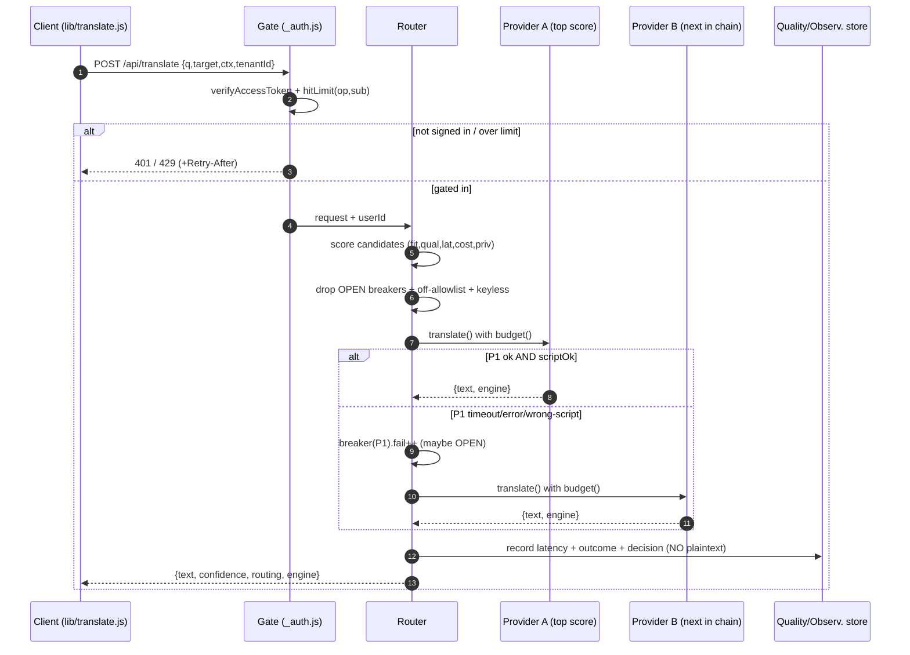
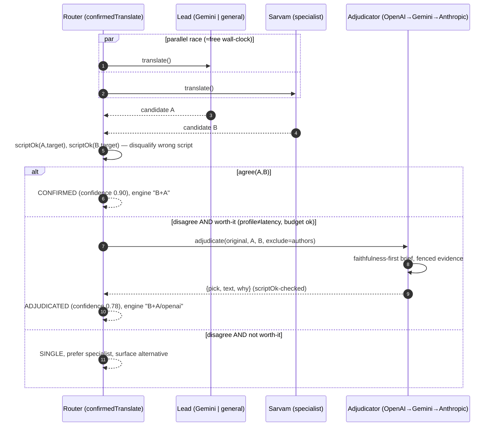
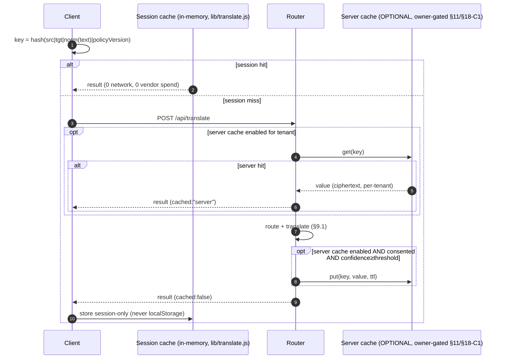
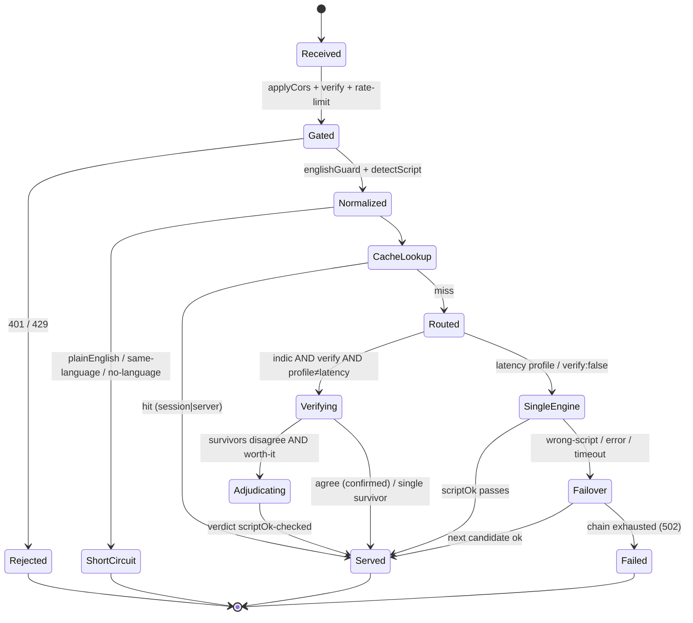
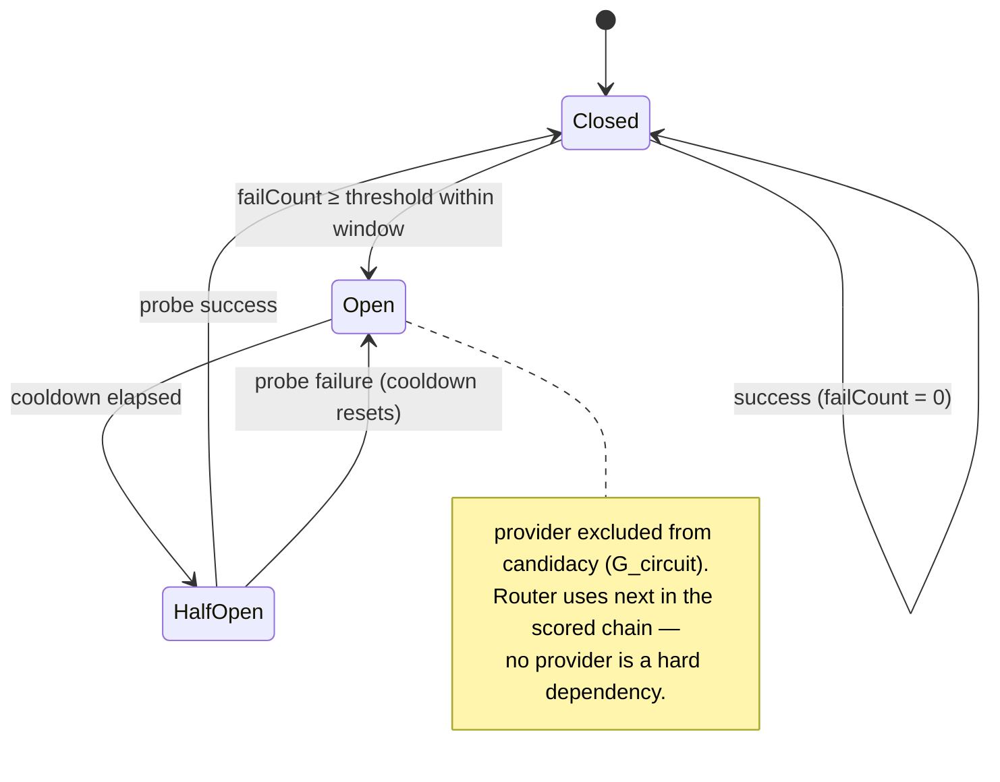
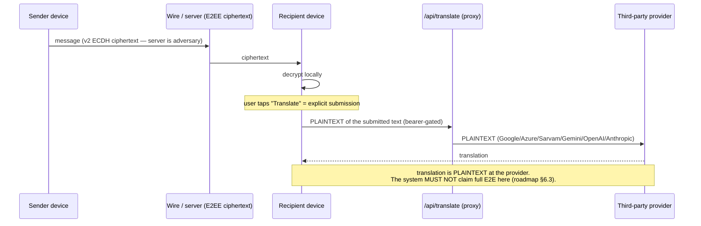

# 02 — Enterprise Translation Platform (Priority ②, Workstream 2)

**Status:** PLANNING ONLY — implementation-ready design. No production code,
schema, config, or feature flag is changed by this document.
**Owner directive (2026-08-01):** translation platform is execution-order item
**②** (push ① → **translation ②** → live voice ③ → adaptive ④ → remaining
Priority 1 crypto). See §18 for the numbering trap.
**Controlling ADR:** `spotme/docs/adr/010-translation-platform.md` (this
document proposes concrete additions to it in §16; it does not edit it in
place).
**Standing principle (roadmap §2 rule 10):** every AI feature optimises
**accuracy + latency + privacy simultaneously**; **no provider may become a
hard dependency** — route and fall back on quality, availability, cost, and
response time.
**Grounding:** the platform already half-exists. `web/api/translate.js` (902
lines) is a live multi-provider engine; `web/src/lib/translate.js` (401 lines)
is the client. This design **formalises what grew organically**; it does not
rebuild it. Every capability below maps to existing code, cited by file and
symbol.

---

## Table of contents

1. [Executive summary, goals & non-goals](#1-executive-summary-goals--non-goals)
2. [Motivation](#2-motivation)
3. [Provider abstraction](#3-provider-abstraction)
4. [Provider capability matrix](#4-provider-capability-matrix)
5. [Routing engine](#5-routing-engine)
6. [Confidence, quality, verification & adjudication](#6-confidence-quality-verification--adjudication)
7. [Language & script detection pipeline](#7-language--script-detection-pipeline)
8. [API contracts](#8-api-contracts)
9. [Sequence diagrams](#9-sequence-diagrams)
10. [State diagrams](#10-state-diagrams)
11. [Cache architecture](#11-cache-architecture)
12. [Privacy & security](#12-privacy--security)
13. [Database changes (planning only)](#13-database-changes-planning-only)
14. [Observability](#14-observability)
15. [Benchmark methodology](#15-benchmark-methodology)
16. [ADR-010 improvements (proposed)](#16-adr-010-improvements-proposed)
17. [Alternatives, scalability, testing, deployment, rollout & future](#17-alternatives-scalability-testing-deployment-rollout--future)
18. [Conflicts & review notes](#18-conflicts--review-notes)

---

## 1. Executive summary, goals & non-goals

### 1.1 What this is

Spot Me carries mostly short, context-dependent Indic chat — often *romanized*
(Tamil typed in English letters). A single statistical engine mistranslates
exactly this traffic (`web/api/translate.js:818-830`, measured: `"naan
innaiku vetuku varen"` → *"I'm going to come to the blast to connect"* on one
engine vs *"I am coming home today"* cross-confirmed). The existing engine
already solves this with a hand-wired stack: parallel cross-confirmation, a
deterministic wrong-script guard, an LLM adjudicator panel, and an ordered
fallback chain. **This document turns that stack into a declared platform**:
a provider interface, routing as *data* rather than branches, first-class
confidence/quality scoring, cost-aware routing, caching, and observability —
the five things ADR-010 §7 lists as "what does NOT exist" today.

### 1.2 Goals

- **G1 — Provider abstraction.** One typed interface per capability; every
  existing function (`googleTranslate`, `azureTranslate`, `sarvamTranslate`,
  `geminiTranslate`, `askOpenAI`, `askAnthropic`, `googleTransliterate`,
  `azureDetect`) becomes a *registration*, not a rewrite (ADR-010 §1).
- **G2 — Routing as data.** A scored routing table replaces the hardcoded
  engine order in `handler()` (`translate.js:846-867`). Dynamic, latency-aware,
  and cost-aware profiles select from the same table.
- **G3 — No hard dependency.** Any single provider outage re-routes. The
  degenerate form (today's first-success chains) keeps working during
  migration and *is* the router with the table OFF.
- **G4 — Confidence & quality as data.** The adjudicator verdicts and
  wrong-script disqualifications currently computed and thrown away
  (`translate.js:616` logs one line) become a rolling per-provider, per-pair
  quality score the router reads and an observable metric.
- **G5 — Enterprise controls.** Per-tenant provider allow-lists, cost budgets
  + alerts (today: "eight metered vendors, no caps in code" — audit §17), and
  a redaction hook before plaintext crosses a trust boundary.
- **G6 — Latency headroom for live voice (③).** The same provider abstraction
  and latency-aware routing profile are consumed by the live-voice pipeline
  (roadmap §6.2 step 5); this platform is its substrate, designed so the
  live-voice ADR (`adr/011`) does not re-invent provider selection.

### 1.3 Non-goals

- **No SDK lock-in.** REST clients stay (ADR-010 non-goals). No `@google-cloud`,
  no `openai` npm — the file is deployed as a dependency-free serverless bundle
  (`_auth.js:18-25`).
- **No server-side translation memory of message plaintext** (ADR-010
  non-goals; roadmap §2 rule 7). This constrains §11/§13 and is a live tension
  surfaced in §18-C1 for owner decision — not silently resolved here.
- **No change to E2EE properties.** Translation operates on text the user
  explicitly submitted for translation; the trust boundary is documented
  explicitly (§12), never elided.
- **Not the live-voice architecture.** Streaming STT→translate→TTS with
  interruption handling is ADR-011 (③). This platform provides the *text*
  translation leg and the provider/routing substrate it calls.
- **No new crypto, no Priority 1 files touched.** ADR-008 §12 hard stop is
  untouched by this work.

### 1.4 Success criteria (measurable, validated at implementation)

| Criterion | Target |
|---|---|
| Provider failover on single-vendor outage | 100% of requests still answered (degrade, never die) |
| Wrong-script escape rate to reader | 0 (deterministic `scriptOk` gate on every path) |
| Routing decision recorded per request | 100%, with **no plaintext** in the record |
| Confidence attached to every response | 100% |
| Per-tenant cost visibility | per-provider counters + budget alerts before enterprise enable |
| Interface parity | every current provider re-expressed as an adapter with zero behaviour change when routing table = OFF |

---

## 2. Motivation

The roadmap principle (§2 rule 10) is three simultaneous optimisations, and the
existing engine already embodies each — it is simply undeclared and
unmeasured:

- **Accuracy** is won at *disagreement*: cross-confirmation
  (`confirmedTranslate`, `translate.js:633`) races a specialist (Sarvam) and a
  general/reading engine; agreement is the strongest human-free signal, and
  genuine disagreement is escalated to a faithfulness-first adjudicator
  (`adjudicate`, `translate.js:569`). The adjudicator was hardened after
  cross-confirmation was found *selecting for* prompt injections — a hijacked
  output is always the more fluent, so a fluency-only judge stamped the
  attacker's sentence `confirmed:true` (`translate-guards.test.js:162`).
- **Latency** is protected by parallel racing (confirmation costs ≈0 wall-clock;
  only disagreement costs an extra call) and by per-leg budgets
  (`LEG_MS=8000`, `LLM_MS=12000`, `translate.js:50-52`) after a measured 73.6 s
  hang took down a whole request.
- **Privacy** is protected on-device-first (Chrome Translator, "nothing leaves
  the phone", `lib/translate.js:1-12`) and by *never persisting message
  plaintext* — the plaintext localStorage cache was deliberately ripped out for
  disappearing-message hygiene (`lib/translate.js:14-29`).

What the roadmap demands that the code cannot yet do: **choose** between
providers on measured quality/latency/cost/availability rather than a hardcoded
order, **prove** it is helping (quality feedback loop), **cap** the spend
(budgets), and **coexist** with enterprise multi-tenancy (allow-lists,
redaction). That gap is this document.

---

## 3. Provider abstraction

> Typed signatures only. This is a design, not an implementation; no adapter
> code is written by this document. Signatures are TypeScript-flavoured for
> precision; the runtime is dependency-free JS (`_auth.js:18`).

### 3.1 Core value types

```ts
// BCP-47 subset already enforced server-side (translate.js:35 LANG_CODE)
type LanguageCode = string;            // "ta", "pt-BR", "ta-Latn"
type ScriptCode   = string;            // ISO-15924: "Latn","Taml","Deva","Knda"…
type ProviderId   = 'google' | 'azure' | 'sarvam' | 'gemini' | 'openai'
                  | 'anthropic' | 'google-inputtools' | 'elevenlabs'
                  | 'device' | 'gtx' | 'mymemory';

type Capability =
  | 'translate' | 'detect' | 'transliterate'
  | 'comprehend'            // the ?op=read reading layer (llmRead)
  | 'adjudicate'            // the judge panel
  | 'stt' | 'tts' | 'clone'; // voice legs (ElevenLabs), for the ③ substrate

type LatencyClass = 'realtime' | 'fast' | 'medium' | 'slow'; // budget tiers
type CostClass    = 'free' | 'cheap' | 'metered' | 'premium';
type QualityTier  = 'reference' | 'high' | 'general' | 'fallback';
type PrivacyPosture =
  | 'on-device'             // nothing leaves the phone (Chrome Translator)
  | 'cloud-contract'        // metered vendor under contract/DPA
  | 'cloud-keyless';        // unofficial/keyless endpoint (gtx) — RISK
```

### 3.2 Request / result shapes

```ts
interface TranslateRequest {
  text: string;                 // clipped to 1000 (translate.js:723)
  sourceLang?: LanguageCode;    // a CLAIM, not a fact (lib/translate.js:227)
  targetLang: LanguageCode;
  context?: ConversationContext;// session-scoped, fenced, never persisted (§12)
  verify?: boolean;             // opt out of cross-confirmation for latency
  tenantId?: string;            // enterprise allow-list + budget scope
  routingProfile?: 'accuracy' | 'latency' | 'cost';
}

interface TranslateResult {
  text: string;
  sourceLang: LanguageCode | null;   // detected or echoed
  targetScript: ScriptCode;
  engine: string;                    // "gemini+sarvam/openai" — composite kept
  confidence: number;                // 0..1, taxonomy §6.1
  confirmed: boolean;
  alternative?: string;              // the rejected candidate, surfaced not dropped
  routing: RoutingDecision;          // §5.5 — returned to caller & logged
  cached: 'session' | 'server' | false;
  latencyMs: number;
}
```

### 3.3 The provider interface (every adapter implements)

```ts
interface TranslationProvider {
  readonly id: ProviderId;

  // ── capability declaration (data the router scores against) ──────────────
  capabilities(): ProviderCapabilities;          // §4 row, as data

  // ── the operations a provider MAY support (declared in capabilities) ─────
  translate?(req: TranslateRequest): Promise<ProviderTranslation>;
  detectLanguage?(text: string): Promise<DetectResult>;
  detectScript?(text: string): ScriptResult;     // deterministic, local, sync
  transliterate?(req: TransliterateRequest): Promise<TransliterateResult>;
  comprehend?(req: ComprehendRequest): Promise<ComprehendResult>; // llmRead
  adjudicate?(req: AdjudicateRequest): Promise<AdjudicateResult | null>;

  // ── operational signals the router reads on every routing decision ───────
  health(): HealthSnapshot;                       // cheap, from rolling state
  priceSignal(req: Pick<TranslateRequest,'text'|'sourceLang'|'targetLang'>)
    : PriceSignal;                                // estimate BEFORE calling
}

interface ProviderCapabilities {
  supports: Capability[];
  languagePairs: (src: LanguageCode, tgt: LanguageCode) => PairFitness; // 0..1
  scripts: ScriptCode[];
  streaming: boolean;
  qualityTier: QualityTier;
  latencyClass: LatencyClass;
  costClass: CostClass;
  privacy: PrivacyPosture;
  rateLimit: { rpm?: number; note?: string };     // e.g. Azure free ~10 rps
}

interface HealthSnapshot {
  circuit: 'closed' | 'open' | 'half-open';        // §10.2
  p50Ms: number; p95Ms: number;                    // rolling, from observ. store
  errorRate: number;                               // rolling window
  lastError?: string;                              // internal only, never relayed
}

interface PriceSignal {
  unit: 'char' | 'token' | 'call' | 'none';
  estimatedUnits: number;
  costClass: CostClass;
}

interface ProviderTranslation {                    // what an adapter returns
  text: string; detected: LanguageCode | null; engine: string;
}
interface ScriptResult   { script: ScriptCode; confident: boolean; }
interface DetectResult    { language: LanguageCode; script: ScriptCode; romanized: boolean; score: number | null; }
interface ConversationContext { turns: string[]; /* fenced as untrusted, §12 */ }
```

**Registration, not rewrite.** The mapping from today's code:

| Existing symbol (`translate.js`) | Adapter method |
|---|---|
| `googleTranslate` | `google.translate` |
| `azureTranslate` / `azureTransliterate` / `azureDetect` | `azure.translate` / `.transliterate` / `.detectLanguage` |
| `sarvamTranslate` / `sarvamTransliterate` | `sarvam.translate` / `.transliterate` |
| `geminiTranslate` / `askGemini` | `gemini.translate` / `.comprehend` / `.adjudicate` |
| `askOpenAI` | `openai.comprehend` / `.adjudicate` |
| `askAnthropic` | `anthropic.comprehend` / `.adjudicate` |
| `googleTransliterate` | `google-inputtools.transliterate` |
| `scriptOk` (`translate.js:90`) | shared `detectScript` guard, not per-provider |
| `sttBlob`/`ttsClone`/`cloneVoice` (`lib/voice.js`) | `elevenlabs.stt`/`.tts`/`.clone` |
| client `deviceTranslator` (`lib/translate.js:80`) | `device.translate` (on-device) |

---

## 4. Provider capability matrix

Declared as data (`capabilities()`), scored by the router. `translate` unit is
per-character unless noted; LLM legs are per-token. Latency figures are the
measured ones the code already documents.

| Provider | translate | detect | translit | comprehend | adjudicate | Languages | Scripts | Streaming | Quality tier | Latency class (measured) | Cost class | Privacy posture | Rate limit / note |
|---|:--:|:--:|:--:|:--:|:--:|---|---|:--:|---|---|---|---|---|
| **device** (Chrome Translator) | ✓ | ✗ | ✗ | ✗ | ✗ | model-gated subset | broad if model present | ✗ | general | `realtime` (local, after 2 s avail probe) | free | **on-device** | needs known source; `downloadable`≠use |
| **google** (Cloud Translation v2) | ✓ | ✓* | ✗ | ✗ | ✗ | 100+ | broad | ✗ | high | `fast` | metered (char) | cloud-contract | vendor quota |
| **azure** (Translator v3) | ✓ | ✓ | ✓ | ✗ | ✗ | 100+ | broad + translit | ✗ | high | `fast` (svc p90 3.8 s) | metered (char) | cloud-contract | free tier ~10 rps → 429+wait (`translate.js:679`) |
| **sarvam** (Indic specialist) | ✓ | ✓† | ✓ | ✗ | ✗ | 12: en,hi,bn,gu,kn,ml,mr,or/od,pa,ta,te (`SARVAM_LANGS`) | Indic | ✗ | **reference (Indic)** | `medium` | metered | cloud-contract | `api-subscription-key` header only |
| **gemini** (flash-lite) | ✓ (reading) | ✓† | ✗ | ✓ | ✓ | broad + romanized Indic + Tulu/Konkani | broad | ✓ (API; unused) | high (context-aware) | `medium` (lite ~0.8 s; flash ~3.5 s) | metered (token) | cloud-contract | 429 often = out of credit (`translate.js:371`) |
| **openai** (gpt-4o) | ✓ (via LLM) | ✗ | ✗ | ✓ | ✓ | broad | broad | ✓ (API; unused) | high | `slow` (read chain p50 3.2 s) | premium (token) | cloud-contract | key found rotated in field |
| **anthropic** (claude-sonnet) | ✓ (via LLM) | ✗ | ✗ | ✓ (lead reader) | ✓ | broad | broad | ✓ (API; unused) | high | `slow` (LLM tail) | premium (token) | cloud-contract | unpinned alias on purpose (`translate.js:290`) |
| **google-inputtools** | ✗ | ✗ | ✓ (word-aware, romanized→native) | ✗ | ✗ | Indic + more | Indic | ✗ | high (ear-spelled) | `fast` | free (keyless) | **cloud-keyless** | undocumented; every failure ⇒ fall back to Azure |
| **elevenlabs** | ✗ | ✗ (stt lang only) | ✗ | ✗ | ✗ | STT/TTS langs | n/a | ✓ (voice) | n/a (voice) | `medium` | metered | cloud-contract | ③ substrate; consent-bound clone |
| **gtx** (keyless Google) | ✓ | ✓ (auto) | ✗ | ✗ | ✗ | broad | broad | ✗ | general | `fast` | free (keyless) | **cloud-keyless** | **client-only fallback; roadmap §7: replace** |
| **mymemory** | ✓ | ✗ | ✗ | ✗ | ✗ | broad | broad | ✗ | fallback | `medium` | free tier | cloud-keyless | last resort; junk on some pairs |

\* Google v2 can detect but the engine uses Azure detect for romanized coverage
(`ta-Latn`). † Sarvam/Gemini "detect" is auto-detection inside translate/read,
not a standalone endpoint. **cloud-keyless** providers are enterprise-ineligible
by default (§12.3 allow-list).

---

## 5. Routing engine

Replaces the hardcoded engine ordering in `handler()` (`translate.js:846-867`)
with a scored table. The current order is the *scored default* — with the table
OFF, the router emits exactly today's sequence (ADR-010 §2, rollback = flag).

### 5.1 Candidate scoring formula

For a request `r` and each provider `p` that **passes the hard gates**:

```
Hard gates (any failure ⇒ p excluded from candidacy):
  G_supports :  p.capabilities.supports ∋ requiredCapability(r)
  G_pair     :  p.capabilities.languagePairs(r.src, r.tgt) > 0
  G_circuit  :  p.health.circuit ≠ 'open'                     (§10.2)
  G_allow    :  p ∈ tenantAllowList(r.tenantId)               (§12.3)
  G_privacy  :  privacyPolicy(r.tenantId) admits p.privacy    (e.g. no keyless)

Score (only over gated-in candidates):
  score(p, r) =  w_fit  · fit(p, r)
               + w_qual · quality(p, pair(r))
               + w_lat  · latency(p)
               + w_cost · cost(p, r)
               + w_priv · privacyBonus(p)

where each term ∈ [0,1]:
  fit(p,r)      = p.capabilities.languagePairs(src,tgt)  // Sarvam≈1.0 for Indic
  quality(p,·)  = rollingQualityScore(p, pair)           // §6.2 EWMA, default 0.6
  latency(p)    = clamp(1 − p.health.p95Ms / budget(profile), 0, 1)
  cost(p,r)     = 1 − normalizedCostClass(p)             // free→1, premium→~0.1
  privacyBonus  = { on-device:1.0, cloud-contract:0.6, cloud-keyless:0.0 }

Selection:
  primary   = argmax score
  fallbacks = remaining candidates sorted by score, descending  (the chain)
```

### 5.2 Routing profiles (weight presets = policy knobs)

| Profile | w_fit | w_qual | w_lat | w_cost | w_priv | Used by |
|---|:--:|:--:|:--:|:--:|:--:|---|
| **accuracy** (default: whole-chat, `?op=read`) | 0.25 | 0.40 | 0.10 | 0.10 | 0.15 | reading incoming Indic chat |
| **latency** (live typing preview; ③ live voice text leg) | 0.20 | 0.20 | 0.40 | 0.05 | 0.15 | sub-second paths |
| **cost** (batch / background whole-chat pre-translate) | 0.20 | 0.25 | 0.05 | 0.35 | 0.15 | bulk jobs |

Weights sum to 1.0; `privacyBonus` is *also* a hard gate via `G_privacy`, so the
soft weight only breaks ties among admitted providers. All weights, the
per-profile `budget()` ceiling, and per-pair overrides are **data**, hot-editable
without a deploy — the routing table itself.

### 5.3 Additional policy knobs

- `confirm.enabled` (per pair): run cross-confirmation (§6.3) or single-engine.
  Today: `indic && body.verify !== false` (`translate.js:852`). Becomes a
  measured per-pair decision ("skip confirmation for high-confidence pairs",
  ADR-010 §6) rather than assumed.
- `adjudicate.budget`: max adjudications/min/tenant; and a *worth-it* predicate
  (§6.4) — never on the latency profile.
- `allowList[tenantId]`: provider allow-list (default: all cloud-contract; never
  cloud-keyless).
- `budget[tenantId][provider]`: soft (alert) and hard (block→re-route) caps.
- `pairOverride[src|tgt]`: pin/deny a provider for a pair (e.g. force Sarvam for
  `*→kn`).

### 5.4 Enterprise fallback chains & circuit-breaking

- **Fallback chain** = the scored candidate list. The router walks it on
  failure, timeout (`budget()`), or **wrong-script disqualification** — the same
  `scriptOk` gate the fallback loop already applies (`translate.js:877`). No
  provider is a hard dependency (G3).
- **Circuit breaker** per provider (§10.2): opens on failure threshold, sheds
  that provider from candidacy (`G_circuit`), half-opens after cooldown to probe.
  This is new — today a dead provider (e.g. Gemini 404 on retired model,
  `translate.js:348`) is retried every request and silently falls through.
- **Composite engine strings are preserved** (`"gemini+sarvam/openai"`) so the
  decision is legible end-to-end.

### 5.5 The routing decision (returned & logged, no plaintext)

```ts
interface RoutingDecision {
  profile: 'accuracy' | 'latency' | 'cost';
  requiredCapability: Capability;
  candidates: Array<{ id: ProviderId; score: number; gatedOut?: string }>;
  chosen: ProviderId | string;      // composite allowed
  fallbacksTaken: ProviderId[];     // providers tried before success
  verified: 'agree' | 'adjudicated' | 'single' | 'none';
  adjudicator?: ProviderId;
  breakerTrips: ProviderId[];       // providers whose breaker moved this request
  policyVersion: string;            // routing-table version (cache-key input)
}
```

---

## 6. Confidence, quality, verification & adjudication

### 6.1 Confidence taxonomy (formula)

Every response carries `confidence ∈ [0,1]`, derived — not guessed:

```
confidence =
  0.90–1.00  CONFIRMED   two independent engines agree()  (translate.js:519)
                          OR on-device exact round-trip
  0.70–0.89  ADJUDICATED judge picked, faithfulness-first, scriptOk-verified
                          (record which candidate won + why, translate.js:616)
  0.50–0.69  SINGLE       one engine, passed scriptOk, no second opinion available
  0.30–0.49  FALLBACK     served from the keyless tail (gtx/MyMemory) or
                          single-engine with no script opinion possible
  < 0.30     DEGRADED     wrong-script survivor / unverified last resort (flagged)
```

`agree()` compares meaning-bearing characters only (normalises whitespace,
zero-width joiners, punctuation incl. the danda `।`) so trivial differences do
not manufacture disagreement and triple the cost (`translate.js:511-525`).

### 6.2 Quality scoring (the feedback loop — the missing piece)

Per `(provider, languagePair)`, a rolling EWMA the router reads as `quality(p,pair)`:

```
q_new = α · sample + (1 − α) · q_old      (α ≈ 0.1; seed 0.6; per pair)

sample signals (already computed today, then discarded except one log line):
  +1.0  won an adjudication              (adjudicate pick)
  +0.8  agreed with an independent engine (confirmedTranslate agree branch)
   0.0  lost an adjudication
  −1.0  disqualified for wrong script    (scriptOk === false)
  −0.6  user tapped "show original" / reported a bad translation (client signal)
```

This turns ADR-010 §4's observation ("verdicts and disqualifications are
computed and thrown away") into the router's `quality` term (§5.1) and a drift
metric (§14). Stored **without plaintext** (§13, `TranslationQualityScore`).

### 6.3 Cross-provider verification

Unchanged in spirit from `confirmedTranslate` (`translate.js:633`), generalised
to the router:

1. Race the profile's top general/reading engine and the specialist (Sarvam)
   in **parallel** (`Promise.allSettled`) — confirmation is ≈free in wall-clock.
2. **Disqualify wrong-script answers first** (`scriptOk`) — Sarvam has returned
   Devanagari for a Kannada target, Gemini Tamil for Telugu/Kannada
   (`translate.js:641`). Arithmetic guard, zero extra calls.
3. If the survivors `agree()` → CONFIRMED (0.9).
4. If they disagree → adjudicate (§6.4), author-excluded.
5. If only one survives → SINGLE, `note:'single engine'`.

### 6.4 LLM adjudication — when it is worth the latency/cost

Adjudication is the **most expensive call in the service** (`translate.js:611`).
The *worth-it* predicate (a policy knob, §5.3):

```
adjudicate  ⟺  survivors disagree
            AND profile ≠ 'latency'                 (never on the sub-second path)
            AND quality-gap(pairEngines) is material (both plausible, not one obviously better)
            AND adjudicate.budget[tenant] not exhausted
```

Panel order `OpenAI → Gemini → Anthropic`, **the candidate's own author
excluded** (`translate.js:600-606`) — a model marking its own homework is not a
second opinion. The brief is **faithfulness-first, ahead of fluency**
(`translate.js:586`) — the fix that stopped cross-confirmation laundering prompt
injections — and the verdict is itself `scriptOk`-checked before it ships
(`translate.js:613`). Any adjudicator failure falls back to the specialist: a
second opinion is an improvement, never a dependency (roadmap rule 10).

---

## 7. Language & script detection pipeline

Order is load-bearing — the deterministic guards must run **before** any model
gets an opinion, or English becomes romanized Kannada (`english.js:1-27`,
the real incident).

```
1. ENGLISH GUARD (deterministic, no network) — isPlainEnglish (english.js:75)
     wordCount ≥ 3 AND englishScore ≥ 0.5  ⇒  treat as English, stop.
     Function-word set deliberately EXCLUDES tokens that collide with romanized
     Indic ("en","un","na","ne","va","di","la") so "en pondati" ≠ English.

2. SCRIPT DETECTION (deterministic, no network) — detectScript
     Unicode-block test (TARGET_BLOCK, translate.js:67-79) + ANY_INDIC.
     Answers: which Indic block, or "non-Indic / no opinion".
     This is the same arithmetic that powers scriptOk — one shared function.

3. NON-LATIN SHORTCUT (no network)
     ANY_INDIC.test(text) ⇒ source script is decisive on its own; no detect call.
     (translate.js:809 hasIndicScript)

4. PROVIDER DETECT (network, only when still ambiguous) — azureDetect
     Romanized Indic → English is the ambiguous case with NO local signal
     (Tamil in Latin letters, target en, no declared source). Azure reports
     "ta-Latn" — language + romanized flag — for ~259–271 ms (translate.js:835).
     Gated: skip for emoji/digits-only (/\p{L}/ test) and when a declared
     source or non-English target already decides it.

5. ROUTE
     romanized flag ⇒ eligible for transliterate / comprehend(read) paths;
     detected base language ⇒ feeds fit(p,r) and the specialist decision.
```

**Script detection is provider-independent and free** — it is the platform's
cheapest and most reliable guard, and it runs on *every* translation path
(verified and fallback alike), which is exactly the property the fallback loop
gained at `translate.js:877`.

---

## 8. API contracts

Transport unchanged: `POST /api/translate[?op=…]`, bearer-gated
(`gateVendorProxy`, `_auth.js:157`), CORS-allow-listed (`applyCors`), bodies
JSON. New fields are additive; existing clients keep working.

### 8.1 Translate — single

**Request**
```json
POST /api/translate
Authorization: Bearer <access-token>
{
  "q": "naan innaiku vetuku varen",
  "source": null,
  "target": "en",
  "verify": true,
  "context": { "turns": ["ne enga iruka", "veetla"] },
  "tenantId": "acme",
  "routingProfile": "accuracy"
}
```
**Response 200**
```json
{
  "text": "I am coming home today",
  "detected": "ta",
  "sourceLang": "ta",
  "targetScript": "Latn",
  "engine": "gemini+sarvam/openai",
  "confidence": 0.78,
  "confirmed": true,
  "alternative": "I will come to the house today",
  "cached": false,
  "latencyMs": 1840,
  "routing": {
    "profile": "accuracy",
    "requiredCapability": "translate",
    "candidates": [
      { "id": "sarvam", "score": 0.86 },
      { "id": "gemini", "score": 0.81 },
      { "id": "azure",  "score": 0.55 },
      { "id": "gtx",    "score": 0.00, "gatedOut": "privacy: cloud-keyless" }
    ],
    "chosen": "gemini+sarvam/openai",
    "fallbacksTaken": [],
    "verified": "adjudicated",
    "adjudicator": "openai",
    "breakerTrips": [],
    "policyVersion": "rt-2026.08.1"
  }
}
```

### 8.2 Translate — batch (whole-chat)

**Request**
```json
POST /api/translate?op=batch
{
  "items": [
    { "id": "m1", "q": "vanakkam", "target": "en" },
    { "id": "m2", "q": "epadi iruka", "target": "en" },
    { "id": "m3", "q": "😂😂😂",       "target": "en" }
  ],
  "routingProfile": "cost",
  "tenantId": "acme"
}
```
**Response 207 (multi-status; partial failures are first-class)**
```json
{
  "partial": true,
  "results": [
    { "id": "m1", "status": "ok",      "text": "hello",        "engine": "sarvam", "confidence": 0.62, "cached": "server" },
    { "id": "m2", "status": "ok",      "text": "how are you",  "engine": "gemini+sarvam", "confidence": 0.90, "cached": false },
    { "id": "m3", "status": "skipped", "reason": "no-language", "text": "😂😂😂" }
  ],
  "failed": [
    { "id": "m4", "status": "error", "reason": "all-engines-failed", "retryable": true }
  ]
}
```
Batch runs items concurrently with a bounded pool; one item failing never fails
the batch (partial model). `skipped` covers emoji/digits-only and same-language.

### 8.3 Detect

**Request** `POST /api/translate?op=detect` `{ "q": "naan varala" }`
**Response 200**
```json
{ "language": "ta-Latn", "base": "ta", "script": "Latn", "romanized": true, "score": 0.87,
  "candidates": [ { "language": "ta-Latn", "score": 0.87 }, { "language": "ml-Latn", "score": 0.05 } ] }
```

### 8.4 Admin — capability matrix & health (new)

**Request** `GET /api/translate?op=admin.providers` (employee/admin bearer only)
**Response 200**
```json
{
  "policyVersion": "rt-2026.08.1",
  "providers": [
    { "id": "sarvam", "supports": ["translate","transliterate"], "qualityTier": "reference",
      "latencyClass": "medium", "costClass": "metered", "privacy": "cloud-contract",
      "health": { "circuit": "closed", "p50Ms": 640, "p95Ms": 1200, "errorRate": 0.01 } },
    { "id": "gemini", "supports": ["translate","comprehend","adjudicate"], "qualityTier": "high",
      "health": { "circuit": "half-open", "p50Ms": 820, "p95Ms": 3400, "errorRate": 0.12 } }
  ],
  "budgets": [ { "tenantId": "acme", "provider": "openai", "spentUnits": 41200, "hardCapUnits": 50000, "state": "warn" } ]
}
```

**Request** `GET /api/translate?op=admin.health` → rolling per-provider
quality/latency/cost/circuit, drift flags (§14). No message content ever
appears in admin responses.

### 8.5 Error & partial-failure model

| HTTP | `error` body | Meaning | Client action |
|---|---|---|---|
| 400 | `need q` / `need target` / `bad language code` | validation (`translate.js:724,779,786`) | fix request |
| 401 | `sign in required` | no/invalid bearer (`_auth.js:161`) | refresh token |
| 429 | `too many requests — slow down` + `Retry-After` | per-user tier limit (`_auth.js:166`) | back off |
| 429 | `Language service is busy — retry in a moment` + `Retry-After` | **upstream** vendor 429, translated to a safe message (`translate.js:893`) | retry once |
| 207 | `{partial:true,…}` | batch: some items failed | render per-item |
| 502 | `all engines failed` / `Language service unavailable` | every candidate exhausted; **upstream text never relayed** (names vendor & pricing tier, `translate.js:898`) | show original |

Invariant preserved from today: the proxy **never relays the upstream error
text** to the client — it names the vendor and pricing tier (`_auth.js` rationale;
`translate.js:898`).

---

## 9. Sequence diagrams

### 9.1 Routed translation with fallback



### 9.2 Cross-provider verification + LLM adjudication



### 9.3 Cache hit vs miss



---

## 10. State diagrams

### 10.1 Request lifecycle



### 10.2 Provider circuit-breaker



Default parameters (policy knobs): `threshold = 5 failures`, `window = 60 s`,
`cooldown = 30 s`, `half-open probes = 1`. Timeouts (`budget()`,
`translate.js:52`) and wrong-script disqualifications both count as failures.

---

## 11. Cache architecture

### 11.1 Two tiers (today: only tier 0 exists, correctly)

- **Tier 0 — session cache (exists, keep).** `memory`, `readCache`,
  `detectCache`, `translitCache` in `lib/translate.js` — `Map`s, bounded at 500,
  **in-memory only, never persisted**, cleared on the `spotme:tcache:v3` sweep
  (`lib/translate.js:66-70`). This is deliberate: the plaintext localStorage
  cache was removed because it outlived disappearing messages
  (`lib/translate.js:14-29`). No-ops are never cached (would poison later
  attempts, `lib/translate.js:243`).
- **Tier 1 — server cache (NEW, owner-gated, off by default).** Optional,
  per-tenant, for enterprise workloads where repeated content is common (support
  macros, broadcast messages, UI strings). **Its existence collides with
  ADR-010's non-goal "no server-side translation memory of message plaintext"
  and roadmap rule 7 — see §18-C1; it ships only on an explicit owner decision.**

### 11.2 Key design

```
cacheKey = SHA-256( normalize(text) ‖ src ‖ tgt ‖ policyVersion ‖ contextHash )

  normalize(text)  = same meaning-normalisation as agree() (case, whitespace,
                     zero-width joiners, punctuation) — so trivially different
                     inputs share a cache line
  policyVersion    = routing-table version (§5.5) — a routing change invalidates
  contextHash      = hash of the fenced context window, or ∅ when context-free
                     (context-dependent translations MUST NOT share a context-free line)
```

### 11.3 Privacy of cached content (the hard constraint)

- The **key is a hash** — not reversible to plaintext, and by itself stores no
  message.
- The **value** (the translation) is user content. Tier 1 stores it only:
  (a) per-tenant, encrypted at rest with a per-tenant key; (b) with a TTL and a
  max size; (c) **only when the tenant has consented to a server-side
  translation cache**; (d) **never** for disappearing/view-once conversations
  (the client marks these `noStore:true`); (e) evictable on device-wipe /
  account deletion.
- Default remains **no server cache** — Tier 0 only. This keeps the ADR-010
  non-goal intact unless the owner opts a tenant in.

### 11.4 Invalidation

- `policyVersion` bump (routing/model change) ⇒ whole namespace stale.
- Quality drift on a `(provider,pair)` below threshold (§14) ⇒ purge that pair.
- TTL (default 7 d for tier 1) and LRU under a size cap.
- Explicit purge on account deletion / tenant off-boarding / consent withdrawal.

### 11.5 Hit-rate targets (validated at implementation, not assumed)

| Path | Target session hit-rate | Target tier-1 hit-rate |
|---|---|---|
| Scroll re-render (same message re-seen) | > 95% (already the tier-0 purpose) | n/a |
| Whole-chat re-open | > 60% | > 40% (enterprise, if enabled) |
| Enterprise canned content (macros, broadcast) | n/a | > 80% |
| Live typing preview | n/a (never cached; latency profile) | n/a |

---

## 12. Privacy & security

### 12.1 The trust boundary — stated explicitly



**The platform must never claim end-to-end privacy for a cloud-translated
message.** Translation operates on text the user explicitly submitted; the
moment it leaves the device for a cloud provider, a third party sees plaintext.
On-device translation (Chrome Translator, `privacy:'on-device'`) is the only
path that preserves the E2E property, and it is already tier-0 preferred.

### 12.2 AI-processing indicator (consistency with ③)

Mirror the live-voice "AI-generated audio" indicator (roadmap §6.3): a visible,
non-dismissable marker that a translation was produced by a cloud provider (vs
on-device). The UI already labels cloud translations "cloud"
(`lib/translate.js:6-9`); this formalises it as a consent-relevant signal.

### 12.3 Per-tenant provider allow-lists

- `allowList[tenantId]` is a hard routing gate (`G_allow`, §5.1).
- **Default policy admits only `cloud-contract` providers** (under DPA);
  `cloud-keyless` (`gtx`, `mymemory`, `google-inputtools`) are **denied for
  enterprise tenants by default** — they have no data-processing contract.
- A regulated tenant may pin `on-device only` (translation degrades to Chrome
  Translator or is disabled), or restrict to a region-appropriate provider
  (e.g. Sarvam for India-resident data).

### 12.4 Redaction & consent

- **Redaction hook** before any plaintext crosses the boundary (§12.1): an
  optional per-tenant PII scrub (emails, phone numbers, card-like digit runs)
  that replaces spans with placeholders, translates, then re-inserts. Off by
  default; on for tenants that require it. (Design hook only — no PII detector
  is implemented by this document.)
- **Consent**: cloud translation is a per-user setting; enterprise tenants can
  require explicit opt-in. Voice legs (③) already require explicit voice-clone
  consent (`profile.js` enrollment) — text translation gains a parallel, lighter
  consent surface.

### 12.5 Existing hardening — carried forward as platform invariants

- **Auth gate** on every call (`gateVendorProxy`) — the endpoint was once an
  open, unauthenticated LLM proxy answering `evil.example.com`
  (`_auth.js:1-13`).
- **Prompt-injection fencing** with per-request nonces on every
  attacker-reachable string (`fenced`, `UNTRUSTED_RULE`, `translate.js:99-115`);
  context windows ride inside fences as untrusted DATA, never instructions
  (ADR-010 §3). Locked by `translate-guards.test.js`.
- **Vendor-option injection closed**: language codes are allow-listed
  (`LANG_CODE`) and URL-encoded, after `source:"en&textType=html"` was found
  flipping Azure options (`translate.js:154-159`).
- **No upstream error text relayed** (names vendor/pricing tier,
  `translate.js:898`).
- **Alg-pinned HS256** token verification — no `alg:none` forgery
  (`_auth.js:51-68`).

---

## 13. Database changes (planning only)

> Additive & reversible. No table stores message plaintext (roadmap rule 7;
> ADR-010 non-goals). Conventions matched to existing models: `cuid()` ids,
> `@default(now())` timestamps, `@@index`, `Json?` metadata (cf. `AuditLog`,
> `HealthSample`, `CrashReport` in `schema.prisma`). **Reversible** = each is a
> new table dropped by a down-migration; nothing alters an existing column.

```prisma
// Rolling per-(provider,pair) quality score the router reads (§6.2).
// NO plaintext — only aggregate signals.
model TranslationQualityScore {
  id          String   @id @default(cuid())
  provider    String                       // ProviderId
  langPair    String                       // "ta|en"
  score       Float    @default(0.6)       // EWMA 0..1
  samples     Int      @default(0)
  agreeRate   Float    @default(0)
  adjWinRate  Float    @default(0)
  wrongScript Int      @default(0)         // disqualification count
  updatedAt   DateTime @updatedAt
  @@unique([provider, langPair])
  @@index([provider])
}

// Per-request routing/analytics event. NO message content; hashed request id
// only. Feeds observability (§14) and drift detection.
model TranslationRoutingEvent {
  id            String   @id @default(cuid())
  reqHash       String                     // SHA-256(request) — correlation, not content
  tenantId      String?
  profile       String                     // accuracy|latency|cost
  chosen        String                     // composite engine string
  fallbacks     Json?                      // ProviderId[]
  verified      String                     // agree|adjudicated|single|none
  adjudicator   String?
  confidence    Float
  latencyMs     Int
  cached        String                     // session|server|false
  policyVersion String
  ts            DateTime @default(now())
  @@index([tenantId, ts])
  @@index([chosen, ts])
}

// Per-tenant, per-provider usage counters for budgets & alerts
// (today: "eight metered vendors, no caps in code").
model TranslationUsageCounter {
  id           String   @id @default(cuid())
  tenantId     String
  provider     String
  windowStart  DateTime                    // e.g. daily bucket
  units        Int      @default(0)        // chars or tokens
  calls        Int      @default(0)
  costEstimate Float    @default(0)
  @@unique([tenantId, provider, windowStart])
  @@index([tenantId, windowStart])
}

// Circuit-breaker / health snapshot, periodically flushed from process memory
// so a restart does not lose an OPEN breaker. Rolling, not per-request.
model TranslationProviderHealth {
  provider    String   @id                 // one row per provider
  circuit     String   @default("closed")  // closed|open|half-open
  p50Ms       Int?
  p95Ms       Int?
  errorRate   Float    @default(0)
  openedAt    DateTime?
  updatedAt   DateTime @updatedAt
}

// OPTIONAL, owner-gated (§11/§18-C1). Ships only if the owner opts a tenant
// into a server-side cache. Value is ciphertext; key is a hash.
model TranslationCache {                     // OFF by default — do not create without §18-C1 sign-off
  keyHash    String   @id                    // SHA-256 (see §11.2)
  tenantId   String
  value      Bytes                           // per-tenant encrypted translation
  srcLang    String
  tgtLang    String
  confidence Float
  hits       Int      @default(0)
  expiresAt  DateTime
  createdAt  DateTime @default(now())
  @@index([tenantId, expiresAt])
}
```

Migration is one additive migration (four always-safe tables +
`TranslationCache` only under C1). Rollback drops the tables; no existing model
is touched, so mixed-version deploys are safe.

---

## 14. Observability

Today there is **no observability stack** — only `AuditLog` / `HealthSample` /
`CrashReport`, and `prom-client` is installed but unused (audit §13, §15). This
platform adds the minimum floor without pulling Priority 9 forward.

- **Per-provider metrics** (from `TranslationProviderHealth` +
  `TranslationRoutingEvent`): quality (EWMA), latency p50/p95/p99, error rate,
  fallback rate, adjudication rate, wrong-script disqualification rate, circuit
  trips, cost/unit and spend-vs-budget.
- **Routing-decision logs**: every `RoutingDecision` (§5.5) persisted as a
  `TranslationRoutingEvent` — **no plaintext**, `reqHash` only. Answers "why did
  this request pick that provider?" and "how often does the chain fall back?".
- **Drift detection**: alert when a `(provider,pair)` quality EWMA drops > X%
  below its 30-day baseline, or wrong-script rate rises — the signal that a
  provider model changed under us (already happens: retired Gemini/Anthropic
  model ids, `translate.js:290,348`).
- **Budget alerts**: soft (warn) and hard (block→re-route) per
  `TranslationUsageCounter`.
- **Surface**: expose via the same admin/ops surface referenced by ADR-009 §4
  (push platform) and, minimally, a `/metrics` endpoint using the already-present
  `prom-client` (audit §17 quick win) — proposed, not built here.

Rule 7 invariant: **no security-sensitive state and no message content** in any
metric, log, or analytics row.

---

## 15. Benchmark methodology

Every priority's completion gate requires benchmarks with environment, raw
results, median, and tail latency (roadmap §8). For translation:

### 15.1 Quality

- **Reference sets.** Seed with the owner's existing **26-sentence Tanglish
  corpus** already used to grade the reading layer (`translate.js:422`; the bare
  instruction scored 14/26). Expand to per-pair golden sets for the first-class
  Indic pairs (ta, hi, te, kn, ml, bn, mr, +romanized variants) and the majors
  (es, fr, de, pt, ar, ja, zh) — each with source, reference translation, and a
  faithfulness note.
- **Automated metrics.** chrF++ and BLEU for surface overlap; **COMET**
  (reference-based neural) as the primary quality signal for pairs it covers.
  Report per pair, per provider.
- **Human eval.** Faithfulness-first rubric (mirrors the adjudicator brief,
  `translate.js:586`): a fluent-but-unfaithful output scores **below** a
  clumsy-but-faithful one — the exact failure mode cross-confirmation was
  hardened against. Blind A/B between providers and between routing profiles.
- **Adversarial suite.** The injection corpus from `translate-guards.test.js`
  (the `INJECTION` string and hint attacks) run against every LLM leg; a pass
  requires the payload to appear only inside a fence and never as executed
  instruction.

### 15.2 Latency

- Report **p50/p90/p95/p99** per provider and per path (single-engine,
  cross-confirmed, adjudicated, cache-hit), against the measured baselines the
  code documents (service p90 3.8 s; `?op=read` p50 3.2 s / p90 6.6 s;
  detect 259–271 ms; Gemini lite ~0.8 s / flash ~3.5 s).
- Enforce the per-leg budgets (`LEG_MS`, `LLM_MS`) as SLOs; a leg exceeding
  budget is a benchmark failure, not a slow success.

### 15.3 Cost per unit

- chars (statistical) / tokens (LLM) per translated message, per provider, and
  **cost per confirmed translation** (cross-confirmation + adjudication
  multiplies calls). Validates cost-aware routing actually saves money.

### 15.4 Routing A/B harness

- **Shadow routing**: run the candidate router alongside production, scoring but
  not serving, and log the counterfactual choice + confidence — zero user
  impact, real traffic.
- **Offline replay**: replay `TranslationRoutingEvent` `reqHash`-correlated
  fixtures (content held client-side or in a sealed eval set) through new
  weights to measure quality/latency/cost deltas before promoting a
  `policyVersion`.
- **Canary tenant**: enable a new routing table for one tenant, compare metrics,
  then widen — rollback is the `policyVersion` (§17.5).

---

## 16. ADR-010 improvements (proposed)

> Proposals to `spotme/docs/adr/010-translation-platform.md`. **Not applied
> here** — ADR-010 is edited under separate review. Each references the section
> above that specifies it.

1. **§1 (Provider abstraction) — add the typed interface (§3).** ADR-010 names
   the capabilities but gives no signatures; add `TranslationProvider`,
   `ProviderCapabilities`, `HealthSnapshot`, `PriceSignal`, and the
   registration-mapping table so adapters are implementable without
   interpretation.
2. **§2 (Dynamic routing) — add the scoring formula & profiles (§5.1–5.3).**
   ADR-010 says "scores candidates" but gives no function; add the weighted
   formula, the hard gates, the three profiles, and the policy knobs as the
   normative routing spec.
3. **New §: capability matrix (§4).** Promote the informal provider notes to the
   declared matrix the router scores against.
4. **§2 — add circuit-breaking (§5.4, §10.2).** ADR-010 relies on "current
   availability (circuit-breaker state)" but never defines the breaker; add the
   state machine and default parameters.
5. **§4 (Confidence) — add the confidence taxonomy & quality EWMA (§6.1–6.2).**
   Turn "agreement-derived / adjudicator-derived / single-engine" into the
   numeric bands and the feedback-loop update rule.
6. **§4/§6 — add the adjudication worth-it predicate (§6.4).** Make "skip
   confirmation for high-confidence pairs" a specified, measured policy, not a
   note.
7. **New §: cache architecture + the plaintext tension (§11).** ADR-010's
   non-goal ("no server-side translation memory of message plaintext") needs the
   explicit two-tier design and the owner-gated Tier-1 carve-out (C1) so the
   non-goal is honoured by default and consciously overridable.
8. **New §: per-tenant allow-lists, redaction, AI-indicator (§12.2–12.4).**
   ADR-010 has no enterprise/tenant model; add it.
9. **§5 (Cost-aware routing & observability) — add the DB tables & metrics
   (§13–14).** Give the "budgets and alerts" concrete tables and the
   drift-detection + `/metrics` surface.
10. **New §: benchmark methodology (§15).** ADR-010 §6 defers targets "with
    implementation"; attach the reference sets (incl. the 26-sentence corpus),
    COMET/BLEU/chrF, latency percentiles, and the A/B harness.
11. **Rollback wording (ADR-010 §Rollback) — bind to `policyVersion` (§17.5).**
    Make "routing table OFF = today's behaviour verbatim" precise: OFF ⇒ the
    hardcoded order at `translate.js:846-867`, and every table state carries a
    `policyVersion` that is the rollback unit and a cache-key input.

---

## 17. Alternatives, scalability, testing, deployment, rollout & future

### 17.1 Alternatives considered & trade-offs

| Option | Trade-off | Verdict |
|---|---|---|
| **Single best provider** (e.g. all-Google) | simplest, cheapest to build | **rejected** — hard dependency (violates rule 10); no Indic reference quality (Sarvam), no context reader (Gemini/LLM); one outage = feature down |
| **Managed aggregator** (Unbabel/Intento-style) | offloads routing | **rejected** — vendor lock-in, another plaintext processor in the boundary, opaque quality, cost |
| **Keep today's hardcoded chains** (status quo) | zero build | **rejected as endpoint** — but *kept as the degenerate router* (table OFF), so migration is safe and reversible |
| **LLM-only translation** (drop statistical engines) | best on context | **rejected** — latency (p50 3.2 s) and cost too high for the common path; LLMs caught answering wrong-script; statistical engines are the fast confirmers |
| **This design: scored multi-provider router** | most build effort | **chosen** — the only option satisfying accuracy+latency+privacy simultaneously with no hard dependency |

### 17.2 Scalability

- **Rate-limit counter is per-instance** in process memory (`_auth.js:113-118`):
  correct on single-process Railway, but on serverless/multi-instance the
  effective ceiling is `limit × instances`. For enterprise scale, move buckets
  to a shared store — the comment already flags Redis (`ioredis` is a present-
  but-unused dependency). **Depends on the Priority 3 Redis/Dragonfly selection
  — do not integrate ad-hoc (§18-C2).**
- **Routing is stateless** per request; quality/health/breaker state is small
  rolling aggregate (one row per provider/pair), shardable and cache-friendly.
- **Cross-confirmation is parallel** — throughput bound by the slowest of two
  concurrent legs, not their sum.
- **Cache tiers** absorb re-render and enterprise repeat load (§11.5).

### 17.3 Testing

- **Extend the guard suite** (`translate-guards.test.js`,
  `english-guard.test.js`, `translit.test.js`) — they already stub `fetch` and
  assert the injection fences, faithfulness brief, script guard, and unguessable
  nonce. Add: router scoring (deterministic given fixed health/quality inputs),
  circuit-breaker transitions, allow-list gating, confidence taxonomy, batch
  partial-failure, and cache key/no-op rules.
- **Adapter contract tests**: one shared test asserting every adapter honours
  the interface (shape, timeout, error-non-relay, scriptOk on outputs).
- **Benchmark/eval harness** (§15) in CI as a non-blocking report initially,
  gating before enterprise enable.

### 17.4 Deployment

- Ships **behind the existing engine order as default** (ADR-010 §Rollback):
  routing table `policyVersion = OFF` reproduces `translate.js:846-867` exactly.
- **Per-capability flags** (translate / read / translit / verify), defaulting to
  the safe (legacy) state (roadmap rule 6). This document does **not** create or
  flip any flag.
- Same dual mount (NestJS bridge `express.all` + Vercel serverless function),
  same dependency-free bundle constraint (`_auth.js:15-25`) — no npm SDKs.

### 17.5 Rollout & rollback

1. **Shadow** (score-only, no serving) → collect counterfactuals.
2. **Canary tenant** on a new `policyVersion`; compare quality/latency/cost.
3. **Widen** by tenant, then default.
- **Rollback = set `policyVersion` back** (data change, no deploy); the legacy
  hardcoded chain remains the code path underneath (ADR-010 §Rollback). Cost
  budgets and circuit breakers are always-on safety, independent of routing
  version.

### 17.6 Future evolution (on-device / local models)

- **On-device first, expanded.** Chrome Translator is already tier-0
  (`privacy:'on-device'`); as coverage grows it becomes the preferred provider
  for more pairs — the only path that preserves E2E (§12.1). Native ML Kit is the
  mobile equivalent the client comments already anticipate.
- **Self-hosted / local models** (NLLB-200, a local small LLM for the reading
  leg) as a `privacy:'on-device'`/regional provider for tenants that forbid any
  cloud plaintext — plugs in as another adapter, no router change.
- **Consented enterprise translation memory** (Tier-1 cache matured into a
  reviewed TM) — only under C1's owner decision.
- **③ live-voice reuse**: the latency profile + provider abstraction here is the
  text leg ADR-011 consumes; keep the interface stable so live voice does not
  fork it.

---

## 18. Conflicts & review notes

> Surfaced, **not silently resolved.** Each needs an owner decision or a
> cross-priority dependency call.

- **C1 — Server-side cache vs the "no plaintext memory" non-goal (BLOCKING for
  Tier 1).** ADR-010 non-goals and roadmap rule 7 forbid server-side memory of
  message plaintext. §11 Tier 1 (and `TranslationCache`, §13) would store
  translated user content server-side, even encrypted per-tenant. **Default in
  this design is OFF (Tier 0 only), preserving the non-goal.** *Owner decision:*
  (a) never build Tier 1; (b) build it opt-in per enterprise tenant with
  encryption + TTL + consent + no-store-for-disappearing; or (c) hash-only /
  UI-string-only cache that never holds conversational plaintext. Do not create
  `TranslationCache` without this sign-off.

- **C2 — Rate-limit / shared-state scaling depends on Priority 3.** The
  per-instance bucket (`_auth.js:113`) and the rolling health/quality/breaker
  state want a shared store (Redis/Dragonfly). That selection is explicitly a
  **Priority 3** decision ("select Redis or DragonflyDB through benchmarks; do
  not integrate both", roadmap §5 P3) and the owner amendment did **not**
  schedule the horizontal-scale remainder of P3. *Owner decision:* accept the
  per-instance ceiling for launch, or authorise a scoped shared-store dependency
  ahead of P3 for enterprise volume.

- **C3 — Cost caps before enterprise scale.** "Eight metered vendors, no caps in
  code beyond per-user rate limits" (audit §17). Cross-confirmation +
  adjudication *multiply* calls per message. §13 `TranslationUsageCounter` and
  §14 budget alerts are proposed, but the **enforcement policy** (hard block vs
  degrade-to-cheaper vs alert-only) is an owner call, as are the actual budget
  numbers per tenant.

- **C4 — Unofficial `gtx` and MyMemory.** Roadmap §7 says **replace** the
  unofficial `gtx` endpoint and **retain MyMemory only with measured
  quality/terms**. They are client-side fallbacks (`lib/translate.js:166-181`),
  `privacy:'cloud-keyless'`, and this design **denies them to enterprise tenants
  by default** (§12.3). *Owner decision:* keep them as consumer-tier last resort
  (documented risk), or remove `gtx` outright now.

- **C5 — Priority-number ambiguity (numbering trap).** This lives at
  `docs/priority-2/` = execution-order item **②** (owner amendment 2026-08-01:
  push ① → **translation ②** → live voice ③ → adaptive ④ → Priority 1 crypto).
  It is **not** roadmap §5 "Priority 2 — Production Hardening", nor §5 / gap-
  analysis "Priority 6 — Translation." CLAUDE.md warns: never treat a
  renumbering as interchangeable. *Review note:* confirm the directory intent so
  the doc set is not mis-filed.

- **C6 — Observability floor vs Priority 9.** §14 proposes a minimal
  translation-specific observability floor (reusing installed `prom-client`,
  ADR-009 §4 surface). Full OpenTelemetry/metrics/traces is **Priority 9**.
  *Owner decision:* is the minimal `/metrics` + routing-event floor in scope for
  launch, or deferred to P9 (leaving translation blind at enterprise scale)?

- **C7 — Context preservation vs privacy.** ADR-010 §3 requires conversation
  context be **session-scoped and never persisted server-side**; enterprise
  translation memory / better context reuse would want persisted context. §11.2
  `contextHash` keeps context-dependent translations from sharing context-free
  cache lines, but any *persisted* context collides with §3. *Owner decision:*
  keep context strictly ephemeral (accept lower cache reuse), tied to C1.

- **C8 — No Priority 1 / crypto interaction.** This design touches no Priority 1
  file, no signing keys, no ratchet, no feature flag; ADR-008 §12 hard stop is
  unaffected. Stated for the reviewer's assurance.

---

*End of planning document. Implementation requires: owner decisions on C1–C7;
the ADR-010 edits in §16 under separate review; and the completion-checklist
evidence (roadmap §8) gathered at build time, not asserted here.*
