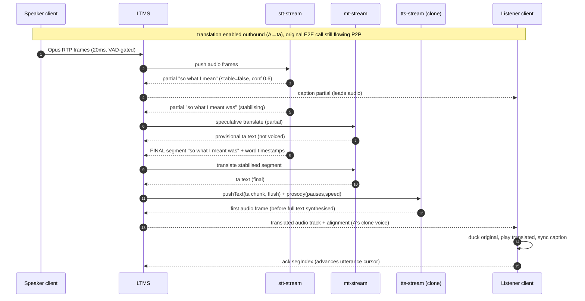
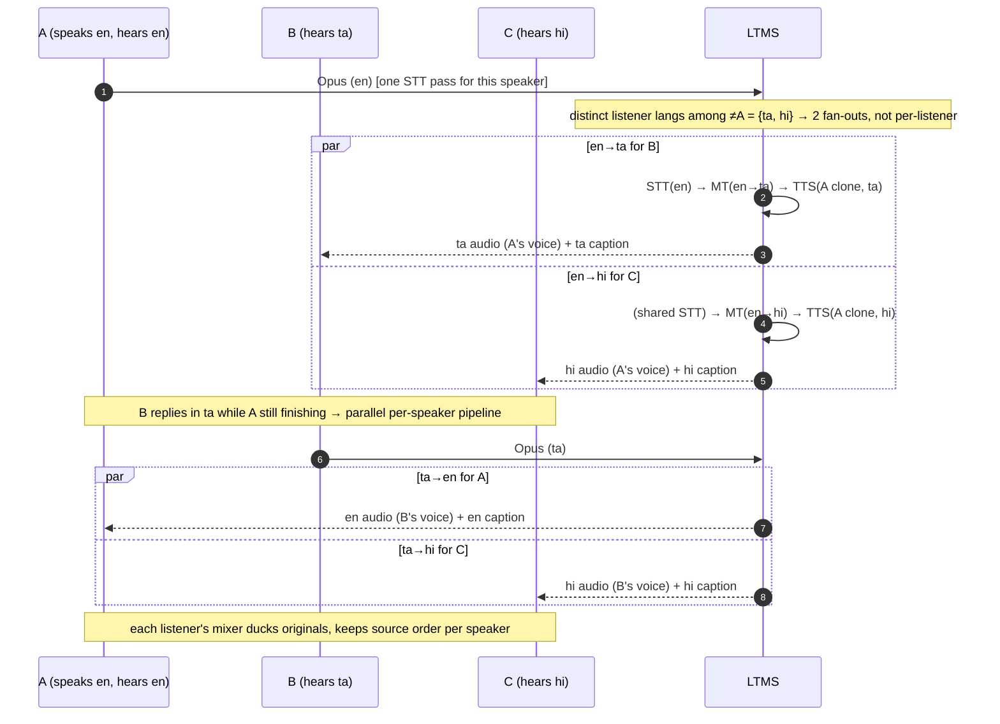
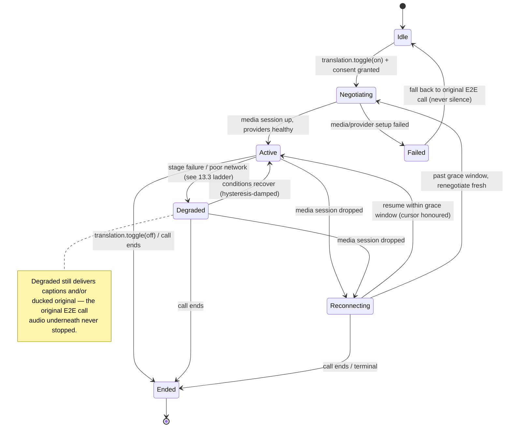

# 03 — Live Voice Translation (Priority 2, Workstream 3 · FLAGSHIP)

**Status:** PLANNING ONLY. Design document — no production code, config, schema,
feature flag, or Priority-1 file is changed by this document. Nothing here is
scheduled for implementation until the owner authorises it.

**Owner execution order (roadmap V2 Amendment 2026-08-01):** ① push → ②
translation platform → **③ live voice translation (this document)** → ④
adaptive transport → ⑤ remaining Priority-1 crypto.

**Controlling inputs (read alongside this):**
`docs/adr/011-live-voice-translation.md` (the ADR this document expands and
proposes improvements to), `docs/MASTER-ENGINEERING-ROADMAP-V2.md` §6 + rule 10
+ the Owner Amendment, `docs/adr/010-translation-platform.md` (the provider
platform this shares), `docs/adr/012-adaptive-communication-network.md`
(Workstream 4), `docs/adr/002-realtime-centrifugo-abstraction.md` (the transport
seam and its one hard rule), `docs/13-PRODUCT-AUDIT.md` §2/§9/§10 (the shipped
async pipeline), `docs/17-CRYPTO-IMPLEMENTATION-GUIDE.md` (the E2EE posture this
must not silently cross).

**Grounding commit context:** the async voice-note pipeline this shares
adapters with is `web/src/views/chat.js:4039 sendVoice` → `web/src/lib/voice.js`
(`sttBlob`/`ttsClone`/`cloneVoice`) → `web/api/voice.js` (the ElevenLabs proxy)
→ `web/src/lib/translate.js:200 translateText`. Calls are `web/src/lib/rooms.js`
(`conn.startCall`/`acceptCall`/`endCall`, states `idle→ringing-out/ringing-in→
connecting→active`) over the WebRTC perfect-negotiation path in
`web/src/lib/socket-transport.js` (`ensurePc`/`handleRtcSignal`), TURN minted by
`web/api/turn` (`web/src/net.js readyRTC`). Every file path in this document is
absolute-from-repo-root and load-bearing.

---

## Table of contents

1. [Executive summary, goals/non-goals, latency target](#1-executive-summary)
2. [Motivation — why a DEDICATED architecture](#2-motivation--why-dedicated)
3. [End-to-end streaming architecture](#3-end-to-end-streaming-architecture)
4. [Latency budget](#4-latency-budget)
5. [Voice / emotion / prosody preservation](#5-voice-emotion-prosody-preservation)
6. [Multilingual conversations (N-way)](#6-multilingual-conversations)
7. [Provider strategy](#7-provider-strategy)
8. [Transport & timing](#8-transport--timing)
9. [API / streaming contracts](#9-api--streaming-contracts)
10. [Sequence diagrams](#10-sequence-diagrams)
11. [State machines](#11-state-machines)
12. [Privacy model](#12-privacy-model)
13. [Quality scoring & QoS](#13-quality-scoring--qos)
14. [Cost estimation](#14-cost-estimation)
15. [Database / state changes](#15-database--state-changes)
16. [Observability](#16-observability)
17. [Benchmark plan](#17-benchmark-plan)
18. [ADR-011 improvements](#18-adr-011-improvements)
19. [Conflicts & review notes](#19-conflicts--review-notes)

---

## 1. Executive summary

Live Voice Translation lets a participant speak naturally in one language while
each other participant hears the **meaning in their own language, rendered in
the speaker's own enrolled voice**, with live captions leading the audio. It is
Spot Me's primary product differentiator (roadmap §4/§6) and the only one of the
four flagship workstreams that is a genuinely new realtime subsystem rather than
a hardening of shipped code.

This document specifies a **dedicated real-time pipeline** — capture → streaming
STT → streaming MT → (optional) streaming LLM correction → streaming TTS
re-voiced in the speaker's clone → per-listener playback — in which **partial
results flow through every stage** so no stage waits for a complete predecessor.
The pipeline runs inside a new server-side component, the **Live Translation
Media Service (LTMS)**, which is the single declared point where call audio
exists in cleartext (§12). The existing E2E call path is untouched and remains
the permanent fallback: translation OFF, or any pipeline failure, leaves the
original encrypted call exactly as it is today.

### 1.1 Goals

- Real-time captions (partial + final), leading the audio always.
- Translated speech in the listener's language.
- Preserve **speaker identity** (the enrolled ElevenLabs clone).
- Preserve **emotion, pauses, pacing** (prosody transfer, staged — §5).
- **Multilingual conversations** with >2 participants and mixed languages (§6).
- **Lowest practical latency: MVP < 2.5 s end-to-end**, production < 1 s where
  provider capabilities allow (§4).
- No hard provider dependency; route/fall back on quality, availability, cost,
  response time (roadmap rule 10; §7).
- Original-audio + captions fallback, never silence (§13).

### 1.2 Non-goals (MVP)

- Not always-on: explicit, per-call, per-direction opt-in (ADR-011).
- No change to `web/src/views/chat.js` voice-note code (the async pipeline
  stays byte-for-byte as shipped).
- Full research-grade prosody/emotion cloning is **staged** — MVP delivers
  speaker identity + pause/pacing alignment; expressive emotion transfer is a
  later tier (§5.4, §18).
- On-device STT/TTS is a future track (§18.6), not MVP.
- **Group (>2) is a design target here but a post-MVP delivery** — this is a
  direct tension with ADR-011's "no group-call translation in MVP" non-goal and
  is escalated in §19 (C-1).

### 1.3 The hard latency target, and how the budget is split

The MVP gate is **< 2.5 s end-to-end, measured per segment**: from the moment a
*stabilisable source unit* (a clause/segment closed by the STT endpointer or the
max-segment timer) is complete in the speaker's audio, to the first sample of
that unit's translated audio leaving the listener's speaker. A second, tighter
SLO governs captions: **onset-to-partial-caption < 1.0 s**, which is met by
construction because captions skip MT-stabilisation and TTS.

The 2.5 s is **not** the sum of the stage costs — serial, the stages exceed it.
It is met only by pipelining: speculative MT/TTS on partial hypotheses so that
when a segment stabilises, most of its translation is already in flight. The
critical path is `capture-uplink → STT-stabilise → MT-finalise-delta →
TTS-first-audio → downlink → jitter-buffer`, and the two dominant, tunable terms
are **STT stabilisation** and **TTS first-audio**. Full numbers in §4.

---

## 2. Motivation — why DEDICATED

### 2.1 The foundation already ships, in batch form

`web/src/views/chat.js:4039 sendVoice` already runs the exact three stages this
feature needs, asynchronously, for voice notes: `sttBlob` (ElevenLabs
`scribe_v1`) → `translateText` (the multi-provider engine) → `ttsClone`
(ElevenLabs `eleven_v3` → `eleven_multilingual_v2` fallback), then sends the
re-voiced mp3 through the ordinary attachment path. It preserves the speaker's
identity via the one-clone-per-profile `voiceId` (`db.profile().voiceId`). None
of WhatsApp / Signal / Telegram ships this. **The owner directive is to base the
live architecture on this working pipeline — the same three stages, re-conceived
as streams — and explicitly NOT to extend the voice-note code.**

### 2.2 Why the async pipeline cannot simply be "made live"

The batch pipeline is correct for its job and wrong for this one on every axis
that matters at realtime:

| Axis | Async voice-note pipeline (shipped) | Live voice translation (this design) |
|---|---|---|
| Unit of work | one complete clip, known length | an unbounded stream of 20 ms frames |
| STT call | one `POST /speech-to-text` of the whole clip | a persistent streaming session with partial + endpointed results |
| Translation | one `translateText` on the full transcript | incremental: stabilised segments translate as they close |
| TTS call | one `POST /text-to-speech/{id}` returning a whole mp3 | input-streaming WebSocket; first audio before the sentence is complete |
| Failure mode | step fails → user re-sends; nothing is lost | must degrade mid-utterance without silence, then recover |
| Buffering | none — it is a file | jitter buffers on ingest and playout; endpointing; barge-in |
| Cancellation | `pendingClip` identity check (`chat.js:4077`) | interruption / barge-in cancels in-flight TTS for superseded segments |
| Deadlines | 45 s per step (`STEP_TIMEOUT_MS`) | ~hundreds of ms per stage; overshoot degrades, never blocks |
| Concurrency | one clip at a time | N speakers × M listener languages, live |
| Timing fidelity | none needed | pauses, pacing, and source→target alignment must survive |

Sharing the batch buffers, deadlines, and UI would force one to serve two
opposite masters. So the live form is a **separate subsystem** with its own
buffers, control loop, and UI, that **reuses only the provider adapters and the
voice clones.**

### 2.3 What is shared vs what is not

**Shared:**
- **Provider adapters** — the ADR-010 provider abstraction (`translate`,
  `detect`, plus new `stt-stream`, `tts-stream` capabilities). ElevenLabs, the
  MT engines (Google/Azure/Sarvam), and the LLM legs (OpenAI/Gemini/Anthropic)
  register once and are consumed by both the batch and live pipelines.
- **Voice clones** — the one-per-profile ElevenLabs `voiceId` and its enrollment
  / consent / deletion lifecycle (`web/src/lib/voice.js`,
  `web/src/views/profile.js:443`). Live TTS re-voices with the same clone. No new
  cloning flow; no second clone.
- **Credential custody** — provider keys stay server-side behind the authed
  proxy pattern (`web/api/voice.js` `gateVendorProxy`), never in the bundle.
- **Honesty rules** — persistent AI-generated-audio indicator; both transcripts
  kept; captions marked machine-made.

**NOT shared:**
- The voice-note capture/confirm/send UI and its `sendVoice` state machine.
- The 45 s step deadlines and the file-shaped STT/TTS REST calls.
- The batch translation memory cache (`translate.js` `memory` map) — live uses a
  short rolling **conversation context** window instead (§7.3).
- The attachment delivery path (`conn.deliverAttachment`) — live audio never
  becomes a stored attachment.
- The E2E room-key media path — LTMS is a **declared plaintext boundary** (§12),
  not a room peer, and cannot be, because it must read audio the room key hides.

---

## 3. End-to-end streaming architecture

### 3.1 The dedicated component: Live Translation Media Service (LTMS)

The LTMS is a new server-side media component. When a participant enables
translation for a call direction, their client publishes a **second, dedicated
Opus audio stream** of its own microphone to the LTMS over a purpose-built media
transport (WebRTC to the LTMS; §8). The **original call audio keeps flowing P2P,
end-to-end encrypted, untouched** — the translated stream is additive, so the
untranslated call is always one tap (or one failure) away.

The LTMS terminates that media session (it is the DTLS endpoint; it sees
cleartext audio — the declared exception, §12), runs the streaming pipeline, and
returns to each listener, over the same media session, (a) a translated audio
track re-voiced in the speaker's clone, and (b) a caption/control data channel.
The listener's client mixes/ducks the translated track against the original per
§6.4.

The LTMS holds only in-memory ring buffers for the duration of an utterance;
nothing is persisted except metrics and the session envelope (§15). Provider
adapters are called from the LTMS, not the client, so N listener languages fan
out from one STT pass and share credentials, rate limits, and circuit-breaker
state.

### 3.2 Pipeline stages (all pipelined; partial results flow)

```
                                   ┌─────────────────────────── LTMS (server, declared plaintext boundary §12) ───────────────────────────┐
 Speaker client                    │                                                                                                        │
 ┌───────────┐   Opus 20ms RTP     │  ┌────────────┐   PCM frames   ┌───────────────┐  partial+final  ┌──────────────┐  stable segments      │
 │ mic       │────────────────────▶│─▶│ ingest +   │──────────────▶│ streaming STT │────────────────▶│ segmenter /  │──────┐                │
 │ Audio/    │  (dedicated stream,  │  │ jitter buf │               │ (partials +   │   transcript    │ endpointer + │      │                │
 │ getUserMedia│  additive to the    │  │ + VAD      │               │  endpointing) │                 │ lang detect  │      ▼                │
 └───────────┘  E2E P2P call)      │  └────────────┘               └───────────────┘                 └──────────────┘  ┌──────────────┐     │
                                   │                                        │  partial captions (lead)                  │ conversation │     │
                                   │                                        ▼                                           │ context win. │     │
                                   │                                 (to captions fan-out)                              └──────┬───────┘     │
                                   │                                                                                            ▼             │
                                   │  ┌──────────────┐  streamed tokens  ┌─────────────────────┐  corrected  ┌────────────────────────────┐ │
                                   │  │ streaming    │◀─────────────────│ streaming MT         │◀───────────│ (optional) streaming LLM   │ │
                                   │  │ TTS (clone   │   translated txt  │ incl. speculative    │  segment    │ correction — folded into   │ │
                                   │  │ voice, per   │─────────────────▶│ MT on partials       │            │ the MT-LLM leg or skipped  │ │
                                   │  │ target lang) │  first-audio      └─────────────────────┘            └────────────────────────────┘ │
                                   │  └──────┬───────┘                                                                                       │
                                   │         │  translated Opus + alignment meta, per (utterance,targetLang)                                  │
                                   └─────────┼──────────────────────────────────────────────────────────────────────────────────────────────┘
                                             │ RTP track + caption/control data channel, per listener
                                             ▼
                                   Listener client(s): jitter buffer → duck original → play translated + render captions
```

Stage responsibilities:

1. **Capture** (speaker client) — `getUserMedia({audio})` at 48 kHz, AudioWorklet
   framing to 20 ms Opus, client-side VAD to suppress silence uplink. Reuses the
   HTTPS/mic-permission handling already in `rooms.js conn.startCall`.
2. **Ingest + jitter buffer** (LTMS) — de-jitter RTP, resample to the STT
   provider's rate (16 kHz mono for most), maintain a small ring buffer.
3. **Streaming STT** — persistent session emitting *partial* hypotheses
   (revisable) and *endpointed/final* segments, with word-level timestamps and
   confidence. Partials drive captions immediately; only stabilised text is ever
   voiced.
4. **Segmenter / endpointer + language detect** — closes translatable units on
   endpoint or a max-segment timer; auto-detects source language on early audio,
   sticky per speaker but revisable (ADR-011 pipeline).
5. **Conversation context window** — a rolling window of recent stabilised
   segments feeds the MT/LLM legs (ADR-010 §3), fenced as untrusted attacker
   text (nonce fences, never instructions).
6. **Streaming MT** — translates stabilised segments immediately; runs
   *speculative* translation on stable-enough partials so the finalise delta is
   small (§4). Emits translated text incrementally per target language.
7. **Streaming LLM correction (optional)** — a faithfulness-first pass that fixes
   disfluencies/context; folded into a single streaming LLM-translate leg where
   one provider does translate+correct, or skipped entirely for high-confidence
   segments. First to be dropped under load (§13.3).
8. **Streaming TTS** — ElevenLabs input-streaming WebSocket in the speaker's
   clone voice, per target language, emitting audio before the segment text is
   complete; prosody controls applied per §5.
9. **Playback** (listener client) — playout jitter buffer, duck/replace original,
   render captions ahead of audio.

### 3.3 Why this shape meets the constraints

- **Dedicated** — none of steps 2–8 touches `chat.js`, the room key, or the
  async pipeline. The LTMS is a new service; the client work is a new media
  session additive to the call.
- **Pipelined** — every arrow is a stream; partials flow; TTS starts before MT
  finishes a sentence, MT starts before STT closes a segment.
- **No hard dependency** — each of STT/MT/LLM/TTS is an ADR-010 adapter with
  independent failover (§7.4); losing any one degrades one stage, not the call.
- **Never silence** — the original E2E audio path never stopped; the degradation
  ladder (§13.3) always lands on it.

---

## 4. Latency budget

**Measurement point (proposed, ratify per §19 C-3):** primary SLO is
*segment mouth-to-ear* — source-clause-complete → first translated audio sample
at the listener. Secondary SLO is *onset-to-partial-caption*.

Per-segment budget, MVP targets. "Serial" is the cost if stages ran one after
another; "Critical path (pipelined)" is the residual cost after speculative
overlap, and is what the SLO is measured against.

| Stage | Serial cost | On critical path | Lever / note |
|---|---|---|---|
| Capture + VAD + Opus encode + uplink to LTMS | 120–250 ms | **200 ms** | 20 ms frame + client encode + one network hop (WebRTC/TURN) |
| Streaming STT — first partial | 150–300 ms | *(overlapped)* | feeds captions; NOT on the audio critical path |
| Streaming STT — segment stabilisation / endpoint | 400–800 ms | **700 ms** | **dominant term**; endpoint timeout + finalisation; gates voiced text |
| Streaming MT — full segment | 200–400 ms | **150 ms** | speculative MT ran on partials; only the finalise *delta* remains |
| Streaming LLM correction | 200–400 ms | **0–250 ms** | folded into MT-LLM leg, or skipped for high-confidence (dropped first under load) |
| Streaming TTS — first audio byte | 300–700 ms | **500 ms** | **second dominant term**; ElevenLabs Flash/Turbo input-streaming |
| Downlink LTMS → listener | 80–200 ms | **150 ms** | WebRTC RTP, one hop |
| Jitter / playout buffer | 150–300 ms | **200 ms** | adaptive; trades latency for smoothness under loss |
| **Total, naive serial** | **~1.6–3.35 s** | — | exceeds the gate — proves overlap is mandatory |
| **Total, pipelined critical path (LLM off)** | — | **~1.9 s p50** | 200+700+150+500+150+200 |
| **Total, pipelined critical path (LLM on)** | — | **~2.15 s p50** | +250 ms correction |

Critical-path identity:

```
T_segment ≈ capture_uplink + STT_stabilise + MT_finalise_delta
            + (LLM_correct | 0) + TTS_first_audio + downlink + jitter
```

**Where streaming buys the time.** Serial worst-case is ~3.35 s; the gate is
2.5 s. Three overlaps close the gap:

1. **Speculative MT on partials** — STT partials that are stable across two
   frames are translated ahead of the endpoint, so MT's on-path cost collapses
   from 200–400 ms to a ~150 ms finalise delta. (Speculative output is never
   *voiced* — only stabilised text reaches TTS — but it is prepared.)
2. **TTS input-streaming** — TTS begins synthesising from the first translated
   tokens; first-audio arrives before the sentence is fully translated. This is
   the difference between the batch `POST /text-to-speech` (whole mp3) and the
   live WebSocket `stream-input`.
3. **LLM correction folded or skipped** — one streaming LLM leg that translates
   *and* corrects removes a serial hop; and high-confidence segments (§13.1) skip
   correction entirely.

**Production target < 1 s** is reached only where a provider does streaming
STT with sub-300 ms stabilisation *and* a sub-150 ms-model TTS (e.g. ElevenLabs
Flash v2.5 class), on a good network, with LLM correction off and pair-tuned
routing. It is a benchmark outcome, not an assumption (roadmap §8).

**Tail behaviour:** p95 target < 3.2 s for segment mouth-to-ear; p95 caption
< 1.5 s. Under the degradation ladder (§13.3), captions continue to meet their
SLO even when translated audio is dropped.

---

## 5. Voice / emotion / prosody preservation

The hard problem: STT→MT→TTS is a *text bottleneck* — the source waveform's
identity, emotion, and timing do not survive a round-trip through text unless
they are explicitly extracted and re-applied. This section is where the flagship
promise is kept or broken, and it is deliberately **staged** because full
expressive transfer is at the research frontier.

### 5.1 Speaker identity (MVP — solved)

The translated audio is synthesised with the **speaker's enrolled ElevenLabs
clone** (`voiceId`), exactly as the shipped voice-note path does. This is the one
preservation axis that is already proven in production. Unenrolled speakers get a
neutral, **labelled** voice (ADR-011) — never a silent substitution, never
another person's clone (roadmap §6.4: no cloning from intercepted audio).

### 5.2 Pauses & pacing (MVP — alignment, not guesswork)

The streaming STT emits **word-level timestamps**; the segmenter records a
**pause map** (inter-word gaps above a threshold) and the source segment's
duration. On synthesis:

- **Pause preservation** — silences at source pause positions are re-inserted at
  the corresponding target segment boundaries (the target rarely splits
  identically, so pauses attach to the nearest target clause boundary).
- **Pacing** — the target segment is time-budgeted to the source segment's
  duration ± a bounded factor; TTS speed/`speed` control is nudged within a safe
  range (over-compression sounds robotic, so the range is capped and the playout
  buffer absorbs the rest).
- **Turn timing** — segment ordering is preserved per speaker so a listener hears
  translations in the order the speaker said them, even when TTS for a later,
  shorter segment finishes first (reorder buffer at playout).

### 5.3 Length mismatch across languages (MVP — the structural problem)

The same meaning takes different time in different languages (German compounds,
Tamil agglutination, Japanese honorifics). Left alone, translated audio drifts
ahead of or behind the conversation. Mitigations, in order of preference:

1. **Segment-level elasticity** — absorb small mismatches in the per-segment
   playout budget (the jitter buffer flexes ±150 ms).
2. **Bounded time-scaling** — nudge TTS speed within ±15 % before it degrades
   audibly.
3. **Catch-up on pauses** — when the speaker pauses, the pipeline uses that
   natural gap to let a lagging translation catch up rather than compressing
   speech.
4. **Honest drift cap** — if cumulative drift exceeds a bound, the captions stay
   truthful (they always lead) and the audio re-syncs at the next endpoint rather
   than accumulating lag indefinitely. Drift is a first-class metric (§16).

### 5.4 Emotion & prosody transfer (STAGED — MVP basic, later full)

- **MVP (Tier 0):** speaker identity (5.1) + pause/pacing alignment (5.2) +
  ElevenLabs `eleven_v3` / expressive model defaults. This already reads as "the
  speaker's voice, natural rhythm" — the shipped voice-note bar.
- **Tier 1 (fast follow):** coarse **emotion tags** derived from source
  acoustic features (energy, pitch range, speech rate → neutral/animated/subdued)
  passed to the TTS as style controls or `eleven_v3` audio-tag hints. This is
  segment-granular, not sample-accurate.
- **Tier 2 (research track):** true **prosody transfer** — source pitch contour
  and stress mapped onto the target utterance — via an expressive
  speech-to-speech-translation model (e.g. a SeamlessExpressive-class model, or a
  future ElevenLabs expressive-STS capability) that bypasses the text bottleneck
  for the prosody channel while text still drives the words. Treated as an
  alternative provider adapter (§7), gated on benchmarked fidelity (§17).

**The latency trade-off must be stated:** the most expressive ElevenLabs model
(`eleven_v3`) has higher first-audio latency than Flash/Turbo. The router (§7.4)
picks the expressive model when the latency budget has headroom and the fast
model when it does not; emotion fidelity is therefore *adaptive*, and the choice
is observable. This is escalated as C-4 (§19): the owner must accept that MVP
emotion fidelity is "basic + adaptive", not "full".

---

## 6. Multilingual conversations (N-way)

**Scope note:** the full N-way design below is the *target architecture*. ADR-011
scopes MVP to 1:1; delivering >2 is escalated as C-1 (§19). The design is
presented in full because the task requires it and because the LTMS is built
N-way from day one even if the MVP UI exposes only 1:1.

### 6.1 Per-participant language

Each participant has a **listen language** (what they want to hear/read) and an
implicit **speak language** (auto-detected per utterance, sticky per speaker,
revisable — §3.2 step 4). Listen language defaults to `db.profile().lang` and is
changeable mid-call via a control message (§9.4) without renegotiating media.

### 6.2 Who-hears-what matrix

For a call with participants P = {A, B, C} and per-listener languages
L(A)=en, L(B)=ta, L(C)=hi, and a speaker S=A uttering in en:

| Speaker A says (en) | A hears | B hears | C hears |
|---|---|---|---|
| translated audio | *(nothing added — it's their own voice)* | en→ta, A's clone | en→hi, A's clone |
| captions | *(own transcript, optional)* | en source + ta caption | en source + hi caption |

Generalised: for an utterance by speaker `s` in language `lang(s)`, the LTMS
produces one translation per **distinct listen-language among listeners ≠ s**.
Distinct-language fan-out (not per-listener) means a 5-person call where everyone
wants English costs **one** translation, not four.

### 6.3 N-way routing

- **One STT pass per active speaker** (not per listener) — audio is the same
  regardless of who listens.
- **One MT+TTS fan-out per distinct target language** among the listeners of
  that speaker.
- **Concurrency bound:** simultaneous *active speakers* × *distinct target
  languages* is the true cost driver and is capped per call (§14.3). Cross-talk
  (two speakers at once) is handled by per-speaker pipelines that run in
  parallel; the listener mixer (§6.4) ducks/queues per source.
- **Speaker attribution** — every caption and every translated audio track
  carries `speakerId`, so listeners always know who is talking and clients can
  spatialise or label (ADR-011: unenrolled speakers labelled).

### 6.4 Per-listener mix

Each listener's client runs a small mixer:

- **Duck, don't mute** — the original speaker's audio is ducked (attenuated, not
  removed) under the translated track, so overlap, laughter, and tone remain
  audible and the listener can fall back instantly. (ADR-011: "ducks under the
  original when live captions suffice.")
- **Per-source reorder buffer** — translated segments play in source order per
  speaker (§5.2).
- **Caption lane** — captions render ahead of audio, marked machine-made, with a
  confidence cue on low-confidence segments (§13.1).
- **Barge-in** — when the listener themselves starts speaking, their own
  translated-audio playback yields (they don't need to hear a translation of
  someone they just interrupted); §8.4.

---

## 7. Provider strategy

Everything here is the ADR-010 provider platform, extended with streaming
capabilities. **No provider is a hard dependency** (roadmap rule 10); every stage
degrades independently.

### 7.1 Streaming capability registrations (extend ADR-010)

ADR-010 registers per-capability providers. This feature adds two streaming
capabilities and consumes existing ones:

| Capability | Candidate providers (illustrative, benchmarked before selection) | Notes |
|---|---|---|
| `stt-stream` | ElevenLabs Scribe (streaming), Deepgram, Google Cloud STT streaming, Azure Speech, AssemblyAI realtime, Soniox, Gladia | must emit partials + word timestamps + endpointing + per-word confidence; retention terms gate inclusion (§12) |
| `mt-stream` | Google Cloud Translation v2, Azure Translator v3, Sarvam (Indic), streaming LLM-translate legs (OpenAI/Gemini/Anthropic) | REST MT called per stabilised segment (already low-latency); LLM legs stream tokens |
| `llm-correct` | OpenAI, Gemini, Anthropic (the shipped adjudicator panel) | streaming; folded into `mt-stream` LLM leg where one provider does both |
| `tts-stream` | **ElevenLabs** (input-streaming WS; Flash/Turbo/`eleven_v3`), plus a fallback neutral-voice TTS | ElevenLabs is default because it holds the clones; fallback loses the clone, keeps intelligibility |
| `voice-clone` | ElevenLabs (shipped, one clone per profile) | unchanged; shared with voice notes |

Providers declare, per ADR-010 §1: supported language pairs, script coverage,
**latency class** (first-token / first-audio), **cost class** (§14), and — new
for this feature — **retention terms** (zero-retention capable or not, §12).

### 7.2 The streaming adapter interface (shape, not code)

The batch adapters are request/response. Streaming needs a session contract.
Illustrative interface (planning shape — implemented when scheduled):

```
interface StreamingSttAdapter {
  open(opts: {sourceLang?, sampleRate, model}) -> SttSession
}
interface SttSession {
  pushAudio(pcmFrame)                    // 20ms frames
  onPartial(cb: (seg:{text, tStart, tEnd, words[], conf, stable}) => void)
  onFinal(cb:   (seg:{text, tStart, tEnd, words[], conf, lang}) => void)
  flush() ; close()
  health() -> {rttMs, firstPartialMs, errorRate}
}

interface StreamingTtsAdapter {
  open(opts: {voiceId, targetLang, model, prosody, speed}) -> TtsSession
}
interface TtsSession {
  pushText(chunk, {flush:bool})          // input-streaming
  onAudio(cb: (opusFrame, {alignment}) => void)   // alignment = char→time
  cancel()  // barge-in: abandon in-flight synthesis for a superseded segment
  close() ; health() -> {firstAudioMs, errorRate}
}
```

The existing `web/api/voice.js` ops (`stt`/`tts`/`clone`/`unclone`) become the
**batch registration** of the ElevenLabs adapter; the streaming sessions above
are a **second registration** of the same provider. Both share credentials and
rate-limit accounting; neither rewrites the other.

### 7.3 Context preservation (shared with ADR-010 §3)

A rolling **conversation-context window** (recent stabilised segments, per
speaker + cross-speaker) feeds the MT/LLM legs so pronouns, entities, and
idioms translate correctly (ADR-010's "varen is a promise, not a description"
example). Context is session-scoped, **never persisted server-side**, and rides
inside nonce fences as untrusted text (ADR-010 §3; §12 here).

### 7.4 Adaptive routing + failover

Per ADR-010 §2, a routing table (data, not branches) scores candidates per
request on: **pair-fitness** (Sarvam for Indic MT; a provider's language
coverage for STT/TTS), **measured latency class** (first-partial / first-audio,
the levers from §4), **rolling quality score** (§13.1), **availability**
(circuit-breaker state), **cost class** (§14), and **retention eligibility**
(§12 — a non-compliant provider is never routed to, whatever its quality;
roadmap rule 10).

**Mid-utterance failover** — because sessions are long-lived, a provider can die
mid-utterance:

- **STT death mid-utterance** — the ingest buffer holds the last ~1–2 s; open a
  fresh session on the failover provider, replay the buffered audio, resume. The
  segment may re-partial (captions revise, which they are allowed to do); voiced
  text only ever comes from stabilised segments, so no wrong audio is emitted.
- **TTS death mid-utterance** — cancel the dead `TtsSession`, re-open on the
  fallback for the *remaining* text of the current segment; already-played audio
  is not repeated (track the alignment char offset). If the fallback lacks the
  clone, the remainder plays in the neutral labelled voice and the indicator
  flips to "generic voice" — honest, not silent.
- **MT/LLM death** — re-issue the current segment to the next candidate;
  worst-case drop LLM correction (§13.3) and ship the raw MT.

Failover is **hysteresis-damped** (ADR-012 §3 pattern) so a flaky provider does
not cause per-segment flapping.

---

## 8. Transport & timing

### 8.1 WebRTC vs the app's socket layer for media

The app's realtime layer (`web/src/lib/socket-transport.js`) is a **ciphertext
relay**: it moves sealed `action` frames, and ADR-002's hard rule is that key
material never crosses the adapter. Call **media** already bypasses that relay —
it rides real `RTCPeerConnection`s built in `socket-transport.js ensurePc`, with
SDP/ICE relayed as sealed `rtc` frames (`handleRtcSignal`), so **call audio never
touches the server** today.

Live translation needs the opposite of the call's E2E property for the
*translation stream only*: the LTMS must read the audio. Decision:

- **Media to the LTMS uses WebRTC** (a `RTCPeerConnection` from the speaker's
  client to the LTMS), for the same reasons the call does: RTP gives native
  packet timing, sequence numbers, NACK/PLC, and jitter handling; DTLS-SRTP
  secures the client↔LTMS hop; and it **reuses the shipped TURN infrastructure**
  (`web/api/turn`, `web/src/net.js readyRTC`, Cloudflare TURN) for NAT traversal
  on the carrier-grade-NAT networks the code already fights (net.js's Jio/Airtel
  note).
- **Signalling to the LTMS uses a dedicated socket namespace** `/xlate` (§9),
  NOT the `rtc` frames — those are sealed with the room key the LTMS cannot read,
  and the LTMS is deliberately not a room peer.
- **A socket-framed fallback** (binary Opus frames over `/xlate` with
  seq+timestamp) exists for environments where a second WebRTC session to the
  LTMS cannot be established; it is lower-quality (no RTP QoS) and higher-latency,
  used only when WebRTC-to-LTMS fails.

### 8.2 Packet timing & buffering

- **Uplink (client→LTMS):** 20 ms Opus frames, RTP timestamped. Client VAD gates
  silence to save uplink and provider cost.
- **Ingest jitter buffer (LTMS):** small adaptive buffer (target ~40–80 ms) to
  de-jitter before STT; STT quality drops sharply on reordered/gapped audio.
- **Playout jitter buffer (listener):** adaptive 150–300 ms (§4), trading latency
  for smoothness; expands under loss, contracts on clean networks.
- **Reorder buffer (listener):** per-speaker, to keep source order (§5.2).

### 8.3 QoS

- RTP for translated audio downlink → NACK/PLC/FEC as available, adaptive Opus
  bitrate under loss (mirrors roadmap Priority-5 call QoS).
- The translation stream is **secondary** to the E2E call audio: under
  contention, the client prioritises the original call (the guaranteed path) and
  lets the translation degrade (§13.3). Translation must never starve the call.

### 8.4 Interruption handling (barge-in)

- **Speaker changes / overlap** — the endpointer splits on speaker change
  (ADR-011). A new stabilised segment from a different speaker opens a parallel
  pipeline; it does not corrupt the first speaker's in-flight segment.
- **Self-correction / superseded partials** — if a partial that was speculatively
  translated is revised by later audio, the speculative TTS for it is **cancelled
  mid-synthesis** (`TtsSession.cancel`), and only the corrected stabilised
  segment is voiced. This is the live analogue of the batch pipeline's
  `pendingClip` cancellation (`chat.js:4077`), but at segment granularity and
  mid-audio.
- **Listener barge-in** — when a listener starts speaking, their translated-audio
  playout ducks/yields so they are not talking over a translation (§6.4).

### 8.5 Reconnect handling (resume mid-call)

Networks drop; the code already treats reconnect as the common path
(`socket-transport.js rejoin`, `net.js` TURN re-fetch). Translation must resume,
not restart:

- **Session token + cursor** — the `/xlate` session has an id and a per-speaker
  **utterance cursor**. On reconnect the client re-establishes the media session
  and presents the cursor; the LTMS resumes emitting from the last acknowledged
  segment. In-flight (un-acked) segments are re-sent.
- **Media renegotiation** — a fresh `RTCPeerConnection` to the LTMS via ICE
  restart / TURN re-fetch (the call path's perfect-negotiation pattern applies).
- **Bounded resume window** — the LTMS holds session state for a short grace
  period (e.g. 30 s) so a brief drop resumes seamlessly; past it, the session is
  torn down and re-negotiated fresh (captions/audio simply resume live, no
  backfill of missed speech — translation is inherently live, not replayable).
- **Fallback during the gap** — while the translation session is down, the
  original E2E call audio continues (it is a different transport), so a reconnect
  is heard as "translation briefly returned to original", never as a dropped
  call.

### 8.6 Interaction with Workstream 4 (adaptive transport, ADR-012)

- **Signalling** (`/xlate` control) rides whatever internet transport ADR-012's
  supervisor has chosen for the app (Socket.IO / Centrifugo) — it is
  metadata-class control traffic and benefits from the supervisor's health
  routing.
- **Media to the LTMS is internet-only** and does not ride Bluetooth/mesh:
  offline transports (ADR-012 §2) carry E2E ciphertext envelopes with no server
  in the path, and the LTMS *is* a server that must read cleartext — so when the
  adaptive layer has dropped to an offline transport, **live translation is
  simply unavailable** (there is no cloud to reach), and the UI states that
  honestly (ADR-012 §1: honesty is not a choice). This is a clean invariant: live
  translation requires connectivity to the LTMS; offline messaging does not use
  the LTMS at all.
- **No conflict with ADR-002's hard rule** — the room transport still never sees
  a key; the LTMS is a separate, declared media boundary, not the room adapter.

---

## 9. API / streaming contracts

All schemas are **planning shapes**, JSON unless noted. A new socket namespace
`/xlate` carries control; WebRTC carries media (§8.1). Auth reuses the bearer /
guest-JWT pattern (`web/src/lib/auth-headers.js`, the `/rooms` handshake).

### 9.1 Session setup

Client → `/xlate` `session.start`:

```json
{
  "callId": "<roomId of the underlying call>",
  "selfId": "<authenticated userId>",
  "role": "speaker|listener|both",
  "speakLang": "auto",
  "listenLang": "en",
  "voiceId": "<caller's ElevenLabs clone id, or null>",
  "consent": { "direction": "outbound|inbound|both", "granted": true, "ts": 169... },
  "caps": { "webrtcToLtms": true, "expressive": true }
}
```

LTMS → client `session.ready`:

```json
{
  "sessionId": "xl_9f...",
  "mediaTransport": "webrtc|socket-fallback",
  "sfu": { "iceServers": [ ... ] },        // reuses /api/turn creds
  "targets": ["en","ta"],                   // distinct listener languages for this speaker
  "resumeGraceMs": 30000
}
```

Media negotiation then proceeds over WebRTC (offer/answer/ICE on `/xlate`,
distinct from the sealed room `rtc` frames).

### 9.2 Audio-in frame (uplink)

Primary: WebRTC Opus RTP track (no app-level framing — RTP owns timing).
Socket-fallback framing (only when `mediaTransport:"socket-fallback"`):

```json
{ "sessionId":"xl_9f...", "speakerId":"A", "seq":1423, "tsMs":48120,
  "codec":"opus", "durMs":20, "b64":"<opus frame>", "vad":true }
```

### 9.3 Partial-caption frame (downlink, data channel / `/xlate` `caption`)

```json
{ "sessionId":"xl_9f...", "utteranceId":"A#87", "speakerId":"A",
  "segIndex":3, "srcLang":"en", "targetLang":"ta",
  "srcText":"so what I meant was",           // original (source of truth)
  "text":"நான் சொன்னது என்னவென்றால்",         // translated caption
  "stable":false, "confidence":0.71,
  "tStartMs":49020, "tEndMs":50110, "machine":true }
```

`stable:false` captions may revise; `stable:true` is final. `confidence` below a
threshold drives the low-confidence visual cue (§13.1). `machine:true` is the
honesty flag — captions are always marked machine-made.

### 9.4 Translated-audio-out (downlink)

Primary: a WebRTC audio track per `(utteranceId,targetLang)` tagged via the
data-channel manifest:

```json
{ "sessionId":"xl_9f...", "utteranceId":"A#87", "speakerId":"A",
  "targetLang":"ta", "voice":"clone|generic", "voiceId":"<id>",
  "trackId":"<mid>", "alignment":[[0,"நான்",49060],[1,"சொன்னது",49340]],
  "prosody":{"tier":0,"emotion":"neutral","speedFactor":1.03,
             "pauses":[{"afterCharsRatio":0.42,"ms":260}]},
  "final":true }
```

`alignment` (char/word → time) lets the client sync captions to audio and
resume correctly after a drop. `voice:"generic"` signals the clone was
unavailable and the indicator must say so.

### 9.5 Control messages

Client → LTMS:

| Message | Body | Effect |
|---|---|---|
| `mute` | `{sessionId, on:bool}` | stop/resume uplink; mirrors `conn.toggleMute` (`rooms.js:770`) |
| `lang.change` | `{sessionId, listenLang}` | change what this listener hears; no media renegotiation |
| `interrupt` | `{sessionId, utteranceId, upToSeg}` | barge-in: cancel in-flight TTS for superseded segments (§8.4) |
| `translation.toggle` | `{sessionId, direction, on:bool}` | per-direction on/off; OFF returns to original audio with zero residue (ADR-011 rollback) |
| `resume` | `{sessionId, cursor:{A:87,B:31}}` | reconnect resume from per-speaker utterance cursor (§8.5) |

### 9.6 Receipts / acks

- `session.ready` acks setup.
- Each `stable:true` caption and each `final:true` audio manifest carries an
  `ack`-able id; the client acks the highest contiguous `segIndex` per speaker,
  which advances the **utterance cursor** used by `resume` (§8.5).
- LTMS → client `stage.health` (periodic): per-stage latency + provider health
  for the client's own degradation UI (§13.3) and observability (§16).

---

## 10. Sequence diagrams

### 10.1 Single utterance through the full pipeline (with partials)



### 10.2 Mid-utterance provider failover (TTS dies)

```mermaid
sequenceDiagram
  autonumber
  participant L as LTMS
  participant T1 as tts primary (clone)
  participant T2 as tts fallback
  participant LC as Listener client
  L->>T1: pushText(seg, flush)
  T1-->>L: audio frames 0..12 (played)
  T1--xL: session error at char offset 40
  Note over L: circuit-breaker opens T1; hysteresis-damped
  L->>L: read alignment → remaining text from offset 40
  alt fallback has the clone
    L->>T2: open(clone voiceId); pushText(remaining)
    T2-->>L: audio frames 13..N
    L-->>LC: continue clone voice (no repeat, no gap heard)
  else fallback lacks the clone
    L->>T2: open(generic voice); pushText(remaining)
    T2-->>L: audio frames 13..N (generic)
    L-->>LC: remainder in generic voice + flip indicator "generic voice"
  end
  L-->>LC: stage.health {tts: failover, provider: T2}
```

### 10.3 Reconnect during an active call (resume mid-call)

```mermaid
sequenceDiagram
  autonumber
  participant SC as Speaker client
  participant X as /xlate signalling
  participant L as LTMS
  participant LC as Listener client
  Note over SC,LC: network drop on the translation media session
  SC--xL: RTP stops (media session down)
  Note over SC,LC: ORIGINAL E2E call audio continues on its own transport
  L->>L: hold session state (resumeGraceMs=30s), keep cursors {A:87}
  SC->>X: reconnect; session.resume {sessionId, cursor:{A:87}}
  X->>L: resume
  L-->>SC: session.ready {mediaTransport, iceServers (TURN re-fetch)}
  SC->>L: ICE restart → new RTCPeerConnection, RTP resumes
  L-->>LC: resume emitting from segIndex > cursor
  Note over SC,LC: past the grace window → torn down, renegotiated fresh (live only, no backfill)
```

### 10.4 Three-party multilingual exchange



---

## 11. State machines

### 11.1 Call translation session lifecycle



### 11.2 Single utterance

```mermaid
stateDiagram-v2
  [*] --> Listening
  Listening --> Transcribing: VAD onset, audio to STT
  Transcribing --> Transcribing: partials revise (captions lead, stable=false)
  Transcribing --> Translating: segment stabilised (endpoint / max-seg timer)
  Translating --> Correcting: high-confidence? no → LLM correction
  Translating --> Synthesizing: high-confidence? yes → skip correction
  Correcting --> Synthesizing: corrected text ready
  Synthesizing --> Playing: first audio frame emitted (clone voice)
  Playing --> [*]: segment fully played + acked
  Transcribing --> Interrupted: speaker change / superseded partial
  Translating --> Interrupted: superseded by revised stabilisation
  Synthesizing --> Interrupted: barge-in → TtsSession.cancel
  Interrupted --> Listening: re-open pipeline for the corrected/next segment
  Transcribing --> Dropped: STT unrecoverable + failover exhausted
  Translating --> Dropped: MT unrecoverable + failover exhausted
  Synthesizing --> Dropped: TTS unrecoverable → caption-only for this segment
  Dropped --> [*]: caption retained; audio omitted (never wrong audio)
  note right of Playing
    Only STABILISED text is ever voiced.
    Speculative translations of partials are
    prepared but never played.
  end note
```



---

## 12. Privacy model

### 12.1 The trust boundary, stated plainly

Live translation processes **cleartext speech and transcripts through
third-party providers**. This is inherently plaintext at the provider boundary —
STT cannot transcribe what it cannot read. The LTMS is the single point where
call audio exists decrypted server-side. **This is a deliberate, user-visible
exception to Spot Me's E2E posture, and it must be stated in those words in the
UI**, per call, per direction (ADR-011).

```
E2E boundary (crypto guide §0: "the server is the adversary")
┌───────────────────────────────────────────────────────────────┐
│  Original call audio: client ── DTLS-SRTP P2P ── client        │  ← server sees nothing
│  Messages:            client ── sealed envelopes ── client     │  ← server relays ciphertext
└───────────────────────────────────────────────────────────────┘
        │  (additive, opt-in, per direction)
        ▼
╔═══════════════════════════════════════════════════════════════╗
║  DECLARED PLAINTEXT BOUNDARY — Live Translation (LTMS)         ║
║  speaker mic ── DTLS-SRTP ── LTMS ── (TLS) ── STT/MT/LLM/TTS   ║
║  providers. Audio + transcripts are cleartext here, by         ║
║  explicit per-call per-direction consent. Ephemeral only.      ║
╚═══════════════════════════════════════════════════════════════╝
```

### 12.2 Consent

- **Per-call, per-direction opt-in** (ADR-011). Enabling outbound translation
  consents to *your* audio crossing the boundary; the UI names the exception.
- **Voice-clone consent is unchanged** — the shipped one-clone-per-profile
  enrollment/consent flow (`web/src/views/profile.js`) governs cloning. No new
  clone, no cloning from call audio, no cloning another person (roadmap §6.4).
- **Both parties' visibility** — every participant sees the persistent
  AI-generated-audio indicator whenever synthesized audio is active (roadmap
  §6.3), and sees when a counterpart has translation on (you should know your
  words are being machine-processed).

### 12.3 Retention — ephemeral by default (roadmap rule 10 gate)

- **Providers:** only providers contractually + API-configurably **zero-retention
  capable** are eligible (§7.1 `retention terms`); a provider that cannot meet
  the terms is **not routed to, whatever its quality** (roadmap rule 10; ADR-011).
- **LTMS:** in-memory ring buffers for the utterance only; no audio, no
  transcript persisted server-side. Only metrics + the session envelope (§15).
- **Transcripts:** live on participants' devices only (ADR-011). Both source and
  translated transcripts are kept client-side (source = "what did they actually
  say"), marked machine-produced.
- **No server-side translation memory of call plaintext** (mirrors ADR-010
  non-goal).

### 12.4 Coexistence with the E2EE posture (crypto guide)

The crypto guide's golden rule is "the server is the adversary" and e2e_v3
(X3DH + Double Ratchet) is being built for *messaging*. Live translation does
**not** weaken that:

- It never touches messaging ciphertext, the ratchet, signing keys, or the room
  key. It operates on a *separate, additive media stream* the user explicitly
  routed to the LTMS.
- The original call remains E2E; translation is layered beside it, not through
  it. ADR-002's hard rule ("key material never crosses the adapter") is intact —
  the LTMS is not the room adapter.
- **The system must never claim full end-to-end privacy while cloud AI receives
  decrypted audio** (roadmap §6.3). The indicator and the per-direction consent
  copy are how that honesty is enforced. When translation is off, the E2E claim
  is fully true again with zero residue (ADR-011 rollback).

### 12.5 Call-recording compatibility + its consent implications

- **Compatibility:** because the LTMS already produces per-listener translated
  audio + aligned captions + source transcript, a recording feature (roadmap
  Priority-5 call history) can capture original + translated audio + both
  transcript lanes coherently. The alignment metadata (§9.4) makes a synchronised
  transcript trivial.
- **Consent implications (escalated C-8, §19):** recording a *translated* call
  records (a) the original speech, (b) a synthetic rendering in a person's cloned
  voice, and (c) machine transcripts. This compounds recording-consent law
  (two-party-consent jurisdictions) with voice-likeness and machine-transcript
  disclosure. MVP position: **recording is out of MVP scope for this feature**;
  when built, it requires explicit all-party consent, must mark synthesized audio
  as AI-generated in the artefact, and needs legal/policy review per supported
  region (roadmap §6.4). No recording is implied or enabled by this design.

---

## 13. Quality scoring & QoS

### 13.1 Quality signals

| Signal | Source | Use |
|---|---|---|
| STT confidence (per word/segment) | `stt-stream` adapter | low-confidence caption cue; gate skip-LLM-correction |
| Translation confidence | ADR-010 §4 (agreement / adjudicator / single-engine) | route + flag low-confidence segments in captions |
| Caption accuracy (WER) | benchmark corpus (§17), not live | provider/pair rolling quality score feeding the router |
| Audio MOS | benchmark listening tests (§17) + optional live crowd MOS | TTS provider/model quality score |
| Voice similarity | speaker-verification cosine (§17) | validates clone fidelity per model |
| First-token / first-audio latency | live per-stage (§16) | router latency class; degradation trigger |
| Drift | source vs played duration (§5.4) | re-sync trigger; quality metric |

Low-confidence **must be visible** in captions (ADR-011 "enterprise accuracy") —
never silently shipped as if certain.

### 13.2 Latency SLOs

| SLO | MVP p50 | MVP p95 | Production goal |
|---|---|---|---|
| Onset → partial caption | < 1.0 s | < 1.5 s | < 0.7 s |
| Segment source-complete → first translated audio | < 2.5 s | < 3.2 s | < 1.0 s |
| Translation failure → fallback (original+captions) | < 1.0 s | < 2.0 s | < 1.0 s |
| Reconnect resume within grace | < 2.0 s | < 4.0 s | < 1.0 s |
| Voice-profile deletion propagation | < 24 h | — | < 1 h (roadmap §6.5) |

(The 2.5 s / fallback / deletion numbers reconcile the Owner-Amendment tightening
of roadmap §6.5's 3.0 s first-audio target down to 2.5 s end-to-end.)

### 13.3 Degradation ladder (never silence)

Applied automatically on stage failure or SLO breach, most-capable first:

```
Tier 4  Full: translated voice (clone) + captions + ducked original   ← target
Tier 3  Drop LLM correction: raw-MT voice + captions + ducked original
Tier 2  Drop TTS: captions + full-volume original audio (no synth voice)
Tier 1  Drop MT voice+captions to source captions only over original audio
Tier 0  Translation off: original E2E call, zero residue (ADR-011 rollback)
```

Each downgrade is **announced** (the indicator states the current reality — the
honesty rule) and **hysteresis-damped** to avoid flapping. Tier 0 is always
reachable because the original E2E audio path never stopped existing underneath
(ADR-011). Under network contention the client protects the original call and
sheds translation first (§8.3).

---

## 14. Cost estimation

### 14.1 Per-minute cost model (one translated direction, one speaker, one target)

A minute of *active speech* (VAD-gated, so silence is not billed) touches four
metered stages. Order-of-magnitude planning figures (illustrative provider-class
rates; **benchmark + contract before trusting** — the audit's standing warning is
"eight metered vendors, no caps in code"):

| Stage | Unit basis | Planning rate (class) | Per active-min (est.) |
|---|---|---|---|
| Streaming STT | audio minute | STT streaming class | ~$0.02–0.10 |
| Streaming MT (REST legs) | characters | MT class | ~$0.01–0.03 |
| LLM correction (optional) | tokens in/out | LLM class | ~$0.01–0.05 (0 if skipped) |
| Streaming TTS (clone) | characters synthesized | ElevenLabs Flash/Turbo→`v3` class | ~$0.10–0.30 (**dominant**) |
| **Total per active-minute, one direction** | | | **~$0.14–0.48** |

**TTS dominates**, and it scales with §6.3 fan-out: N distinct target languages ×
active speakers. A 3-way call where all three speak and each hears a distinct
language can be ~4–6× a single direction.

### 14.2 How adaptive routing bounds cost (ADR-010 §5)

- **Model tiering** — Flash/Turbo TTS (cheaper, faster) is the default; the
  expensive expressive model (`eleven_v3`) is used only when the latency budget
  and a quality/cost budget both allow (§5.4). Cost is therefore *adaptive*.
- **Skip LLM correction** for high-confidence segments (§13.1) — removes a whole
  metered stage on most segments.
- **VAD-gated uplink** — silence is not transcribed or billed.
- **Distinct-language fan-out** (§6.3) — not per-listener.
- **Cheaper STT/MT where quality permits** — the router's cost class is a scoring
  input (ADR-010 §2).

### 14.3 Cost caps (must exist in code — the audit's open finding)

- **Per-user / per-account per-day translated-minute budget**, enforced at the
  LTMS (extends the `gateVendorProxy` rate-limit pattern from `web/api/voice.js`,
  where clone=5/min, voice=30/min today).
- **Per-call concurrency cap** on `active speakers × distinct target languages`
  (§6.3), the true cost driver.
- **Budget alerts** feeding the ADR-009/010 observability surface (§16).
- Hitting a cap degrades to captions-only (Tier 1, §13.3) — honest, bounded, not
  a hard cut.

---

## 15. Database / state changes (PLANNING ONLY)

**Additive and reversible only. No existing model of the 25 Prisma models is
altered; no Priority-1 file is touched.** By the privacy model (§12.3), **no
audio or transcript is persisted** — only metrics and a session envelope.

Proposed additive tables (shape, not a migration — migration authored when
scheduled):

```
model VoiceTranslationSession {        // one row per translated call session
  id            String   @id
  callId        String                 // underlying roomId (metadata, not content)
  startedAt     DateTime
  endedAt       DateTime?
  participants  Int                    // count only, no identities beyond FK metadata
  directions    Int                    // distinct (speaker→lang) fan-outs observed
  peakTier      Int                    // best degradation tier reached (13.3)
  endReason     String                 // toggled_off | call_ended | terminal | budget
  // NO audio, NO transcript, NO translated text.
}

model VoiceTranslationMetric {         // aggregated per-stage metrics, not per-utterance content
  id             String  @id
  sessionId      String                // FK VoiceTranslationSession
  stage          String                // capture|stt|mt|llm|tts|downlink|jitter
  provider       String                // which adapter served
  p50Ms          Int
  p95Ms          Int
  firstTokenMs   Int?
  firstAudioMs   Int?
  errorCount     Int
  failoverCount  Int
  segments       Int
  costMicros     Int?                  // metered cost estimate for budgeting
}
```

- **Reversibility:** both tables are drop-only rollback; nothing references them
  from existing models, so removal is a clean down-migration.
- **Additive columns (if any) elsewhere:** none required for MVP. A future
  `Profile.liveTranslateOptIn` boolean would be additive + default-false, but is
  not needed — consent is per-call (§12.2), not persisted.
- **No Redis dependency assumed** — LTMS session state is in-memory for MVP
  (single-node), consistent with the current gateway (`rooms.gateway.ts`: "single
  node is Phase 1; the Redis adapter replaces this map when the gateway scales
  out"). Horizontal LTMS scale is §18.3, explicitly not the Redis/Dragonfly P3
  decision (ADR-012 non-goal).

---

## 16. Observability

Feeds the same surface as ADR-009 §4 / ADR-010 §5 (OpenTelemetry, roadmap
Priority-9). Note the audit finding: `prom-client` is installed but there is **no
metrics endpoint today** — this feature is a first consumer of the observability
work, not a provider of it.

Per-stage, per-provider, per-session:

- **Latency histograms:** capture-uplink, STT first-partial, STT stabilisation,
  MT, LLM correction, TTS first-audio, downlink, jitter, and the composed
  segment mouth-to-ear (the SLO, §13.2).
- **First-token / first-audio** distributions (the §4 levers).
- **Drop / interrupt / revision rates:** dropped segments (Tier 0 audio),
  barge-in cancellations, partial-revision counts, drift re-syncs.
- **Provider health:** circuit-breaker state, failover counts, mid-utterance
  failovers, per-provider error rate and RTT.
- **Degradation tier** occupancy over time (how often calls sit below Tier 4).
- **Cost counters:** per-stage metered units and estimated cost per session,
  feeding the §14.3 budgets and alerts.
- **Quality:** rolling caption WER and MOS from the benchmark loop (§17) attached
  to provider/pair scores (ADR-010 §4).

**Never logged (security invariant, roadmap rule 7 + §12):** audio, transcripts,
translated text, or clone identifiers as content. Metrics are counts and timings
only.

---

## 17. Benchmark plan

Per roadmap §8: every number is env + median + p95/p99, measured, not assumed.
Benchmarks are an implementation gate (ADR-011).

### 17.1 End-to-end latency

- **Harness:** inject a known reference audio file at the speaker client (or a
  synthetic RTP source), timestamp at each stage boundary (capture, STT partial,
  STT final, MT, LLM, TTS first-audio, downlink, playout), and measure composed
  segment mouth-to-ear at the listener. Report per language pair, per provider
  combination, per network profile (good / lossy / high-RTT via a shaped link).
- **Networks:** clean, 3 % loss, 150 ms RTT, and a carrier-grade-NAT profile
  (the Jio/Airtel case `net.js` already fights) to prove TURN-relayed media.
- **Outputs:** the §4 table validated with real p50/p95/p99; the two dominant
  levers (STT stabilisation, TTS first-audio) characterised per provider.

### 17.2 Caption accuracy

- **WER** against a reference transcript per source language, and **translation
  quality** (BLEU/COMET + the shipped LLM-adjudicator faithfulness judgement,
  ADR-010 §4) per pair. Seed corpus: extend the owner's 26-sentence romanized-
  Indic corpus (audit §10) with spoken audio for the VOICE_NOTE_LANGS set
  (`chat.js:329` — ta te ml kn hi mr bn gu pa ur) plus en.

### 17.3 Voice-similarity (speaker verification)

- **Cosine similarity** between an ECAPA/x-vector embedding of the clone-TTS
  output and the speaker's enrollment sample, per TTS model (Flash vs Turbo vs
  `eleven_v3`). Establishes how much identity each latency tier costs — the §5.4
  trade-off, quantified.

### 17.4 Emotion / prosody fidelity

- **Pitch-contour correlation** and **energy-envelope correlation** between
  source and translated segments (measures whether Tier-1/Tier-2 prosody transfer
  is doing anything).
- **Pause-alignment IoU** between the source pause map and the synthesized pauses
  (§5.2).
- **MOS listening tests** (naturalness + emotion-match) with native speakers per
  pair; small panel, reported with variance.
- These four are how the §5 staging decision (C-4) is made on evidence, not
  opinion.

---

## 18. ADR-011 improvements (proposals in this document)

Concrete proposals to strengthen ADR-011. These are **proposals for owner
review**, not edits to the ADR.

### 18.1 Proposed additions to ADR-011

1. **Name the LTMS boundary explicitly.** ADR-011 says audio crosses to
   providers but does not name *where in our own infrastructure* it is decrypted.
   Add the LTMS as the single declared plaintext boundary, distinct from the room
   adapter, so ADR-002's hard rule and the E2E claim stay precisely scoped (§12).
2. **Define the latency measurement point.** "< 2.5 s speech → translated audio"
   is ambiguous (onset vs segment-complete). Adopt *segment source-complete →
   first translated audio* as the primary SLO + *onset → partial caption* as the
   secondary (§4). Escalated C-3.
3. **Stage prosody/emotion fidelity.** ADR-011 lists "preserve emotion/pauses/
   pacing" as flat requirements; make them a tiered, benchmarked ladder (§5.4)
   so MVP is honest about "identity + pacing now, expressive later". Escalated
   C-4.
4. **Specify the degradation ladder** (§13.3) as normative — ADR-011 says
   "degraded is original audio + captions, never silence" but not the tiers
   between full and off.
5. **Add cost caps as a gate** (§14.3) — ADR-011 covers privacy/latency but not
   the audit's open cost-cap finding.
6. **Specify barge-in and reconnect-resume** (§8.4/§8.5) at contract level (§9) —
   ADR-011 mentions barge-in but not the mid-synthesis cancel or the utterance
   cursor.
7. **Reconcile the group-call non-goal** with the flagship's stated multilingual
   >2 requirement (§6, C-1).

### 18.2 Alternatives + trade-offs

| Decision | Chosen | Alternative | Why chosen |
|---|---|---|---|
| Where audio is decrypted | server-side LTMS | client-side provider calls (like voice notes) | client-side can't do N-way fan-out efficiently, can't share credentials/rate-limits, and forces the speaker to know every listener's language; LTMS centralises and isolates the plaintext boundary |
| Media to LTMS | WebRTC (reuse TURN) | raw Opus over socket | RTP gives packet timing/QoS/NAT traversal for free and reuses shipped infra; socket path kept only as fallback |
| Prosody | text pipeline + re-injected prosody, staged | expressive speech-to-speech translation now (SeamlessExpressive-class) | S2ST expressive models are heavier/less mature and fewer are zero-retention; adopt as a Tier-2 adapter once benchmarked |
| LLM correction | optional, foldable, skippable | always-on correction | correction is a latency + cost tax; high-confidence segments don't need it |
| TTS default | Flash/Turbo, expressive on headroom | always `eleven_v3` | `eleven_v3` first-audio breaks the 2.5 s budget on many networks; adapt per §4 |
| Original audio | keep E2E P2P, translation additive | replace call audio with translated only | keeping the original guarantees Tier-0 fallback and preserves the E2E call |

### 18.3 Scalability

- **LTMS is CPU/GPU-light but I/O-heavy** (it orchestrates providers, doesn't run
  models itself in MVP) → scales horizontally as stateless-per-session workers;
  session affinity via the `sessionId`. Single-node MVP matches the current
  gateway posture (`rooms.gateway.ts`).
- **Provider fan-out** is the real scaling axis; concurrency caps (§14.3) and
  distinct-language fan-out (§6.3) bound it.
- **SFU** for group media (routing translated tracks to N listeners) aligns with
  roadmap Priority-5's "reviewed SFU such as LiveKit only after audit" — the LTMS
  can front or embed an SFU when group ships.
- **Not** the Redis/Dragonfly P3 horizontal-scale decision (ADR-012 non-goal) —
  LTMS session state is in-memory for MVP.

### 18.4 Testing

- Unit: segmenter/endpointer, prosody mapper, reorder/jitter buffers, the
  streaming adapter mocks (deterministic fake STT/MT/TTS sessions).
- Integration: full pipeline against sandbox provider accounts; forced
  mid-utterance failover; forced reconnect; barge-in cancel.
- E2E: two- and three-browser harness (extends the shipped Playwright E2E and
  the two-origin harness the transport tests already use), measuring the §17
  metrics on real media.
- Regression: the "never silence" property under every degradation trigger;
  "voiced text only from stabilised segments" (no wrong audio) as an invariant
  test.

### 18.5 Deployment, rollout / rollback

- **Feature-flagged per direction** (ADR-011): OFF restores the untranslated call
  with zero residue. The flag is the rollback; the original audio path never
  stopped.
- **Dark → internal → cohort** rollout (the pattern the crypto guide §10 uses for
  e2e_v3, and ADR-010/012 for their flags): ship dark, enable for internal
  accounts, widen by cohort and by validated language pair (roadmap §6.5: 5–8
  pairs first).
- **Kill switch** at the LTMS: disabling the service degrades every live call to
  Tier 0 (original E2E audio) — no client update needed.
- **Provider rollout** rides ADR-010's per-capability flags; a new STT/TTS
  provider is added to the routing table dark and promoted on benchmark evidence.

### 18.6 Future evolution

- **On-device STT/TTS** (roadmap §6 "private modes: cloud, self-hosted,
  on-device") — a future adapter tier that keeps audio on-device for supported
  languages, shrinking the plaintext boundary to zero for those pairs. Gated on
  on-device model maturity (ADR-011 non-goal today).
- **Expressive S2ST** (§5.4 Tier 2) as a prosody-channel adapter.
- **Self-hosted provider mode** for enterprise/regulated deployments (roadmap
  Priority-11) — the adapter interface (§7.2) already abstracts this.
- **Recording** (roadmap Priority-5) with the consent model of §12.5.

---

## 19. Conflicts & review notes

This is the flagship; the risky/uncertain calls are enumerated for owner
decision. Each is a genuine fork, not a rhetorical one.

| # | Conflict / risk | Positions | Decision needed |
|---|---|---|---|
| **C-1** | **Group (>2) scope.** ADR-011 non-goal: "no group-call translation in MVP (1:1 first)". Task/flagship requirement: multilingual conversations >2. | Design N-way now (this doc), ship 1:1 first; OR pull group into MVP. | Owner: is group a *design target, 1:1 delivery* (recommended), or MVP delivery? |
| **C-2** | **LTMS plaintext boundary vs "media never touches the server".** Today call audio is P2P/E2E; the LTMS must read it. | ADR-011 already declares the plaintext exception; this doc scopes it to the LTMS and keeps the original call E2E. | Owner: ratify the LTMS as the sole declared media plaintext boundary, distinct from the ADR-002 room adapter. |
| **C-3** | **Latency measurement point.** "< 2.5 s speech → translated audio" is ambiguous. | Segment-complete → first-audio (primary) + onset → caption (secondary), §4. | Owner: ratify the measurement definition the benchmark gate uses. |
| **C-4** | **Emotion fidelity honesty.** True prosody/emotion transfer is research-grade; MVP delivers identity + pacing + basic/adaptive emotion. | Staged tiers (§5.4), benchmarked (§17.4). | Owner: accept "basic + adaptive" emotion for MVP, expressive later? |
| **C-5** | **Expressive-vs-latency TTS trade-off.** `eleven_v3` (expressive) breaks the 2.5 s budget on many networks; Flash/Turbo meet it with less emotion. | Adaptive model choice per §4/§5.4, observable. | Owner: accept adaptive (sometimes-generic-expressiveness) audio, or pin a model and move the latency target? |
| **C-6** | **Provider retention gate.** Roadmap rule 10 forbids routing to a provider that can't meet retention terms — this may exclude some best-quality streaming STT/TTS providers. | Only zero-retention-capable providers eligible (§7.1/§12.3). | Owner + legal: confirm which providers clear the retention bar per region. |
| **C-7** | **Cost exposure.** TTS-dominated, fan-out-multiplied; audit says "no caps in code". | Per-user/day + per-call concurrency caps (§14.3), degrade on cap. | Owner: set the budget numbers the caps enforce. |
| **C-8** | **Call-recording consent.** Recording a translated call captures cloned-voice synthetic audio + machine transcripts across consent jurisdictions. | Recording out of MVP scope; when built, all-party consent + AI-marking + legal review (§12.5). | Owner + legal: confirm recording is deferred and its future consent model. |
| **C-9** | **Offline transports (ADR-012) × live translation.** When the adaptive layer drops to Bluetooth/mesh, there is no LTMS to reach. | Live translation is unavailable offline; UI states it honestly (§8.6). | Owner: confirm "translation requires connectivity" is acceptable (it is inherent). |
| **C-10** | **Observability prerequisite.** This feature is a first consumer of an observability stack that does not exist yet (audit: `prom-client` installed, no `/metrics`). | Ship with the metrics tables (§15) + minimal per-stage timing; full OTel is Priority-9. | Owner: accept minimal built-in metrics for MVP, or block on Priority-9 observability first? |
| **C-11** | **Language-set skew.** The shipped voice-note langs are Indic-heavy (`chat.js:329`); streaming STT/TTS quality varies widely by language. | Roll out per benchmarked pair (§18.5), 5–8 first (roadmap §6.5). | Owner: confirm the initial validated pair list. |

**Standing constraints honoured by this document:** PLANNING ONLY; no git
writes; no production code/config/schema/flag changes; no Priority-1 file
touched; the async voice-note pipeline (`chat.js`) left byte-for-byte intact;
ADR-002's key-material rule and the crypto guide's E2E posture preserved; the
ADR-008 §12 hard stop untouched (this feature does not generate, persist, or
publish any signing key, prekey, or ratchet state).
