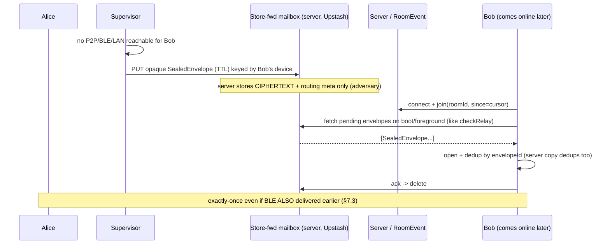
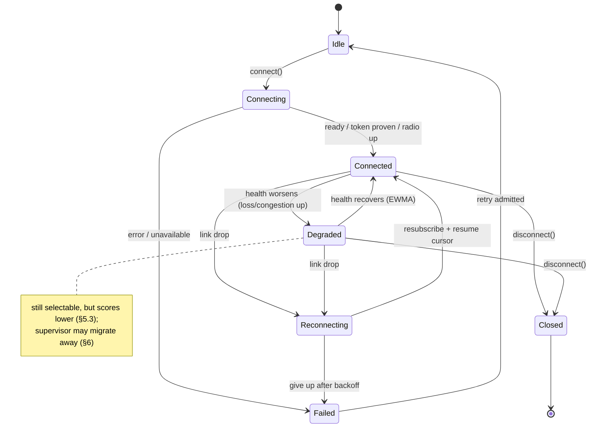
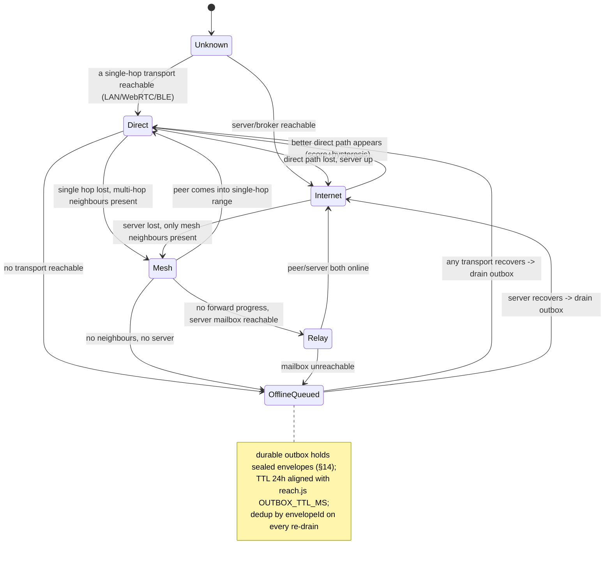

# Priority 2 · Workstream 04 — Adaptive Communication Network

**Status:** PLANNING ONLY — design, not a schedule to build. No production code,
schema, config, or feature flag is changed by this document.
**Date:** 2026-08-01 · **Controlling ADR:** [ADR-012](../adr/012-adaptive-communication-network.md)
(this document *improves* it — see §17) · **Builds on:**
[ADR-002](../adr/002-realtime-centrifugo-abstraction.md) (the `ITransportAdapter`
seam and its one hard rule), [ADR-004](../adr/004-forward-secrecy-design.md)
(the ratchet), the shipped `web/src/lib/transport/*` and `reach.js`.

**Where this sits in the roadmap.** The
[Owner Amendment (2026-08-01)](../MASTER-ENGINEERING-ROADMAP-V2.md#owner-amendment--2026-08-01-execution-order--one-principle)
elevates the *adaptive communication layer* to launch priority ④ —
"**Users never manually select a transport**" — and states it "supersedes the
earlier hold on transport work to the extent of this scope." This file is the
implementation-ready design for that item; it does **not** schedule the
horizontal-scale remainder of Priority 3 (Redis/Dragonfly selection, load
testing), which the amendment explicitly did not lift.

**One sentence.** Add a *transport supervisor* above the existing adapter seam
that chooses and migrates between Socket.IO, Centrifugo, WebRTC/P2P, LAN,
Wi-Fi Direct, native Bluetooth, and a Bluetooth mesh **automatically**, while
end-to-end encryption, identity enforcement, and exactly-once delivery hold
**identically on every transport, including an offline mesh whose relay devices
are adversaries** — because sealing moves *above* the transport and the
transport only ever carries opaque, self-describing, deduplicated envelopes.

---

## Table of contents

1. [Executive summary, goals & non-goals](#1-executive-summary-goals--non-goals)
2. [Motivation](#2-motivation)
3. [Transport abstraction interface](#3-transport-abstraction-interface)
4. [Transport capability matrix](#4-transport-capability-matrix)
5. [Automatic routing / decision engine](#5-automatic-routing--decision-engine)
6. [Transport migration](#6-transport-migration)
7. [Offline messaging, store-and-forward & Bluetooth mesh](#7-offline-messaging-store-and-forward--bluetooth-mesh)
8. [Encryption invariants & key isolation (CRITICAL)](#8-encryption-invariants--key-isolation-critical)
9. [API / protocol contracts](#9-api--protocol-contracts)
10. [Sequence diagrams](#10-sequence-diagrams)
11. [State machines](#11-state-machines)
12. [Battery, bandwidth, congestion, roaming](#12-battery-bandwidth-congestion-roaming)
13. [Failure recovery](#13-failure-recovery)
14. [Database / state changes (planning only)](#14-database--state-changes-planning-only)
15. [Observability](#15-observability)
16. [Benchmark plan](#16-benchmark-plan)
17. [ADR-012 improvements](#17-adr-012-improvements)
18. [Conflicts & review notes](#18-conflicts--review-notes)

---

## 1. Executive summary, goals & non-goals

Spot Me already has the *seam*: a narrow `ITransportAdapter` contract with
Socket.IO (default), Centrifugo (flag-gated), and a legacy WebRTC/Trystero P2P
path behind it; a per-room replay cursor with in-order dispatch; a durable
knock relay for first-contact; and an inviolable rule — **no adapter touches key
material** (ADR-002 §2). What it lacks is *adaptivity*: nothing selects between
transports automatically, nothing migrates a live conversation from one to
another, and Bluetooth is a discovery gimmick over the internet lobby, not a
messaging path (`web/src/views/bluetooth.js` says so out loud).

This design adds four things and one refactor:

- **A refactor (the linchpin): lift seal/open *above* the transport.** ADR-002's
  own CORRECTION notes that today AES-GCM `seal`/`open` live *inside*
  `socket-transport.js`, *below* the adapter, and calls moving them up "Phase 3
  … the real prerequisite." Every claim in §8 depends on this. Once the app
  hands transports a sealed envelope, the transport is interchangeable *by
  construction*.
- **A transport supervisor** that owns adapter registration, per-peer route
  state, the scoring/decision engine, hysteresis, and migration (§3, §5, §6).
- **A durable outbox + universal envelope** so a message queued on one transport
  and delivered on another lands **exactly once** (§7, §9).
- **New adapters** — LAN, Wi-Fi Direct, native Bluetooth, Bluetooth mesh — each
  satisfying the *same* contract, each carrying opaque bytes (§3, §4).
- **Offline delivery**: peer-to-peer, store-and-forward through intermediate
  devices, mesh relay, with eventual delivery and dedup on reconnect (§7).

### Goals

| # | Goal | Test of success |
|---|---|---|
| G1 | The user never picks a transport; the system decides. | No transport control ships in the UI; selection is a pure function of health/cost/reachability (§5). |
| G2 | Seamless migration mid-conversation. | Forced Bluetooth→Wi-Fi→relay switch loses **0** messages and reorders **0** (§6, §16). |
| G3 | Offline delivery with no internet. | Two in-range devices, airplane-mode-except-BLE, deliver a message; a third device relays for an absent recipient (§7, §16). |
| G4 | E2EE holds on every transport, mesh included. | The invariant tests in §8 pass for **all** adapters, including a hostile relay. |
| G5 | Reversible to exactly today. | All flags off ⇒ Socket.IO-only, byte-identical to current behaviour (§17). |

### Non-goals

- **No new cryptographic protocol.** e2e_v2 (shipped) and e2e_v3 (built, behind
  flags, *not activated* — see `17-CRYPTO-IMPLEMENTATION-GUIDE.md`) are consumed
  as-is. This workstream changes *where* sealing runs, never *how* it seals.
- **No mesh *activation*.** ADR-012 keeps mesh out of MVP because "relay-node
  trust and retention need their own ADR." This document *designs* mesh so that
  ADR can be written against something concrete; it does not authorise shipping
  it (§18).
- **No horizontal-scale decision.** Redis/Dragonfly, geo-sharded presence, and
  load testing stay in Priority 3, unlifted.
- **No change to what a transport may see.** The metadata surface is *narrowed*,
  never widened (§8, INV-6).

---

## 2. Motivation

**Automatic transport, because a human cannot make this decision.** The right
transport for a message depends on live signals a user cannot observe — is the
server reachable, is the peer on the same LAN, is this device on metered
cellular at 6 % battery, is the peer three BLE hops away. WhatsApp/Signal users
never see a "transport" menu; the network is plumbing. ADR-012 records the
owner's rule verbatim: *"Users must never manually choose transport."* A menu is
not a feature here, it is a design failure.

**Offline-first, because "no internet" is a normal state, not an error.** A
concert, a plane, a protest, a rural valley, a carrier outage, a censored
network — in all of these two phones may be a metre apart with no route to any
server. Today the message spins on "Sending…". The differentiator is that Spot
Me *keeps working*: the message goes peer-to-peer over Bluetooth, or hops
through a willing intermediate device, and reconciles with the server later
without duplicating. This is the property no purely server-relayed messenger
has, and it is worthless if it leaks plaintext to the relay device — hence §8 is
the hardest section, not the routing math.

**Why it matters now.** The seam already exists and is regression-tested; the
cursor/dedup machinery that makes migration lossless already exists for
reconnects; the durable relay already exists for knocks. This workstream is
mostly *connecting parts that were built to connect* — plus the one honest
refactor (seal-lift) that ADR-002 flagged as owed.

---

## 3. Transport abstraction interface

### 3.1 What exists, and why it is kept

`web/src/lib/transport/ITransportAdapter.js` defines the contract as **seven
methods** plus a **forbidden-surface list** enforced by a test, not a comment:

```
TRANSPORT_METHODS   = connect, disconnect, subscribe, unsubscribe,
                      publish, presence, status
FORBIDDEN_KEY_SURFACE = roomKey, deriveKey, setRoomKey, setRoomKeyProvider,
                      clearRoomKey, password, secret, key, keyCache,
                      encrypt, decrypt, seal, open
```

"The narrowness is the design" (its own header): a wide contract would leak
Socket.IO semantics and the next adapter becomes a Socket.IO emulator. **We keep
the seven and the prohibition unchanged.** The frame that crosses any adapter
also stays as-is: `makeFrame({ roomId, type, payload, meta, target })` where
`payload` is **base64 text, never a Buffer** (a framing lesson that cost a day)
and `meta` is **cleartext routing only**.

### 3.2 What is added — capability, health, cost (additive, keyless)

The supervisor cannot score transports it cannot interrogate. We extend the
contract with **three read-only reporting methods** that return plain data
structures and — critically — expose **no key surface**, so
`assertImplementsTransport` and the `FORBIDDEN_KEY_SURFACE` test remain the gate
for every new adapter too.

Design contract (TypeScript for precision; the runtime check mirrors
`ITransportAdapter.js`'s array-and-assertion form, extended with the three new
names):

```ts
// ---- unchanged core (ADR-002) ------------------------------------------
interface ITransportAdapter {
  readonly name: string;                       // 'socketio' | 'centrifugo' | 'webrtc' | 'lan' | 'wifidirect' | 'ble' | 'blemesh'
  connect(opts?: ConnectOpts): Promise<void>;
  disconnect(): Promise<void>;
  subscribe(roomId: string, h: RoomHandlers): Promise<Subscription>;
  unsubscribe(roomId: string): Promise<void>;
  publish(roomId: string, frame: Frame): Promise<{ seq?: number }>;  // OPAQUE bytes only
  presence(roomId: string): Promise<Array<{ userId: string }>>;
  status(): TransportStatus;                    // idle|connecting|connected|reconnecting|closed|failed

  // ---- added by this workstream (all keyless, all read-only) -----------
  capabilities(): TransportCapabilities;        // static shape of this transport
  health(peerId?: string): HealthSample;        // live, cheap, non-blocking snapshot
  cost(): CostSignal;                           // battery/data pressure right now
}

interface TransportCapabilities {
  kind: 'internet' | 'p2p' | 'lan' | 'proximity' | 'mesh';
  needsInternet: boolean;      // false for webrtc-after-signal? see note; true for socketio/centrifugo
  offlineCapable: boolean;     // can deliver with NO server reachable
  rangeClass: 'global' | 'lan' | 'proximity' | 'multihop';
  maxPeers: number | 'unbounded';
  natTraversal: 'server' | 'ice' | 'none';
  supportsBroadcast: boolean;  // one publish reaches many (mesh flood, socket room)
  supportsPresence: boolean;
  durable: boolean;            // server-persisted; an empty audience is no reason to hold a send
  bidirectional: boolean;
}

interface HealthSample {
  reachable: boolean;          // is the destination reachable over THIS transport right now
  rttMs: number | null;        // measured or estimated round trip; null = unknown
  bandwidthKbps: number | null;
  lossRatio: number;           // 0..1 EWMA of failed/attempted
  congestion: number;          // 0..1, EWMA of send-latency inflation / queue depth
  sampledAt: number;           // epoch ms; staleness is itself a signal
}

interface CostSignal {
  batteryClass: 0 | 1 | 2 | 3; // 0 free (idle socket), 3 expensive (active BLE scan / radio wake)
  metered: boolean;            // cellular / capped data
  energyPerKbHint: number | null;
}
```

**Note on `connect` for offline transports.** For Socket.IO, `connect()` today
*proves reachability* (it calls `freshTokens()`), it does not open a socket
eagerly — the adapter is honest that there is "no explicit connect step." The
new adapters follow that spirit: `connect()` means "make this transport *ready to
attempt*" (power the radio, join the mesh, bind the mDNS responder), and
`health().reachable` per peer is the real gate the supervisor reads. This keeps
`status()` about the transport and `health()` about the path to a specific peer.

### 3.3 How each transport maps onto the same ten members

| Member | Socket.IO / Centrifugo | WebRTC (P2P) | LAN / Wi-Fi Direct | Native Bluetooth | Bluetooth Mesh |
|---|---|---|---|---|---|
| `connect` | prove token / open broker | ICE gather + signal | mDNS bind / form-group | power radio, advertise service UUID | join mesh, seed seen-set |
| `subscribe(roomId)` | join socket room / channel | open DataChannel labelled by room | open TCP/WS to peer, tag by room | open GATT characteristic / L2CAP CoC for room | register interest; flooded frames filtered by room |
| `publish(roomId, frame)` | emit `action` / POST proxy | `dc.send(frame)` | socket write | GATT write / L2CAP send of `frame.payload` | wrap `frame` in `MeshFrame`, flood with TTL |
| `presence(roomId)` | server presence | connected peer ids | discovered hosts | scan results in range | last-heard neighbours |
| `health(peer)` | ping RTT, socket state | DataChannel RTT/`getStats` | TCP RTT | RSSI→range, GATT latency | hopcount, per-neighbour loss |
| `capabilities()` | internet, `durable:true` | p2p, `offlineCapable` after signal | lan, offline on same L2 | proximity, offline | mesh, multihop, offline |

The point of the table: **the message layer never learns which row it is on.**
It hands `publish` an opaque frame and reads `health` to choose. That is exactly
what makes §6 (migration) and §8 (encryption) hold.

### 3.4 Generalizing, not replacing, the existing seam

`transport/room.js` is the "one place the app asks for a room" and `index.js`'s
`createTransport()` already returns `{ adapter, requested, actual, reason }` —
**visible** fallback. The supervisor is a strict *super-set* of this:

- `selectedTransport()` (the `localStorage['spotme.transport']` flag) becomes an
  **override for testing/debug**, not the normal path. When it is set, the
  supervisor honours it (pins one adapter) — the escape hatch survives.
- When it is *unset* (the normal case going forward), the supervisor's decision
  engine (§5) chooses. The old `activeTransport()` report generalizes to a
  per-peer route report.
- The socketio and centrifugo adapters gain `capabilities()/health()/cost()`
  and otherwise do not change. Their seal boundary moves up as part of the
  refactor (§8.2), which is what finally lets Centrifugo carry a chat room —
  the very thing `room.js` documents it *cannot* do today because "publishing
  through it would send plaintext."

---

## 4. Transport capability matrix

Values are design estimates to be replaced by measured numbers (§16); none is a
result. "Offline-capable" means *delivers with no server reachable*.

| Transport | Range | Needs internet | Bandwidth | Latency | Battery cost | Max peers | NAT traversal | Offline-capable |
|---|---|---|---|---|---|---|---|---|
| **Socket.IO** | global | yes | high | low (server RTT) | 0 (idle socket) | server-bounded | server | no |
| **Centrifugo** | global | yes | high | low | 0 | server-bounded (broker fan-out) | server | no |
| **Server relay / store-fwd** | global (async) | yes | high | seconds–hours (async) | 0 | n/a | server | no (needs server) |
| **WebRTC (P2P data)** | global | signal only¹ | high | very low (direct) | 1–2 (kept-alive DC) | ~tens | ICE/STUN/TURN | partial¹ |
| **LAN (mDNS + TCP)** | same L2 | no | very high | very low | 1 | subnet-bounded | none | yes (same subnet) |
| **Wi-Fi Direct** | ~50–200 m | no | high | low | 2 | ~8 (group) | none | yes |
| **Native Bluetooth (BLE/L2CAP)** | ~10–30 m | no | low (BLE ~0.1–1 Mbps) | low-moderate | 3 (scan/advertise) | ~7 active | none | yes |
| **Bluetooth Mesh** | multi-hop (∑ ~10–30 m) | no | very low | moderate–high (per hop) | 3 | unbounded (flood) | none | yes |

¹ WebRTC needs a signalling channel to *establish*; once a DataChannel is open
it is direct and survives the signalling server dropping. On a LAN it can
connect with only local ICE candidates (no server), which is why "signal only".

**Reading the matrix as a ladder.** Left-to-right within "needs internet: no" is
roughly the offline fallback order: LAN (fast, same network) → Wi-Fi Direct →
direct BLE → BLE mesh (last resort, slowest, but reaches peers no single hop
can). Internet transports are preferred when healthy (ADR-012 §3). The scorer
(§5) turns this intuition into an explicit function.

---

## 5. Automatic routing / decision engine

### 5.1 What the engine decides, and when

**Per (peer, message-class), on every send and on every health change**, the
supervisor selects the transport with the highest score among those currently
*reachable for that peer*, subject to hysteresis (§5.4) so a flaky link does not
cause flapping. Message classes shift the weights:

- **interactive** — text, typing, receipts, reactions: latency-dominant.
- **bulk** — attachment slices, voice notes: bandwidth- and cost-dominant.
- **control** — key/prekey fetch, delivery receipts: reliability-dominant.

### 5.2 Inputs (all already available or in §3's new methods)

- `capabilities()` — the static shape, gives the reachability gate and class.
- `health(peerId)` — `reachable`, `rttMs`, `bandwidthKbps`, `lossRatio`,
  `congestion`. Smoothed by EWMA (α ≈ 0.3) so one bad sample cannot flip a route.
- `cost()` — `batteryClass`, `metered`.
- Route memory (§14) — the last transport that *worked* for this peer, and how
  recently the peer was seen on each.

### 5.3 The scoring function

For candidate transport `t`, peer `p`, message class `c`:

```
reachable(t, p) == false   ⇒   score = −∞          (hard gate: excluded)

score(t, p, c) =  Σ_k  w[c][k] · s_k(t, p)
               +  stickiness · 1[t == incumbent(p)]      (hysteresis bonus)
```

Sub-scores `s_k ∈ [0, 1]`, higher = better:

| `s_k` | Definition | Intuition |
|---|---|---|
| `s_latency` | `clamp(1 − rttMs / RTT_MAX)`; class fallback when `rttMs=null` | direct paths beat multi-hop |
| `s_bandwidth` | `clamp(bandwidthKbps / BW_REF)` | bulk avoids BLE |
| `s_battery` | `1 − batteryClass / 3` | prefer the idle socket over an active radio |
| `s_cost` | `metered ? 0.3 : 1.0` | avoid burning cellular on a photo |
| `s_reliability` | `1 − lossRatio` (EWMA) | a path that keeps failing loses rank |
| `s_congestion` | `1 − congestion` (EWMA) | shed load off a saturated link |

Class weight vectors (illustrative; tuned against §16 benchmarks, stored in
config, never hard-coded in a way that needs a deploy to change):

```
w[interactive] = { latency:.40, reliability:.25, congestion:.15, battery:.10, cost:.05, bandwidth:.05 }
w[bulk]        = { bandwidth:.35, cost:.25, reliability:.15, congestion:.15, battery:.05, latency:.05 }
w[control]     = { reliability:.45, latency:.20, congestion:.15, battery:.10, cost:.10, bandwidth:.00 }
```

**Worked example.** Peer on the same office Wi-Fi, this device at 90 % battery,
sending text. `socketio` healthy (rtt 40 ms) and `lan` healthy (rtt 3 ms).
Interactive weights make `lan`'s `s_latency ≈ 0.99` dominate; `lan` wins and text
goes direct. The same peer, now sending a 4 MB video on metered cellular with no
Wi-Fi: bulk weights promote `bandwidth`+`cost`; `socketio` (unmetered? no —
metered) and `lan` (unreachable now) both score poorly, so the supervisor may
*defer* the bulk send until a cheaper transport appears (§12) rather than burn
data — a decision a human should never have to make mid-conversation.

### 5.4 Hysteresis — the anti-flapping rule

A candidate replaces the incumbent **only if**:

```
score(candidate) − score(incumbent) ≥ MARGIN      (default 0.15)
   sustained for  DWELL   (default 2 s)
OR incumbent.reachable == false                    (immediate, no dwell)
```

Three dampers stack: the **EWMA** on health (a spike does not move the smoothed
value), the **stickiness bonus** (ties keep the current transport), and the
**margin + dwell** (a marginally-better transport must stay better for a beat).
Loss of reachability is the one case that bypasses dwell — there is nothing to be
loyal to. This is ADR-012 §3's "hysteresis-damped (no flapping on a flaky link)"
made precise.

### 5.5 Selector (design pseudocode)

```
function selectTransport(peer, msgClass):
    candidates = registry.filter(t => t.health(peer).reachable)
    if candidates.empty:
        return OFFLINE_QUEUE                      // §7: durable outbox holds it
    scored = candidates.map(t => (t, score(t, peer, msgClass)))
    best   = argmax(scored)
    inc    = route[peer].incumbent
    if inc != null and inc.reachable and
       score(best) − score(inc) < MARGIN or dwellNotMet(peer):
        return inc                                // stay put — hysteresis
    route[peer].incumbent = best
    emit('route_change', peer, from=inc, to=best, reason=...)   // §15 observability
    return best
```

Selection inputs are **health, latency class, cost, reliability, congestion —
never user choice** (ADR-012 §3). The escape-hatch flag (`spotme.transport`)
short-circuits `candidates` to the pinned adapter for testing, and that override
is itself observable so a tester is never fooled about what carried a message.

---

## 6. Transport migration

### 6.1 The property we already own

Migration is *seamless* only if the ordering and dedup primitives are
transport-independent. **They already are:**

- **Server-authoritative order.** The backend `action` handler assigns
  `seq = RoomEvent.id`, a monotonic total order (`rooms.gateway.ts`). A join
  replays strictly `id > since` and returns `{ events, envelopes, lastEventId,
  truncated }`.
- **Per-room replay cursor.** `socket-transport.js` keeps
  `spotme.cursor.<profileId>.<roomId>`; `advanceCursor` never moves past a frame
  held by `unopenedFloor` (a frame that arrived but could not yet be opened).
- **Dedup by id.** `store.add()` dedupes by message id and honours tombstones;
  "replaying from 0 is safe by construction." `db.upsertConvo` is idempotent.
- **In-order dispatch.** Live frames are serialized through a single
  `frameChain` promise so `edit` never races ahead of the `msg` it edits.

None of these are properties of Socket.IO. They are properties of *the message
layer above the transport*. So a migration is: **re-subscribe on the new
transport, resume from the held cursor, let dedup absorb the overlap.**

### 6.2 Migrating a live conversation (Bluetooth → Wi-Fi → relay)

```
1. Supervisor decides route(peer) changes T_old → T_new (§5.4).
2. subscribe(roomId) on T_new BEFORE unsubscribe(roomId) on T_old
   (make-before-break: no window where the room is on no transport).
3. Drain in-flight:
     - unacked sends sit in the durable outbox (§7, §14) keyed by envelopeId;
       they re-drain over T_new. Dedup by envelopeId collapses any that T_old
       had actually delivered.
     - the cursor is unchanged: T_new resumes replay from the same `since`,
       and store.add() drops the frames already shown.
4. unsubscribe(roomId) on T_old once T_new.health(peer).reachable.
5. Emit route_change (from, to, reason, dwell) for observability (§15).
```

**Ordering across a switch.** Because final order is `seq` and `seq` is assigned
by whoever the server sees first, a message delivered offline over Bluetooth and
*later* over the server carries the **same envelopeId** and dedups; its display
position settles to the server `seq` when the server sees it, but it never
duplicates or drops (that is exactly `store.add`'s existing guarantee, now
exercised by a transport switch instead of only a reconnect). For a switch where
neither side ever reaches the server (Bluetooth→Wi-Fi Direct, both offline), the
offline ordering token (§9.4) carries order until the server can supersede it.

### 6.3 The ratchet must survive a transport change

**It does, unchanged, because it never touches the transport.** The e2e_v3
Double Ratchet state lives in IndexedDB keyed by *conversation*, and the ratchet
header (`SDEV`, `RDEV`, `EK`, `PN`, `N`) rides *inside* the opaque `payload`
(004a envelope schema). Switching transports:

- does not read, write, advance, or reset ratchet state;
- does not re-run X3DH (a session is per conversation, not per transport);
- changes zero bytes of the sealed frame.

This is stated as a **testable invariant** in §8 (INV-3): establish an e2e_v3
session, force a migration mid-stream, assert the ratchet chain indices are
identical before and after and every message still decrypts. A transport change
that perturbed the ratchet would be a build-breaking bug, not a tuning issue.

### 6.4 What migration must never do

- **Never** move a key with the session (INV-1). The new transport gets the same
  opaque envelope the old one would have.
- **Never** advance the cursor past an unacked or unopened frame (reuse
  `unopenedFloor` semantics verbatim).
- **Never** break-before-make (step 2) — a gap where the room is on no transport
  is where a live frame is lost.

---

## 7. Offline messaging, store-and-forward & Bluetooth mesh

### 7.1 Three offline delivery shapes

1. **Direct P2P (in range, both present).** Two devices on the same LAN, Wi-Fi
   Direct group, or BLE link exchange sealed envelopes directly. This is the
   `reach.js` knock/outbox pattern generalized from "first contact" to "every
   message", riding a non-server adapter.
2. **Store-and-forward (recipient absent).** An intermediate device accepts a
   sealed envelope addressed to a recipient it *may* reach later, holds it in a
   bounded, TTL'd mailbox, and forwards it on contact. This is delay-tolerant
   networking (DTN), epidemic style. **The carrier can never open it** (§8).
3. **Mesh relay (recipient out of single-hop range).** A sealed envelope is
   flooded outward with a TTL and a dedup seen-set; each device forwards frames
   it cannot open toward the destination. Multi-hop reaches peers no single
   radio can.

### 7.2 The mesh, concretely

A `MeshFrame` (schema in §9.5) wraps the universal `SealedEnvelope` with a
**cleartext routing header** — the mesh analogue of `frame.meta`:

- `dst` — a hash of the recipient's device id (routing target; not the account).
- `ttl` — decremented each hop; a frame at `ttl == 0` is dropped, not forwarded.
- `hop` — incremented each hop (observability + loop diagnostics).
- `msgId` — equals the envelope's `envelopeId`; the **dedup key**.

Flooding is bounded by three mechanisms, each a hard cap that fails closed:

- **Seen-set.** Each device keeps `msgId → expiry`; a frame whose `msgId` is in
  the set is *not* rebroadcast. Bounds rebroadcast storms and breaks loops.
- **TTL.** Max hop count (default 7) bounds reach and cost.
- **Envelope TTL.** Aligns with `reach.js`'s existing 24 h `OUTBOX_TTL_MS`; a
  stale envelope is dropped everywhere.

### 7.3 Eventual delivery + dedup on reconnect

The invariant that makes all of this safe: **exactly-once at the recipient,
across every path.** A message may arrive by direct BLE *and* by mesh relay *and*
later by the server; all three carry the same `envelopeId`, and:

- `store.add()` dedups by id (already true);
- the sender's outbox stops retrying an envelope once it observes an **ack** —
  either a server `seq` (durable proof) or a signed delivery receipt returned
  over any transport (§9.3);
- a relay device's seen-set stops it re-flooding.

When an offline recipient later reaches the server, the server's copy (if the
sender also queued to the relay) dedups against what already arrived over BLE.
This is ADR-012 §4 — "A message handed to Bluetooth and later also delivered via
server must land exactly once" — realized with the *same* dedup key everywhere.

### 7.4 First-contact offline is constrained (honest limit)

Opening a *new* e2e_v3 session to a peer you have **never** contacted requires
that peer's prekey bundle, which lives on the server (ADR-004). If you are fully
offline and have never fetched it, you cannot open a forward-secret session to a
stranger over Bluetooth — you can only continue existing sessions or fall back to
e2e_v2 with a device key you already hold. This is not a bug in the network; it
is the crypto's async-session precondition. It is surfaced as an owner/architect
decision in §18 (opportunistic bundle prefetch, or a defined offline-first-
contact downgrade, both need a ruling).

---

## 8. Encryption invariants & key isolation (CRITICAL)

**This is the section the whole workstream is judged on.** If any of it is
false, the feature is a plaintext leak, not a feature.

### 8.1 The threat model, restated for transports

From `17-CRYPTO-IMPLEMENTATION-GUIDE.md`: *"The server is the adversary."* This
workstream widens the adversary set: **every transport is untrusted, and a relay
device in a mesh is an adversary exactly like the server.** A mesh relay is worse
than the server in one way — it is an *arbitrary nearby stranger's phone* — so
"the transport carries opaque bytes and nothing else" is not a nicety here, it is
the entire safety argument. A transport is allowed to see routing metadata (who,
when, how big, toward which device hash); it must never see content or be able to
impersonate, alter, or replay.

### 8.2 The linchpin refactor: seal moves ABOVE the transport

ADR-002's CORRECTION states the current reality plainly: AES-GCM `seal`/`open`
live *inside* `socket-transport.js` (`sendAction`, `dispatch`), *below* the
adapter. That is why Socket.IO is safe (crypto sits under it) and why Centrifugo
*cannot carry chat* (its `publish()` POSTs `frame.payload` straight through —
"would therefore send plaintext"). ADR-002 names the fix: **"Phase 3 must lift
`seal`/`open` above the transport … it — not the broker deployment — is the real
prerequisite."**

This workstream *is* that lift, and it is a precondition for every other adapter,
not just Centrifugo:

```
        BEFORE (today)                         AFTER (this workstream)
   app → socket-transport(seal) → socket   app → seal → supervisor → { any adapter }
                    │                                        │
              adapter wraps a                         adapters receive an
              module that seals                       already-sealed envelope
```

`sealForRoom`/`openForRoom` already exist in `socket-transport.js` and already
"own `roomKey()`" without handing the key out — the refactor *relocates the call
site* from inside the transport to a `MessageCodec` layer the supervisor calls
before `publish` and after receive. The `roomKey` provider, the ADR-001 no-v2-
password-fallback rule, the non-extractable keys, and the e2e_v3 branch all move
*with* the call, unchanged. This is presented as a Priority-2 refactor **proposal
only**; it touches crypto-adjacent code and is flagged for owner review in §18.

### 8.3 The invariants, as testable properties

Each is a property with a named test, in the spirit of `17-CRYPTO` §7 ("that is
the whole claim, so it gets a test").

| # | Invariant | Test |
|---|---|---|
| **INV-1** | No adapter — socketio, centrifugo, webrtc, lan, wifidirect, ble, **blemesh** — holds key material. | Extend `test/transport.test.js`: `assertImplementsTransport` + `FORBIDDEN_KEY_SURFACE` over **every** adapter, including the mesh relay role object. |
| **INV-2** | The bytes handed to `publish()` on any transport equal the single sealed-envelope bytes; plaintext never reaches a transport. | Extend `test/transport-seam.test.js`: seal once, feed readable text through each adapter's `publish`, assert the *exact ciphertext* (not the plaintext) reaches the wire, for all adapters. This is the check that pins the §8.2 refactor. |
| **INV-3** | A transport switch changes nothing cryptographically; the ratchet survives. | Establish e2e_v3; migrate T_old→T_new mid-stream; assert ratchet `(PN, N)` identical pre/post and all messages decrypt (§6.3). |
| **INV-4** | A mesh relay cannot open, alter, or replay a frame it forwards. | Relay forwards a sealed frame → cannot decrypt (no key); flip one ciphertext byte → GCM `AUTH` fail at recipient; re-inject same `msgId` → dropped by seen-set / message-key-once. |
| **INV-5** | Identity/trust enforcement (A1–A7) sits above the transport and blocks a Changed/Revoked peer identically on **every** transport including offline BLE/mesh. | Mark peer Revoked; attempt send over each adapter; assert the A5 gate refuses before any `publish`, on all of them (ADR-012 §5). |
| **INV-6** | The cleartext routing surface is *minimized*: mesh header is `{dst-hash, ttl, hop, msgId}` — no content, no plaintext sender identity beyond a device-id hash. | Wire-inspect a `MeshFrame`; assert no field decodes to content or a bare account id; fuzz that oversized/extra fields are rejected. |

### 8.4 Why switching transports is cryptographically a no-op

Because (a) seal/open runs above the supervisor (§8.2), (b) the ratchet/agreement
state is keyed by conversation and non-extractable, and (c) the sealed envelope
is byte-identical regardless of carrier (§9), **the set of bytes a transport sees
is a pure function of the message and session, and independent of which transport
is chosen.** Migration therefore cannot affect confidentiality, integrity,
authentication, forward secrecy, or break-in recovery — those live entirely in a
layer the transport cannot reach. The supervisor is a *router of ciphertext*; it
has the same trust level as the network, which is none.

### 8.5 The new metadata cost, stated honestly

Bluetooth/mesh add a **physical-proximity metadata surface**: a relay learns
that a device with hash `dst` was reachable through it at a time and place. This
is *new* information the server model never had, and ADR-012 §5 already flags it
against the V2 Priority-8 discovery threat-model gate. It is not solved by
encryption (it is metadata, not content). It is an owner decision (§18): the
mesh must not roll out before that threat model rules on `dst`-hash rotation,
whether relays are opt-in, and retention of seen-sets.

---

## 9. API / protocol contracts

### 9.1 Design principle: one envelope, every transport

The same sealed bytes must ride any transport, so the envelope is defined once,
transport-agnostically, and the e2e header lives *inside* `payload` (so adding
devices or ratchet fields never changes the wire per transport — 004a §9).

### 9.2 `SealedEnvelope` — the universal unit

```ts
interface SealedEnvelope {
  v: 1;                       // envelope-format version (NOT the e2e version)
  envelopeId: string;         // 128-bit, base64url; the DEDUP + ordering key. §9.4
  roomId: string;             // routing
  type: string;               // 'msg'|'edit'|'react'|'del'|'read'|'typing'|'bin'|'rtc'|... cleartext routing
  payload: string;            // base64 TEXT. Opaque ciphertext:
                              //   e2e_v2: AES-GCM(sealForRoom) blob
                              //   e2e_v3: MAGIC|VER|HDRLEN|HEADER|IV|CT‖tag  (004a)
  meta?: {                    // CLEARTEXT ROUTING ONLY — never content
    id?: string;              // == envelopeId for content that has a natural id
    seq?: number;             // attachment slice index (bin)
    total?: number;           // attachment slice count
    cm?: string;              // sealed attachment metadata (already used today)
    burn?: boolean;           // view-once routing hint
  };
  ord: OrderingToken;         // §9.4
  target?: string;            // optional per-recipient addressing (device/user)
}
```

Rules inherited and enforced: `payload` is **base64 text, never a Buffer**
(`makeFrame`); `meta` is **cleartext routing only**; nothing here is a key or a
plaintext body. `SealedEnvelope` is a strict superset of today's `Frame`, so the
socketio/centrifugo adapters accept it with no shape change.

### 9.3 Acknowledgement & delivery receipt

```ts
interface DeliveryAck {
  envelopeId: string;
  via: 'server-seq' | 'receipt';
  seq?: number;               // present when the server assigned an order
  receipt?: string;           // base64 signed receipt (recipient device), for offline paths
  at: number;
}
```

An ack is what lets the outbox stop retrying (§7.3, §13). `server-seq` is the
durable proof; a signed `receipt` returned over any transport (including back
across a mesh) proves the *recipient* — not a relay — got it. A relay cannot
forge a receipt (it is signed by the recipient's identity key), and cannot
suppress delivery undetectably (the sender keeps retrying until acked or TTL).

### 9.4 `OrderingToken` — order without a server, three tiers

```ts
type OrderingToken =
  | { tier: 'server';  seq: number }                                   // authoritative
  | { tier: 'ratchet'; sdev: string; pn: number; n: number }           // e2e_v3 intrinsic
  | { tier: 'clock';   sdev: string; counter: number; wallMs: number } // e2e_v2 / offline
```

- **server** — once the server assigns `seq` it is the total order; everything
  reconciles to it.
- **ratchet** — for e2e_v3, `(sdev, PN, N)` from the header already imposes a
  per-sender total order and detects gaps; the receiver's ratchet reassembles it.
- **clock** — for e2e_v2 or fully-offline first delivery, a per-sender monotonic
  `counter` plus wall-clock; cross-sender merge is deterministic by
  `(wallMs, sdev)`.

Reconciliation rule: **server order wins when it exists; offline order is
provisional.** Because every copy shares `envelopeId`, reconciliation can only
*reorder* a message's display position, never duplicate or drop it (that is
`store.add`'s existing dedup guarantee). This is the design's answer to ordering
across an offline→online transition and is an explicit improvement over ADR-012,
which assumes server-mediated cursors (§17).

### 9.5 `MeshFrame` — the offline transport wrapper

```ts
interface MeshFrame {
  m: 1;                       // mesh-frame version
  dst: string;                // hash(recipient deviceId) — routing target, not the account
  ttl: number;                // hops remaining; drop at 0
  hop: number;                // hops taken (observability)
  msgId: string;              // == SealedEnvelope.envelopeId — the seen-set/dedup key
  env: SealedEnvelope;        // the opaque unit; a relay forwards this, never opens it
}
```

A relay's whole job: `if msgId not in seen-set and ttl>0: seen-set.add(msgId);
rebroadcast(ttl−1, hop+1)`. It reads `dst`/`ttl`/`msgId`; it never touches
`env.payload`. `MeshFrame` is the *only* new on-wire contract; on internet and
direct-P2P transports the bare `SealedEnvelope` rides (no mesh header needed).

### 9.6 Internal transport API — unchanged surface

The internal API is §3's ten-member `ITransportAdapter`. The supervisor sits
above it and exposes to the app exactly what `room.js` exposes today
(`joinRoom`, per-type actions, `activeTransport()`), so **call sites do not
change** — the generalization is behind the existing seam, which is the whole
point of ADR-002 having built that seam.

---

## 10. Sequence diagrams

### 10.1 Automatic transport selection on send

```mermaid
sequenceDiagram
  participant App as App (sender)
  participant Codec as MessageCodec (seal)
  participant Sup as Supervisor
  participant Reg as Adapter registry
  participant Net as Chosen transport
  App->>Codec: send(roomId, plaintext, class)
  Codec->>Codec: seal above transport -> SealedEnvelope (INV-2)
  Codec->>Sup: route(peer, SealedEnvelope, class)
  Sup->>Reg: health(peer) + cost() for each adapter
  Reg-->>Sup: HealthSample[] , CostSignal[]
  Sup->>Sup: score(t,peer,class) ; hysteresis (§5.4)
  alt a transport is reachable
    Sup->>Net: publish(roomId, SealedEnvelope)  %% opaque bytes only
    Net-->>Sup: {seq?} or transport ack
    Sup-->>App: queued/sent (route recorded)
  else none reachable
    Sup->>Sup: enqueue in durable outbox (§7,§14)
    Sup-->>App: queued offline (will drain on health change)
  end
```

### 10.2 Seamless migration mid-conversation

```mermaid
sequenceDiagram
  participant Sup as Supervisor
  participant Told as T_old (e.g. BLE)
  participant Tnew as T_new (e.g. Wi-Fi)
  participant Store as Room store (cursor+dedup)
  Note over Sup: health change: score(Tnew)-score(Told) >= MARGIN for DWELL
  Sup->>Tnew: subscribe(roomId)   %% make-before-break
  Tnew-->>Sup: subscribed (resume from held cursor `since`)
  Sup->>Store: replay id > since
  Store-->>Sup: overlap frames (dedup by envelopeId drops dupes)
  Sup->>Tnew: re-drain unacked outbox (same envelopeIds)
  Note over Sup,Store: ratchet untouched (INV-3); order = seq/ord token (§9.4)
  Sup->>Told: unsubscribe(roomId)  %% only after Tnew reachable
  Sup-->>Sup: emit route_change(from=Told,to=Tnew,reason,dwell)
```

### 10.3 Offline store-and-forward via a mesh intermediary

```mermaid
sequenceDiagram
  participant A as Alice (offline)
  participant R as Relay device (adversary)
  participant B as Bob (offline, later in range)
  A->>A: seal -> SealedEnvelope (R can never open it, INV-4)
  A->>R: MeshFrame{dst=hash(Bob.dev), ttl=7, msgId, env}
  R->>R: msgId not seen -> seen-set.add(msgId)
  Note over R: R forwards opaque bytes; cannot read, alter, or replay
  R->>B: MeshFrame{ttl=6, hop+1, env}
  B->>B: open(env) -> decrypt ; dedup by envelopeId
  B-->>R: signed DeliveryAck{receipt}  %% recipient-signed, relay cannot forge
  R-->>A: relay receipt back (when A reachable)
  Note over A: outbox stops retrying on ack (§7.3, §13)
```

### 10.4 Server-relay fallback when all P2P fails



---

## 11. State machines

### 11.1 Per-transport connection lifecycle

Generalizes `TransportStatus` (idle/connecting/connected/reconnecting/closed/
failed) with a `degraded` health state the scorer reads.



### 11.2 Peer reachability / route state

`direct → mesh → relay → offline-queued`, and recovery back up the ladder.



---

## 12. Battery, bandwidth, congestion, roaming

### 12.1 Battery optimization

- **Radios cost; idle sockets do not.** `cost().batteryClass` ranks an idle
  Socket.IO connection at 0 and active BLE scan/advertise at 3; the scorer's
  `s_battery` term (§5.3) prefers the socket whenever it is healthy — so
  Bluetooth is powered only when there is no route out and a peer is in range
  (ADR-012 §3), exactly the condition where its cost is justified.
- **Duty-cycled scanning.** BLE scan/advertise runs on a duty cycle (scan window
  ≪ interval) tuned per battery level; below a floor (e.g. <15 %), proximity
  transports drop to receive-only or off unless the user is *actively* in an
  offline conversation. This is a native-plugin responsibility (§18).
- **Suppress speculative P2P.** WebRTC keep-alive DataChannels are torn down when
  an internet transport is healthy and battery is low; re-established on demand.

### 12.2 Bandwidth adaptation

- **Adaptive slice size.** Attachments already move in slices (128 KB anchor).
  Slice size adapts to `health().bandwidthKbps`: large on LAN/Wi-Fi Direct, small
  on BLE (whose MTU is tiny), so a photo does not stall a low-bandwidth link.
- **Class-aware deferral.** `bulk` sends are deferred by the scorer when only an
  expensive/slow transport is available and the message is not latency-critical
  (§5.3 worked example); `interactive` text still goes immediately over whatever
  is reachable.
- **Backpressure ceiling.** The existing 8 MB frame cap
  (`maxHttpBufferSize` / `json({limit:'8mb'})`) is the hard ceiling; the outbox
  is bounded (§14) so a saturated link cannot grow memory without limit.

### 12.3 Congestion handling

- `health().congestion` is an EWMA of send-latency inflation and outbox depth per
  transport. Rising congestion lowers `s_congestion` (§5.3), which both *sheds*
  new sends to another transport and *slows* the drain rate on the congested one.
- Mesh congestion is controlled by the seen-set + TTL (§7.2): flooding is bounded
  regardless of load, which is what stops a mesh from melting under a storm.

### 12.4 Roaming / network-change handling

- **Signals.** `online`/`offline`, `visibilitychange`, and (where available)
  `navigator.connection.change` trigger a health re-probe and route re-evaluation.
- **Suspended-tab recovery.** `reach.js`'s existing `resume()` heuristic — "a
  missed heartbeat means the tab was very likely suspended … rejoin rather than
  trust a corpse" — generalizes to *all* transports: on resume, re-probe health,
  re-subscribe, resume from cursor.
- **Wi-Fi ↔ cellular handover is already lossless.** A socket drop during
  handover goes through `rejoin`, which replays `id > since` and dedups — the
  same path a transport migration uses (§6). Roaming is just migration triggered
  by the OS instead of by the scorer.

---

## 13. Failure recovery

### 13.1 Detection

- Per-transport heartbeat/probe drives `status()` and `health().reachable`.
- Per-send ack timeout: no `DeliveryAck` within a class-dependent window marks
  the send unacked and eligible for re-drain (not lost).
- `OperationError` on open triggers the existing one-shot `refreshRoomKey`
  repair; unrepairable frames set `unopenedFloor` and surface via
  `onUndecryptable` — unchanged, and now exercised across transports.

### 13.2 The fallback ladder (ordered)

```
socketio → centrifugo → webrtc/P2P → LAN → wifidirect → ble → blemesh → offline-queued(outbox+mailbox)
```

The scorer normally *selects* rather than walks this ladder, but on cascading
failure the ladder is the deterministic order in which the supervisor tries the
next reachable transport. `offline-queued` is the terminal state, never a drop:
the durable outbox holds the sealed envelope until a transport recovers.

### 13.3 Retry

- Exponential backoff per transport (bounded), independent per peer.
- Idempotent re-drain: every retry carries the same `envelopeId`, so a retry that
  races a success dedups at the recipient.
- Outbox TTL 24 h (reuse `OUTBOX_TTL_MS`); a message past TTL is surfaced as
  undelivered to the user, never silently abandoned (the pre-fix bug `reach.js`
  calls out: a 10-minute TTL "silently abandoned most requests").

### 13.4 No-message-loss guarantees (the property set)

1. **Durability** — an unacked send is persisted in the outbox before the app is
   told "sent"; a crash/reload re-drains it.
2. **Cursor safety** — `advanceCursor` never passes a held (`unopenedFloor`) or
   unacked frame; a reconnect or migration replays it.
3. **Exactly-once** — dedup by `envelopeId` in `store.add`; re-delivery over any
   transport is safe.
4. **Ack-or-retry** — the outbox drains only on a `server-seq` or signed
   `receipt`; absent an ack, it retries until TTL, then surfaces failure.

These four are stated as regression tests in §16 and are the concrete meaning of
ADR-012 §3's "in-flight sends complete or re-queue — never silently drop."

---

## 14. Database / state changes (planning only)

**All additive, all reversible, none touching a Priority 1 file or RoomEvent.**
Rolling back = drop the additive stores / turn the flag off = exactly today.

### 14.1 Client (IndexedDB / localStorage)

| Store | Shape (design) | Purpose | Reversible |
|---|---|---|---|
| `outbox` | `{ envelopeId PK, roomId, sealedPayload, meta, ord, createdAt, attempts, lastTransport, ackState }` | durable send queue above the adapter (generalizes reach's in-memory `outbox` Map + the relay) | drop store |
| `routes` | `{ peerId PK, incumbent, healthEWMA, lastSeen{transport→ts}, reachClass }` | route memory for the scorer & hysteresis | drop store |
| `meshSeen` | `{ msgId PK, expiry }` | mesh dedup / replay bound (bounded, TTL'd) | drop store |
| `receipts` | `{ envelopeId PK, via, at }` | ack bookkeeping so the outbox stops retrying | drop store |

The **replay cursor** (`spotme.cursor.<profileId>.<roomId>`) and the per-room
message store are **reused unchanged** — they already provide order + dedup.

### 14.2 Server (additive; mirrors ADR-004's additive posture)

- **Generalize the existing relay into an opaque store-and-forward mailbox.**
  `web/api/knock.js` (Upstash Redis) already durably holds *opening knocks* for
  offline recipients and is fetched on boot/foreground (`reach.checkRelay`). The
  design extends it to a per-recipient-device mailbox of **opaque
  `SealedEnvelope`s** with a TTL and size cap — the server stores ciphertext +
  routing meta only (it is the adversary). Additive endpoints, versioned like
  ADR-004's `/api/v3/...`; **no change to `RoomEvent`, the gateway, or auth.**
- **No change to ordering.** `seq = RoomEvent.id` stays authoritative; the
  mailbox never assigns order, it only holds-and-forwards.

Retention, size limits, and spam-relay abuse of the mailbox are owner decisions
(§18); the *mechanism* is additive and reversible regardless of that ruling.

---

## 15. Observability

Per `17-CRYPTO` §11 — **never log keys, message keys, plaintext, or shared
secrets; telemetry is counts, timings, and public values only.** Feeds Priority 9
(OpenTelemetry) when that lands; until then, in-app counters.

| Signal | Type | Why |
|---|---|---|
| per-transport `status` + `health` | gauge | is each transport up / degraded / reachable-per-peer |
| `route_change{from,to,reason,dwell}` | event | every migration — the audit trail for flapping and seamlessness |
| delivery latency **by transport** | histogram (median + tail) | which transport is actually fast in the field |
| outbox depth / oldest age | gauge | backpressure & stuck-message alarm |
| fallback-ladder depth reached | counter | how often we drop to mesh/offline |
| mesh hop-count distribution | histogram | mesh reach & cost (ADR-012 §6 evidence) |
| dedup collisions absorbed | counter | proves exactly-once is doing work, not luck |
| ack type (`server-seq` vs `receipt`) | counter | how much delivery is server-proven vs offline-proven |
| e2e version negotiated (v2/v3) per send | counter | activation cohort tracking (no key material) |

A migration that loses or reorders a message must be *visible*: `route_change`
plus the dedup/loss counters make a regression an alarm, not a mystery — the same
philosophy as the "loud fallback" in `createTransport()`.

---

## 16. Benchmark plan

Per V2 §8: report **environment, raw results, median, tail latency, and
comparison**; a number without an environment is not a result (ADR-002's
"deliberately unquantified" discipline).

### 16.1 Per-transport performance

| Metric | Method | Pass condition |
|---|---|---|
| latency (median/p95/p99) | timestamped echo per transport, N≥1000 | recorded per transport; no regression vs Socket.IO baseline on the internet path |
| throughput | bulk transfer, varying slice size | slice-size adaptation improves BLE goodput vs fixed 128 KB |
| battery drain | device power draw over a fixed workload per transport | proximity transports quantified; duty-cycle floor honoured |

### 16.2 Migration seamlessness (the G2 gate)

| Metric | Method | Pass condition |
|---|---|---|
| time-to-detect-failure | kill T_old, measure until supervisor reacts | within target (to be set from data) |
| time-to-first-delivery on T_new | measure until first frame delivered after switch | bounded; recorded |
| **messages lost across forced switch** | scripted Bluetooth→Wi-Fi→relay under load | **0** (hard fail otherwise) |
| **messages reordered** | sequence check across the switch | **0** |
| ratchet continuity (INV-3) | assert `(PN,N)` identical pre/post | identical |

### 16.3 Offline delivery

| Metric | Method | Pass condition |
|---|---|---|
| direct P2P success | two devices, no internet | delivered + acked |
| store-and-forward success | recipient absent then in range via relay | eventual delivery, relay never decrypts (INV-4) |
| mesh N-hop delivery | 3+ device chain | delivered within TTL; dedup correct |
| exactly-once under overlap | deliver by BLE *and* server | recipient shows one message |

### 16.4 Real-radio device matrix

Emulators cannot exercise real BLE (ADR-012 §6): the manual matrix must cover
physical Android and iOS devices, cross-OS pairs, and degraded RF (range,
interference). This is a **native-track** dependency (§18).

---

## 17. ADR-012 improvements

ADR-012 is the controlling ADR; this document proposes the following concrete
improvements to it (to be folded back when scheduled). Each is a *design*
contribution, not a code change.

1. **Name the seal-lift as deliverable #1.** ADR-012 assumes sealing is above the
   transport; ADR-002 records that it is *not* yet. This doc makes the lift an
   explicit, gated, first deliverable (§8.2) with the INV-2 test pinning it — the
   real prerequisite ADR-002 already identified.
2. **Extend the contract with `capabilities()/health()/cost()`** (§3.2). ADR-012
   mentions a "priority/health table"; this specifies the *keyless* interface
   that produces it, preserving `FORBIDDEN_KEY_SURFACE`.
3. **Define the universal `SealedEnvelope` + `envelopeId`** as the one dedup key
   across every transport (§9.2). ADR-012 leans on "dedup by envelope id" but does
   not specify it cross-transport or offline; this makes it the load-bearing
   primitive.
4. **Add the `OrderingToken` three-tier design** (server / ratchet / clock, §9.4)
   so ordering survives an offline→online transition without a server cursor —
   the gap ADR-012 leaves open by assuming server-mediated cursors.
5. **Bring mesh + Wi-Fi Direct into the *design*** (§7, §9.5) while keeping them
   *out of activation*. ADR-012 defers them; this doc gives the mesh-trust ADR
   something concrete to rule on, without shipping it.
6. **Make the scorer + hysteresis concrete** (§5.3–5.5): explicit sub-scores,
   class weights, margin/dwell/stickiness — ADR-012 states the intent, this states
   the function.

### 17.1 Alternatives & trade-offs

| Alternative | For | Against | Verdict |
|---|---|---|---|
| **Keep per-transport crypto (no seal-lift)** | smaller diff | reintroduces V-19 exactly (Centrifugo/mesh send plaintext); INV-2 unsatisfiable | rejected — it is the failure ADR-002 caught |
| **CRDT / vector-clock ordering** | rigorous offline order | heavy; the app already has server `seq` + dedup that suffices; forward secrecy makes old-message rewrite pointless | rejected — the 3-tier token is enough |
| **SIG Bluetooth Mesh profile** | standardized, interoperable | provisioning model and friend/LPN roles are heavy; our frames are opaque app payloads, not SIG models | design keeps a *custom GATT/L2CAP flood* (simpler, app-owned); revisit SIG in the mesh ADR |
| **Always-relay (no P2P at all)** | simplest, one path | fails the whole offline-first goal; no differentiator | rejected |
| **User-selectable transport** | "power users" | violates the owner's verbatim rule; a menu is a design failure here | rejected |

### 17.2 Scalability

The mesh is a **proximity fallback, not a backbone** — flooding does not scale to
large fan-out and is bounded on purpose (seen-set + TTL). Internet-scale fan-out
remains Centrifugo's job and stays in Priority 3 (unlifted). The supervisor is
per-device and per-peer; its cost is O(transports × peers-in-conversation) health
samples, cheap. Horizontal server scale is explicitly *not* in scope (§1
non-goals).

### 17.3 Testing, deployment, rollout / rollback

- **Testing.** The INV-1…INV-6 tests (§8.3) plus the §16 no-loss/exactly-once
  regressions are the gate; they extend the existing `test/transport.test.js` and
  `test/transport-seam.test.js` rather than replacing them.
- **Deployment.** Adapter-by-adapter flags (the pattern already shipped for
  Centrifugo/P2P). The **supervisor ships dark** behind a flag; with all flags
  off, `socketio`-only is the permanent fallback configuration — byte-identical to
  today.
- **Rollback.** Flags off ⇒ today's behaviour; the outbox drains over the primary
  transport. No data written under one transport is unreadable under another —
  everything meets at `RoomEvent` + `envelopeId`, not at the wire protocol (the
  same reversibility property ADR-002 relies on). The seal-lift's rollback is the
  e2e-version negotiation with **visible v2 fallback** (`17-CRYPTO` §10.3).

### 17.4 Future evolution

- The e2e_v3 header already carries `SDEV`/`RDEV` for multi-device fan-out — the
  wire does not change to route to multiple devices over the mesh (004a §9).
- The mesh-trust ADR (relay opt-in, `dst`-hash rotation, retention) is the next
  document; this file is its input.
- A future transport (QUIC, ultrasonic, LoRa) drops in as one more adapter with
  no change above the seam — the point of the whole abstraction.

---

## 18. Conflicts & review notes

Surfaced honestly; native Bluetooth and mesh have real platform and security
constraints, and this workstream must not pretend otherwise.

### 18.1 Owner decisions required

1. **Native Bluetooth is a native-app deliverable, not web.** Web Bluetooth
   cannot run a GATT server, use L2CAP CoC, advertise a service, or scan in
   background; **iOS blocks Web Bluetooth entirely** (`bluetooth.js` says so, and
   its footnote already promises "true offline Bluetooth chat arrives with the
   native app"). Offline BLE messaging requires a **Capacitor native plugin**.
   *Decision:* schedule the native BLE/mesh plugin, or scope offline messaging to
   LAN/Wi-Fi Direct/WebRTC on web for the first cut.
2. **iOS background BLE is severely constrained.** Background scanning is
   throttled, service UUIDs advertise differently backgrounded, and true
   background mesh relaying is limited by the OS. *Decision:* accept
   foreground-only mesh on iOS for MVP, or invest in the constrained background
   modes.
3. **Mesh needs its own trust + retention ADR before rollout.** ADR-012 §non-goals
   is explicit: "No relay/mesh trust model in this ADR (own ADR when scheduled)."
   This document *designs* the mechanism; it does **not** authorise shipping mesh.
   *Decision:* commission the mesh-trust ADR (relay opt-in, `dst`-hash rotation,
   seen-set retention, abuse) and gate mesh activation on it.
4. **Proximity metadata is a new privacy surface** (§8.5). Who-was-near-whom is
   information the server model never had, and it is metadata, not content — so
   encryption does not remove it. ADR-012 §5 ties this to the V2 Priority-8
   discovery threat model. *Decision:* the threat model must rule before any
   offline-messaging rollout.
5. **Server store-and-forward mailbox: retention & abuse** (§14.2). An opaque
   mailbox for offline recipients needs a retention TTL, a per-recipient size cap,
   and anti-spam-relay controls. *Decision:* set the policy; the mechanism is
   additive either way.
6. **Offline first-contact is crypto-constrained** (§7.4). Opening a *new*
   forward-secret session to a never-contacted peer needs their server-hosted
   prekey bundle. *Decision:* allow opportunistic bundle prefetch while online, or
   define a documented offline-first-contact behaviour (e2e_v2 fallback vs.
   refuse). The network may not bypass the crypto's async-session precondition.

### 18.2 Architecture conflicts to reconcile

- **The seal-lift touches the live message path.** Relocating `seal`/`open` out of
  `socket-transport.js` is crypto-adjacent to Priority 1 (ADR-001/002, and
  `17-CRYPTO` §10.3 folds it into v3 activation). This planning doc **changes no
  code and touches no Priority 1 file**; it *proposes* the refactor and flags that
  it must run behind e2e-version negotiation with visible v2 fallback and the full
  ADR-002 test battery. **Owner/architect sign-off required before implementation
  begins**, and it should likely be sequenced *with or after* the Priority 1
  crypto work rather than ahead of it.
- **ADR-012 scopes mesh/Wi-Fi Direct out of MVP; this task required designing
  them.** Resolved by treating them as *design now, activate later behind their
  own ADR* (§17 item 5). No contradiction remains once that framing is accepted;
  it needs to be stated in the ADR-012 update so the "future work" rows and this
  design agree.
- **Roadmap numbering.** Adaptive comms is Priority ④ in the Owner Amendment's
  *launch sequence*, not "Priority 2" in roadmap §5 (which is Production
  Hardening). This file lives in `priority-2/` as workstream `04`; the mapping is
  stated in the header so a renumbering is never read as an unblock (per CLAUDE.md
  and `14-ROADMAP-V1-TO-V2-MAPPING.md` discipline). *Confirm the shelving:*
  implementation of this workstream follows Push → Translation → Live Voice in the
  amendment's order, and does **not** lift the Priority 3 horizontal-scale
  remainder.
- **ADR-008 §12 hard stop is unchanged.** Nothing here generates, persists, or
  publishes signing keys, prekeys, or runs X3DH/ratchet; the adaptive network
  *consumes* whatever e2e version is active and is inert with respect to the
  publication hard stop.

### 18.3 What this document explicitly does not do

Does not modify code, schema, config, or any feature flag; does not touch a
Priority 1 file; does not activate mesh, Wi-Fi Direct, or native Bluetooth; does
not lift the transport-work hold beyond the planning the Owner Amendment already
authorises; does not decide horizontal scale. It is a design to be reviewed,
sequenced, and — only then — built.
