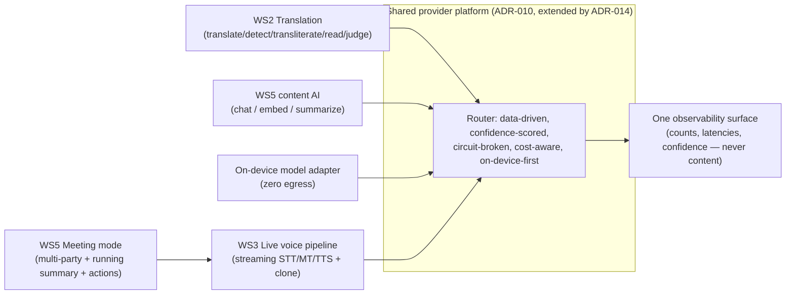
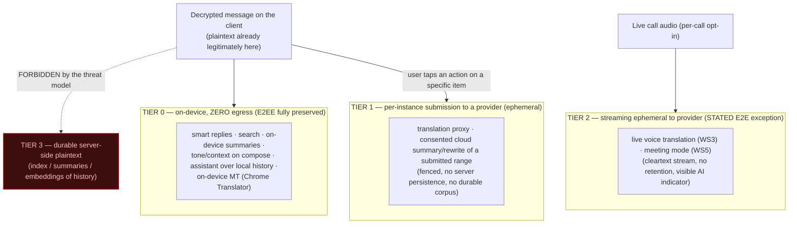
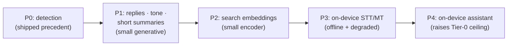
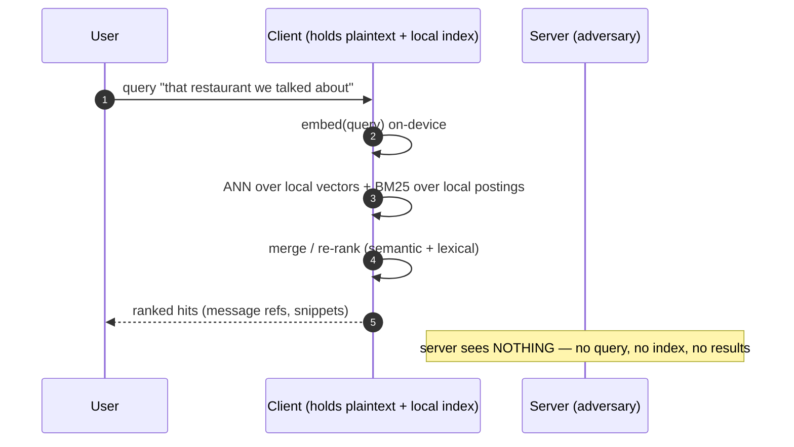
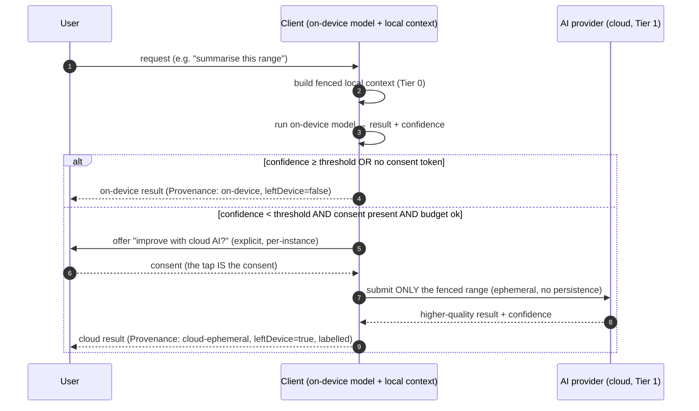
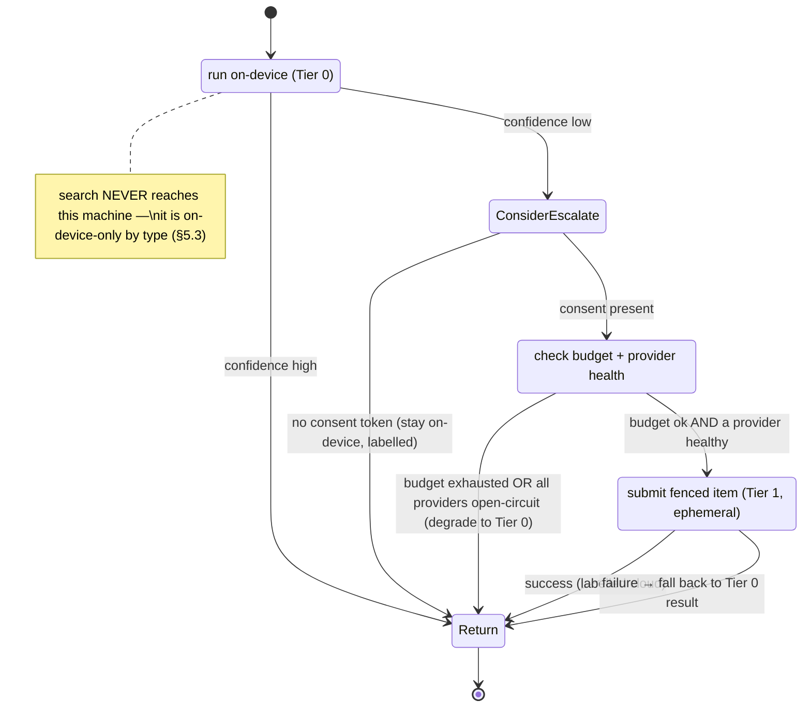

# 05 — AI Communication Platform (Workstream 5)

> **Status: PLANNING ONLY.** This document designs a future capability set. It
> authorises **no** implementation, **no** code, **no** schema, **no** flag
> change, and it **unblocks nothing**. It is gated behind Priority 1 completion
> and the ADR-008 §12 publication hard stop (see §1.3). "AI Communication ADRs
> may proceed as planning" — MASTER-ENGINEERING-ROADMAP-V2, owner directive
> 2026-08-01. Nothing here overrides that gate.
>
> **This is the most forward-looking workstream in the repository.** Where a
> claim is unproven it is labelled UNPROVEN; where a design decision belongs to
> the owner it is escalated in §14, not silently taken.

**Author role:** staff engineer · **Date:** 2026-08-01 · **Branch:**
`docs/priority-2-planning` · **Evidence basis:** current tree, the V2 roadmap,
the crypto implementation guide (17), the product audit (13), and ADRs
010–012.

---

## Table of Contents

1. [Executive summary, goals / non-goals, and the planning-only gate](#1-executive-summary)
2. [Motivation and composition with WS2 (translation) and WS3 (live voice / meeting)](#2-motivation--composition)
3. [Capability catalog](#3-capability-catalog)
4. [Privacy model — the central tension (AI over conversations vs E2EE)](#4-privacy-model--the-central-tension)
5. [Provider abstraction — the AI extension of WS2's platform](#5-provider-abstraction)
6. [Local inference roadmap](#6-local-inference-roadmap)
7. [Cost optimization](#7-cost-optimization)
8. [Conversation search and semantic summaries (privacy-preserving design)](#8-conversation-search--semantic-summaries)
9. [Meeting mode and its relationship to WS3 live voice](#9-meeting-mode)
10. [API sketches, sequence diagrams, and state machines](#10-api-sketches-sequence-diagrams-and-state-machines)
11. [Benchmark and quality approach](#11-benchmark--quality-approach)
12. [Proposed ADR-014 — AI Communication Platform](#12-proposed-adr-014)
13. [Alternatives, trade-offs, scalability, testing, deployment, rollout/rollback, evolution](#13-alternatives-trade-offs-and-operational-concerns)
14. [Conflicts and review notes (owner decisions)](#14-conflicts--review-notes)

---

## 1. Executive summary

### 1.1 What this workstream is

The **AI Communication Platform** turns AI from a set of individual features
(translation, STT/TTS, voice cloning — already shipping) into a coherent
product surface that reasons *over conversations*: **smart translation, tone
preservation, context preservation, semantic summaries, meeting mode,
conversation search, smart replies, and multilingual assistants.** It is the
umbrella that the roadmap names **Priority 6 — AI Communication Platform**
("make AI communication a first-class product area rather than a miscellaneous
feature").

The organising thesis of this document is a single sentence:

> **AI that reasons over conversation *content* must run on-device by default,
> because the server is the adversary and stored messages are end-to-end
> encrypted. Anything that sends conversation content to a provider is a
> loud, consented, ephemeral exception — never the default, never a durable
> server-side corpus.**

Every section below is an application of that thesis. It is the reason this
workstream is *harder* than WS2 (translation) and WS3 (live voice): those two
operate on content the user explicitly hands over for a single action (a tap on
"translate", a per-call opt-in to speak through a provider). This workstream is
tempted, at every feature, to reach into the *stored* encrypted history — and
that temptation is exactly where E2EE breaks if it is indulged server-side.

### 1.2 Numbering and provenance (read this to avoid a false unblock)

Per CLAUDE.md ("never treat a renumbering as an unblock"), the mapping is
stated explicitly:

| Name here | Roadmap V2 inventory | Owner amendment (2026-08-01) | ADR |
|---|---|---|---|
| WS1 (push) | Priority 2 (iOS/Android push) | Exec order #1 | ADR-009 |
| **WS2 (translation)** | Priority 6 (translation leg) | Exec order #2 | ADR-010 |
| **WS3 (live voice / meeting)** | Priority 6 (live voice leg) | Exec order #3 | ADR-011 |
| WS4 (adaptive network) | Priority 3 subset | Exec order #4 | ADR-012 |
| **WS5 — this doc** | **Priority 6 (AI Communication Platform)** | not re-sequenced ahead of Priority 1 | **ADR-014 (proposed)** |

`priority-2/` is a **planning-bucket directory**, not the roadmap's "Priority 2
— Production Hardening". This is Workstream *5* inside that bucket. The
roadmap's requirement inventory item is **Priority 6**. WS2 and WS3 were
re-sequenced *ahead* of the remaining Priority 1 crypto by the owner amendment;
**WS5's broader content-reasoning capabilities were not** — they remain behind
Priority 1 (§1.3).

ADR numbering: 001–012 are used on this branch; **013 = multi-device** (lives
on other branches per the review brief); this document therefore proposes a
non-colliding **ADR-014** (§12). ADR-014 is proposed *as an outline in this
document only* — the ADR file is not created here.

### 1.3 The gate (why nothing ships from this document)

Two independent gates both apply, and neither is opened by this document:

1. **Priority 1 completion.** Owner amendment exec-order #5: "X3DH, Double
   Ratchet, multi-device, forward secrecy, break-in recovery remain MANDATORY
   before Priority 1 is complete." Conversation search across devices (§8) and
   any cross-device AI index depend on the *multi-device* model that is itself
   still blocked (ADR-008 §BLOCKING). WS5 is therefore **doubly gated**: behind
   Priority 1 in general, and behind multi-device specifically for its
   cross-device features.
2. **ADR-008 §12 publication hard stop.** Unchanged by V2. No AI feature may
   introduce a new key, prekey, ratchet dependency, or persistence of
   security-sensitive state. WS5 touches none of the crypto state machine; the
   one storage surface it introduces (the client-side AI index, §8) is
   plaintext-derived *client-only* data governed by the existing device-wipe
   path, not key material.

### 1.4 Goals

- Make the eight named capabilities feel like one product, with one provider
  abstraction (extending WS2/ADR-010), one privacy model, and one routing
  policy (**on-device first**).
- Preserve the Priority 1 posture — *the server is the adversary* — for every
  feature that touches *stored* conversation content, or call it out loudly as
  an owner decision (§14). No silent deviation.
- Satisfy roadmap **rule 10** for every feature: **accuracy + latency +
  privacy optimised simultaneously; no provider a hard dependency; route/fall
  back on quality, availability, cost, and response time.**
- Reuse what already ships: the multi-provider translation engine
  (`web/api/translate.js`), the on-device Chrome Translator ladder
  (`web/src/lib/translate.js`), voice cloning (`web/src/lib/voice.js`), and the
  session-only plaintext cache discipline — none of it is rebuilt.

### 1.5 Non-goals

- **No server-side plaintext index, summary store, or embedding of message
  history.** This is not a "later" — it is *forbidden by the threat model*
  (§4). If the owner ever wants it, it is a separate, loudly-disclosed
  threat-model change (§14 item 1), not a feature toggle.
- **No production code, schema, or flag change** — planning only.
- **No group-call translation MVP** and **no meeting mode before WS3 (1:1 live
  voice) and group calls (roadmap Priority 5)** exist (§9). Meeting mode is
  downstream of both.
- **No new voice-cloning consent surface** — the one-clone-per-profile flow
  (ADR-011) is the only enrollment path; assistant/meeting TTS reuse it.
- No always-on AI. Every content-touching feature is user-initiated or
  per-conversation opt-in.

---

## 2. Motivation & composition

### 2.1 Motivation — the raw material already exists, undeclared

The product audit (13) corrected the record twice: Spot Me already runs **five
live AI capabilities** — STT, TTS, a multi-provider cross-confirmed
LLM-adjudicated translation engine, romanized-Indic LLM reading, and voice
cloning for voice notes. Critically for this workstream, the audit records that
the translation client **already runs on-device first** (Chrome Translator,
"nothing leaves the phone") before any network leg. That is not a future
aspiration; it is the shipped precedent this entire document generalises.

What does *not* exist is the layer that makes these compose into
conversation-level intelligence: a shared abstraction that also does
**chat/completion, embeddings, and summarization**; a client-side index so
**search** and **summaries** can run over history without a server ever seeing
plaintext; and an **on-device model adapter** so replies and assistants have a
zero-egress path. WS5 is that layer.

### 2.2 Composition with Workstream 2 (translation, ADR-010)

WS5 **does not redefine** the provider abstraction — it *extends* ADR-010's.
ADR-010 already establishes: one interface per capability
(`translate`/`transliterate`/`detect`/`read`/`judge`), providers registering
declared capabilities with `langPairs`/`scripts`/`costClass`/`latencyClass`, a
routing table *as data*, confidence scoring, circuit-breaker availability, and
cost-aware routing feeding one observability surface. WS5 adds three new
capabilities (`chat`, `embed`, `summarize`) and one new provider *kind* (the
on-device model) onto that **same registry and router** (§5). "Smart
translation" in this catalog *is* ADR-010's engine surfaced into
conversation-level flows — context-aware, cross-confirmed, adjudicated — not a
second translator.

### 2.3 Composition with Workstream 3 (live voice / meeting, ADR-011)

ADR-011 defines the realtime pipeline: capture → streaming STT → language
detect → incremental translation → voice-clone TTS → jitter-buffered playback,
with per-stage provider failover, original-audio fallback, a persistent AI
indicator, and a **stated, user-visible E2E exception** (cleartext speech to
providers by per-call opt-in). **Meeting mode (§9) is a WS5 capability built
*on* that WS3 pipeline** — it adds multi-party fan-out, a running semantic
summary over the live transcript, action-item extraction, and per-listener
target languages. It shares WS3's pipeline, provider abstraction, failover, and
privacy posture; it does not fork them. Meeting mode is the named "group is a
stated follow-up" in ADR-011's non-goals.

The composition, in one picture:



---

## 3. Capability catalog

For each capability: **what it does**, the **model/provider approach**, its
**latency class** (`interactive` < ~300 ms · `standard` < ~2 s · `batch`
best-effort · `streaming` for live), and its **privacy posture** (the tier is
defined in §4).

### 3.1 Smart translation
- **What:** context-aware, cross-confirmed, adjudicated translation of messages
  and whole chats — the shipped ADR-010 engine surfaced with conversation
  context (the reading chain already proves context matters: "varen" is a
  promise, not a description).
- **Provider approach:** ADR-010 verbatim — on-device Chrome Translator first,
  then the authed multi-provider proxy (`confirmedTranslate` parallel racing +
  `scriptOk` disqualification + `adjudicate` panel), then keyless `gtx`, then
  MyMemory. Context windows ride **fenced as untrusted** (ADR-010 §3).
- **Latency class:** `interactive`/`standard` (parallel racing preserved).
- **Privacy posture:** **Tier 0 → Tier 1.** On-device leg leaks nothing; the
  proxy leg is per-message content the user explicitly submitted by tapping
  translate — ephemeral, fenced, never persisted server-side. This is *today's*
  ladder, unchanged.

### 3.2 Tone preservation
- **What:** when translating or when the assistant rewrites, preserve register,
  formality, sentiment, emphasis, and idiom — so "translated" doesn't mean
  "flattened". Also surfaced as a compose-time "keep my tone" control.
- **Provider approach:** on-device small LM for compose-time tone-locked
  rewrite; for translation, a tone-annotation passed to ADR-010's LLM legs as
  fenced metadata (faithfulness-first briefing already exists in `adjudicate`).
- **Latency class:** `interactive` (compose) / `standard` (translation leg).
- **Privacy posture:** **Tier 0** for on-device compose rewrite; **Tier 1**
  only if the user escalates a cloud rewrite of a specific message.

### 3.3 Context preservation
- **What:** maintain a rolling conversation window so translation, replies, and
  summaries are coherent across turns (pronoun/anaphora resolution, topic
  carry, prior-turn entities).
- **Provider approach:** an **on-device context builder** assembles the window
  from locally-decrypted messages; whatever engine consumes it (on-device or
  cloud) receives it **fenced** (attacker-authored text, never instructions —
  ADR-010 §3). Context is **session-scoped and never persisted server-side**
  (the precedent: plaintext caches were pulled out of `localStorage` for
  disappearing-message hygiene).
- **Latency class:** `interactive` (window assembly is local).
- **Privacy posture:** **Tier 0** to build; the tier of the *consuming* engine
  governs any egress. Context never independently egresses.

### 3.4 Semantic summaries
- **What:** "summarise this chat / this range / what I missed" — abstractive
  summaries and unread catch-ups; segment-aware (topic boundaries).
- **Provider approach:** on-device embedding-based segmentation + on-device
  summarization model by default; optional consented cloud escalation for a
  submitted range (higher quality). Faithfulness-checked (§11).
- **Latency class:** `standard` (short window) / `batch` (long range).
- **Privacy posture:** **Tier 0** default (on-device, zero egress); **Tier 1**
  optional per-range escalation. **No summary is ever stored server-side.**

### 3.5 Meeting mode
- **What:** multi-party live translated calls with a live transcript, a running
  rolling summary, action-item/decision extraction, and per-listener target
  languages (§9).
- **Provider approach:** WS3/ADR-011 streaming pipeline (per stage through the
  provider abstraction) + WS5 summarization applied to the live transcript.
- **Latency class:** `streaming` (translation) + `standard` (rolling summary).
- **Privacy posture:** **Tier 2** — the ADR-011 stated E2E exception (cleartext
  speech to providers, per-call opt-in, no retention). Post-meeting artifacts
  land **on participants' devices only** (§14 item 5).

### 3.6 Conversation search
- **What:** semantic + lexical search across the user's own message history
  ("that restaurant we talked about", paraphrase-tolerant), plus media/sender
  filters.
- **Provider approach:** **on-device only** — a client-side encrypted index
  (lexical postings + small on-device embeddings), nearest-neighbour + BM25
  merge, all local (§8).
- **Latency class:** `interactive` (query over a local index).
- **Privacy posture:** **Tier 0 exclusively.** The server never sees the query,
  the index, or the results. This is enforced in the *type system* (§5) and by
  an egress fence test (§11) — no policy can escalate search to a server.

### 3.7 Smart replies
- **What:** 1–3 suggested replies / quick completions / "smart compose" inline,
  tone-matched to the user and context-aware.
- **Provider approach:** on-device small LM over the local recent-context
  window; suggestions ranked by an on-device relevance score; never
  auto-sent.
- **Latency class:** `interactive` (target < ~1.2 s warm on a mid device —
  UNPROVEN until benchmarked, §11).
- **Privacy posture:** **Tier 0.** Reads local context, zero egress. (Policy
  question — may replies be pre-computed for *unread* messages? §14 item 8.)

### 3.8 Multilingual assistants
- **What:** an in-app assistant that can answer over the user's *own*
  conversation history, draft messages, translate on request, and explain — in
  the user's language.
- **Provider approach:** on-device small LM over a **scoped, fenced** slice of
  local history by default; consented cloud escalation for hard queries. The
  assistant treats all conversation content as **untrusted input**
  (prompt-injection surface — the `fenced()` discipline in `translate.js` is
  the precedent).
- **Latency class:** `standard` (on-device) / `standard` (cloud on escalation).
- **Privacy posture:** **Tier 0** default; **Tier 1** on explicit escalation.
  Scope of history the assistant may read is an owner decision (§14 item 3).

### 3.9 Catalog at a glance

| Capability | Default tier | Escalation | Latency class | Runs over |
|---|---|---|---|---|
| Smart translation | 0 (on-device MT) | 1 (proxy) | interactive/standard | submitted message |
| Tone preservation | 0 | 1 | interactive | outbound / submitted |
| Context preservation | 0 | (consumer's tier) | interactive | local window |
| Semantic summaries | 0 | 1 | standard/batch | local range |
| Meeting mode | 2 (ephemeral stream) | — | streaming | live call audio |
| Conversation search | **0 only** | **never** | interactive | local index |
| Smart replies | 0 | — | interactive | local context |
| Multilingual assistant | 0 | 1 | standard | scoped local history |

---

## 4. Privacy model — the central tension

**This is the section that must not be hand-waved.** AI over user conversations
is in direct tension with the Priority 1 guarantee, stated in the crypto guide
(17 §0): *the server is the adversary.* The server may route, store ciphertext,
and see metadata; it must **never** read content. Every capability above is a
potential violation of that sentence. The model below is how we keep the
sentence true — or, where we cannot, escalate to the owner (§14) instead of
lying about it (roadmap §6.3: "The system must never claim full end-to-end
privacy if cloud AI providers receive decrypted audio" — generalised here to
all content).

### 4.1 The one fact that makes on-device AI legitimate

**The client already holds plaintext.** It decrypts every message to render it
on screen — that is the whole point of E2EE (only the endpoints read content).
AI that runs *on the same device, over already-decrypted content, with zero
egress* sees **nothing the client did not already legitimately hold.** It does
not weaken E2EE at all. This is why the entire strategy is *on-device first*:
it is the only place AI can touch conversation content without changing the
threat model.

### 4.2 Trust boundaries — the tiers



| Tier | What leaves the device | When | E2EE status | Governing precedent |
|---|---|---|---|---|
| **0** | **Nothing** | default for all content-reasoning features | **Fully preserved** | Chrome Translator on-device leg (shipped) |
| **1** | The *one item* the user submitted | user taps translate / "improve this" / "summarise this range" | Explicit, scoped exception; no durable corpus | translate proxy (shipped); session-only caches |
| **2** | A live cleartext stream | per-call, per-direction opt-in | **Stated E2E exception, user-visible** | ADR-011 §"Privacy model" |
| **3** | Durable plaintext / index / embeddings at the server | **never (default)** | **Breaks the threat model** | — (owner decision only, §14 item 1) |

**The invariant:** Tier 3 does not exist as a product default. There is **no
server-side plaintext index, no server-side summary store, no server-side
embedding of message history.** If the server held any of these, a malicious
server would read the corpus — the exact thing E2EE prevents. Any move toward
Tier 3 is an explicit threat-model change, separately ADR'd, and disclosed to
users in those words.

### 4.3 What *fundamentally* requires plaintext at a provider

Be honest about the ceiling of Tier 0. Some things cannot (today) run
acceptably on-device, and genuinely need a provider to see cleartext:

- **Highest-quality translation of hard pairs / adjudication.** The
  cross-confirmation + LLM-adjudicator quality bar (`confirmedTranslate`,
  `adjudicate`) is not reproducible on-device. → Tier 1, per-message, as today.
- **Live low-latency multi-party translation (meeting mode).** Streaming STT +
  MT + expressive cloned TTS under a < 2.5 s budget is beyond mobile on-device
  today. → Tier 2, the stated exception (ADR-011).
- **Frontier-quality open-ended assistant reasoning** over a hard query. →
  Tier 1 on *explicit* escalation only; the default assistant is on-device.

Everything else in the catalog — replies, search, summaries of modest ranges,
tone/context, on-device MT — has a *viable Tier 0 path* (§6). The strategy is
to maximise the Tier 0 set over time as on-device models improve, and to make
every Tier 1/2 use **consented, scoped, ephemeral, fenced, and non-persistent.**

### 4.4 Consent / opt-in model

| Tier | Consent bar | Indicator | Recorded? |
|---|---|---|---|
| 0 | Feature toggle (default-eligible); still disclosed as "on-device AI" | subtle "on-device" mark | preference only |
| 1 | **Explicit per-action** (the tap *is* the consent) or per-conversation opt-in | "sent to translation/AI provider" affordance | a `ConsentToken` gates the call (§5) |
| 2 | **Explicit per-call, per-direction** opt-in | **persistent** AI-active indicator (ADR-011) | per-call consent + audit event (no raw content) |
| 3 | Not offered | — | — |

Consent rules, non-negotiable:
- **No cloud tier without a consent token present** — enforced in the routing
  policy type (§5): a `cloud-ephemeral` ceiling requires `consent`.
- **Consent is scoped and revocable.** Per-conversation AI opt-in is
  independently revocable; revocation is immediate; no residue.
- **Telemetry never carries content.** Counts and timings only (roadmap rule 7;
  crypto guide §7 — "never log plaintext"). This includes embeddings,
  suggestions, and search queries, which *are* content-derived.
- **Disappearing-message hygiene applies to AI derivatives.** A summary,
  embedding, or suggested reply derived from a message under a disappearing
  timer inherits that timer; the on-device index (§8) must honour TTL deletion
  the same way the message store does.

### 4.5 The honesty rule

Restating roadmap §6.3 for all content: **the product must never claim full
end-to-end privacy for a feature whose content reaches a provider.** Tier 0 may
be described as private; Tier 1/2 must be described as "processed by an AI
provider for this action". This is a UX requirement, not a footnote, and it is
a §14 review item wherever the wording is load-bearing.

---

## 5. Provider abstraction

**Reference, do not redefine.** The canonical provider abstraction is
Workstream 2's (ADR-010): one interface per capability, providers registering
declared capabilities, a data-driven router with confidence scoring,
circuit-breaker availability, and cost-aware routing into one observability
surface. WS5 adds capabilities and one provider *kind* onto **that same
registry and router.** The signatures below are **design sketches in a
planning document — not production code, not a file in the tree.**

### 5.1 Shared base (owned by WS2 / ADR-010 — reproduced for reference only)

```ts
type CostClass    = 'free-on-device' | 'cheap' | 'metered' | 'premium'
type LatencyClass = 'interactive' | 'standard' | 'batch' | 'streaming'

interface ProviderHealth { available: boolean; p50ms: number; breaker: 'closed' | 'open' | 'half' }

interface CapabilityRegistration<Cap extends string> {
  provider: string
  capability: Cap
  langPairs?: Array<[from: string, to: string]>   // '*' allowed
  scripts?: string[]
  costClass: CostClass
  latencyClass: LatencyClass
  onDevice: boolean            // true ⇒ zero network egress, costClass 'free-on-device'
  health(): ProviderHealth     // feeds the router's circuit breaker
}
```

### 5.2 WS5 extension — three new capabilities on the same registry

```ts
type AiCapability = 'chat' | 'complete' | 'embed' | 'summarize'

// All conversation content crosses these boundaries wrapped as UNTRUSTED —
// the fencing discipline of translate.js (`fenced(label, text)`) is mandatory,
// because conversation content is attacker-authored (prompt-injection surface).
type FencedText = { readonly kind: 'fenced'; nonce: string; text: string }
interface FencedMessage { role: 'peer' | 'self'; content: FencedText; ts: number }

interface ChatProvider extends CapabilityRegistration<'chat'> {
  chat(messages: FencedMessage[], opts: GenOpts): Promise<Completion>   // replies, assistant
}

interface EmbedProvider extends CapabilityRegistration<'embed'> {
  dim: number
  embed(texts: FencedText[], opts?: EmbedOpts): Promise<Float32Array[]> // BATCHED; search + segmentation
}

interface SummarizeProvider extends CapabilityRegistration<'summarize'> {
  summarize(window: FencedMessage[], style: SummaryStyle): Promise<Summary>
}

// The on-device model is a provider like any other — it simply never egresses.
interface OnDeviceModel {
  id: string
  runtime: 'webgpu' | 'wasm' | 'native'     // native = a future Capacitor path
  memoryMb: number
  ready(): Promise<boolean>                  // model downloaded + runtime compiled/warmed
  // registers as chat | embed | summarize with { onDevice: true, costClass: 'free-on-device' }
}
```

### 5.3 The client-facing AI service surface

```ts
interface Provenance {            // returned on EVERY result — honesty is not optional (§4.5)
  tier: 'on-device' | 'cloud-ephemeral'
  provider: string
  leftDevice: boolean
  confidence: number              // §11 quality signal
  fenced: boolean
}

interface RoutePolicy {
  tierCeiling: 'on-device' | 'cloud-ephemeral'      // default 'on-device'
  escalateBelowConfidence?: number                  // honoured ONLY if consent present
  consent?: ConsentToken                            // REQUIRED for any cloud tier
  budget?: BudgetHint                               // §7 cost governance
}

interface AiService {
  suggestReplies(convoId: string, ctx: LocalContext, p?: RoutePolicy): Promise<Suggestion[] & { prov: Provenance }>
  summarize(convoId: string, range: MessageRange,  p?: RoutePolicy): Promise<Summary & { prov: Provenance }>
  assist(prompt: string, ctx: LocalContext,        p?: RoutePolicy): Promise<AssistantTurn & { prov: Provenance }>

  // Search is typed to be on-device ONLY. There is no RoutePolicy parameter,
  // by design: no caller can escalate search to a server (§4.2 invariant).
  search(query: string, scope: SearchScope): Promise<(SearchHit[]) & { prov: Provenance & { tier: 'on-device' } }>
}
```

The type of `search` **encodes the privacy invariant**: it accepts no policy
and its provenance tier is statically `'on-device'`. Encoding the rule in the
type is deliberate — it makes a server-side search a compile error, not a code
review catch.

### 5.4 How this maps onto what ships

- `chat` registrations: an on-device small LM (Tier 0) + the existing LLM legs
  (Anthropic/Gemini/OpenAI, already wired in `translate.js`) as Tier 1
  providers — **reuse, not new integrations.**
- `embed` registrations: an on-device small encoder (Tier 0 only for the index;
  §8). No cloud embed provider is registered for message history — that would
  be Tier 3.
- `summarize` registrations: on-device summarizer (Tier 0) + an optional
  consented cloud LLM leg (Tier 1).
- The router, confidence scoring, circuit breaker, cost classes, and
  observability are **ADR-010's**, unchanged.

---

## 6. Local inference roadmap

On-device inference is the privacy-preserving answer for most of the catalog
(§4). This is the phased path. All numbers are **engineering targets, UNPROVEN
until benchmarked** (§11), and gated on device capability — the Capacitor
Android WebView's WebGPU availability is itself unproven (audit: hardware-
touching surfaces are UNPROVEN).

### 6.1 Constraints on mobile

| Constraint | Reality | Design response |
|---|---|---|
| Memory | model + runtime must stay resident without eviction; budget ~≤ 300–500 MB | quantized small models (INT4/INT8); one model loaded at a time; unload on background |
| Compute / latency | mid-tier phones, thermal throttling | small models; `interactive` features only where warm-latency is met; escalate rather than stall |
| Battery | inference and indexing are power-hungry | batch/opportunistic indexing, prefer on-charger + idle; debounce reply generation |
| Model download | models are tens–hundreds of MB; cannot bundle | lazy download, content-addressed cache, resumable; feature degrades gracefully until ready |
| Runtime availability | WebGPU spotty in WebViews; WASM slower | WebGPU when present, **WASM fallback**, future **native** path (Capacitor plugin) |
| Cold start | first inference compiles shaders / loads weights | warm on feature open; cache compiled artifacts; show on-device "warming" state |

### 6.2 Phases

**Phase 0 — today (precedent).** On-device Chrome Translator is already first
in the translate ladder. On-device language detection is feasible now. This
proves the Tier-0 path is real, not theoretical.

**Phase 1 — small generative + classifiers (replies, detection, short
summaries).** A quantized small LM (order ~0.5–2 B params, INT4) via WebGPU
(e.g. an ONNX Runtime Web / WebLLM-class runtime), WASM fallback for CPU-only.
Powers **smart replies**, **tone/context on compose**, **short semantic
summaries**, and **language detection**. Target warm latency: replies
`interactive`; short summary `standard`. Zero egress.

**Phase 2 — small encoder embeddings (search).** A small sentence-embedding
model (order ~30–120 M params, MiniLM-class) to embed messages **once each**,
on-device, building the client-side vector index (§8). Embeddings are cheap and
**reusable** across search, segmentation, and reply ranking (§7). This is the
enabler for **conversation search** with **no server involvement at all.**

**Phase 3 — on-device STT / MT for offline + degraded modes.** Heavier;
device-class-gated. On-device incremental STT and lightweight MT feed offline
captions and the degraded path for live/meeting modes (and dovetail with WS4's
offline transports). Explicitly the *last* phase — largest models, tightest
device constraints.

**Phase 4 — assistant on-device.** A more capable on-device chat model (as
mobile NPUs and small-model quality improve) raises the assistant's Tier-0
ceiling, shrinking the Tier-1 escalation set over time.

### 6.3 Capability → feasibility ordering (why this order)



Smallest, highest-privacy-value, most-latency-tolerant-of-on-device wins first;
the largest models (STT/MT/assistant) come last, and until they land those
capabilities use Tier 1/2 with consent.

---

## 7. Cost optimization

The audit's standing warning: **eight metered vendors, no caps in code.** The
single biggest cost lever in this workstream is **moving work on-device**
(Tier 0 has *zero* marginal provider cost). The rest:

- **Model tiering / escalation (small-first).** Try the on-device / small model
  first; escalate to a mid, then premium, cloud model **only** on low
  confidence *and* explicit consent. This mirrors ADR-010's shipped
  first-success chains and its "skip confirmation for high-confidence pairs"
  optimisation (measured, not assumed).
- **Embedding reuse (the highest-leverage lever).** Embed each message
  **exactly once**, on-device, and persist the vector in the local index. One
  embedding then powers **search, topic segmentation for summaries, semantic
  reply ranking, and near-duplicate detection.** Never recompute.
- **Batching.** Batch backlog embedding (idle/on-charger); batch-summarise a
  range in one call rather than per message; debounce reply generation so
  keystrokes don't each trigger inference.
- **Caching.** Session-scoped result caches (the translate client's session-
  only caches are the precedent), keyed by content hash: summaries keyed by
  message-range hash; translations by (text, pair); reply sets by context hash.
  Caches respect disappearing-message TTLs.
- **Cost governance.** Per-provider cost classes + counters (calls, tokens,
  fallbacks, escalations) + **budgets and alerts** — the same surface as
  ADR-010 §5 / ADR-009 §4. A per-user and per-org budget with graceful
  degradation to Tier 0 when exhausted (never a hard failure — roadmap rule 10:
  route/fall back on cost). This is the concrete fix for the audit's "no caps
  in code" finding, applied to AI.
- **No unofficial endpoints for AI.** The `gtx` keyless fallback (a translation
  fallback the audit flags) is **not** extended to AI legs; every AI provider
  is authed, fenced, capped (§14 item 9).

---

## 8. Conversation search & semantic summaries

The concrete privacy-preserving design for the two capabilities that most tempt
a Tier-3 violation. **The invariant: the server never holds a plaintext index.**

### 8.1 Client-side encrypted index

For each message, on-device (Phase 2 model):
1. Compute **lexical postings** (tokenised, normalised) for BM25.
2. Compute a **small embedding vector** (reused per §7).
3. Store both in a **client-side index encrypted at rest** with a device-held
   key, in a dedicated IndexedDB store — consistent with the existing
   `spotme-e2e`, media, and `spotme-identity-pins` IndexedDBs. This index is a
   **fourth client store** and **must join the device-wipe path** (device wipe
   already clears the other three and returns `{ok, failures}`) and must honour
   **disappearing-message TTLs** (§4.4).

The index holds plaintext-derived data on a device that already holds the
plaintext — it changes the threat model **not at all** (§4.1), provided it never
leaves the device unencrypted and never becomes a *server* index.

### 8.2 Query path — entirely on-device



No server round-trip exists in the search path. The `AiService.search` type
(§5.3) forbids one structurally, and an **egress-fence test** (§11) fails the
build if search issues a network call — mirroring the crypto `signing-not-
shipped` fence pattern.

### 8.3 Scale and multi-device

- **Scale on one device:** brute-force cosine is fine for modest corpora; an
  on-device ANN (HNSW/IVF-flat, small) for large histories. All local.
- **Cross-device (gated on Priority 1 multi-device):** the index is **either**
  (a) rebuilt per device from that device's own decrypted history, **or**
  (b) synced as **ciphertext blobs** the server cannot read (encrypted index
  shards moved like any E2E payload — never a queryable server index).
  **Server-side searchable/queryable encryption is explicitly rejected**: its
  leakage profile (access patterns, query correlation) hands the adversary a
  query oracle and is a research-grade risk. If ever wanted, it is a §14
  owner decision, not a default. This whole sub-capability is blocked until
  multi-device ships (ADR-008 §BLOCKING; §1.3).

### 8.4 Semantic summaries — same discipline

Segment a message range on-device using embedding boundaries (§7 reuse), then
summarise. **Default: on-device summarizer (Tier 0), zero egress, nothing
stored server-side.** Optional: the user explicitly escalates a specific range
to a cloud summarizer (Tier 1) — submitted ephemerally, fenced, not persisted.
Summaries are cached client-side keyed by range hash, under the message TTLs.

---

## 9. Meeting mode

### 9.1 What it is and what it is *downstream of*

Meeting mode = multi-party live translated calls with a live transcript, a
**running rolling summary**, action-item/decision extraction, and per-listener
target languages. It is **downstream of two things** and cannot precede either:

- **WS3 (ADR-011) 1:1 live voice** — its non-goals name group as "a stated
  follow-up"; meeting mode is that follow-up.
- **Group calls (roadmap Priority 5)** — a reviewed SFU (e.g. LiveKit, only
  after audit) is a precondition; there is no multi-party call transport today.

So meeting mode is the **most gated** capability in this workstream, and it is
called out as such.

### 9.2 Shared with WS3 vs distinct

| Component | Shared with WS3 (ADR-011) | Distinct to meeting mode (WS5) |
|---|---|---|
| Streaming STT → detect → incremental MT → clone TTS → jitter playback | ✅ reused verbatim | — |
| Provider abstraction + per-stage failover | ✅ (ADR-010) | — |
| Original-audio fallback, AI-active indicator | ✅ | extended to N participants |
| Privacy posture (Tier 2, per-call opt-in, no retention) | ✅ | per-participant consent |
| Fan-out | 1:1 | **N speakers → per-listener target language** |
| Diarization / turn attribution | 2 parties (endpointing) | **speaker diarization across >2** |
| Running semantic summary + action items | — | **WS5 summarization over the live transcript** |
| Post-call artifact | transcripts on-device | **summary + transcript on participants' devices only** (§14 item 5) |

### 9.3 The privacy line meeting mode must not cross silently

Meeting mode inherits WS3's **stated E2E exception** (cleartext to providers for
the live stream). It must **not** silently widen it:
- The **artifact** (transcript + summary) defaults to **device-only**; a
  server/enterprise meeting record is a Priority 11 / owner decision (§14
  item 5).
- An assistant "listening to" or "acting during" a meeting is **new egress**
  and a new consent surface, not covered by the call opt-in (§14 item 7).

---

## 10. API sketches, sequence diagrams, and state machines

### 10.1 Client-first / server-escalation flow (replies, summaries, assistant)



### 10.2 On-device-vs-cloud routing decision (state machine)



### 10.3 Conversation search — proof the server sees nothing

See §8.2. The sequence has **no server participant in the query path** — the
strongest possible statement of the invariant.

### 10.4 Service surface (recap)

The `AiService` interface in §5.3 is the whole client-facing surface:
`suggestReplies`, `summarize`, `assist` (each policy-driven, on-device-first,
provenance-returning) and `search` (on-device-only by type). There is **no new
server REST/WebSocket surface for content AI** — that absence is the design.
The only server-facing calls are the *existing* Tier-1 provider proxies
(`/api/translate`, `/api/voice`) and Tier-2 live-stream providers (WS3), reached
through the shared abstraction with the shared fencing, rate limits, and cost
caps.

---

## 11. Benchmark & quality approach

Per roadmap §8 (benchmarks include env, raw results, median, tail latency, and
comparison) and the crypto guide's test discipline (fences that fail the
build). Nothing here is "trust the model".

### 11.1 Quality

| Capability | Metric | Method |
|---|---|---|
| Summaries | faithfulness + coverage | entailment check (summary asserts only what's in the window — a hallucination gate, mirroring `adjudicate`'s faithfulness-first brief) + embedding-similarity to human references + a **labelled Spot Me corpus** (reuse the pattern: translation is graded against a 26-sentence owner corpus) |
| Smart replies | acceptance rate; post-accept edit distance; safety | did the user pick a suggestion; how much they edited it; offensive/PII-leak rate (`aidefence_has_pii`-style gate) |
| Search | precision@k, MRR, paraphrase recall | a labelled query set over a seeded corpus; semantic-vs-lexical ablation |
| Translation (smart) | ADR-010 confidence + faithfulness | inherited from ADR-010 §4 (agreement/adjudicator/single-engine) |
| Assistant | task success + injection resistance | scored tasks + a **prompt-injection suite** (conversation content is attacker-authored; the `fenced()` nonce discipline is under test) |

### 11.2 Latency

Per-tier p50/p95/p99; on-device **cold-start vs warm**; escalation frequency
(how often Tier 0 is insufficient — a cost *and* quality signal). Live/meeting
latency inherits ADR-011's budget (MVP < 2.5 s end-to-end; the split is
benchmarked, not assumed).

### 11.3 Privacy audits (build-failing, not advisory)

- **Egress fence:** a test asserting Tier-0 features make **zero network
  calls**; it **fails the build** if an on-device feature (esp. search) touches
  the network — the `signing-not-shipped` fence pattern applied to privacy.
- **No-server-index fence:** a test asserting no code path writes a
  plaintext-derived index/summary/embedding to a server endpoint.
- **Consent-gating test:** no Tier-1/2 egress without a recorded
  `ConsentToken`.
- **Telemetry-content fence:** analytics/logs never carry content, embeddings,
  suggestions, or queries (roadmap rule 7; crypto guide §7).
- **Provider retention verification:** each Tier-1/2 provider is used only with
  its shortest-retention API options and contractual no-retain terms (ADR-011
  precedent); a provider that cannot meet retention terms is **not routed to,
  whatever its quality** (rule 10).
- **Disappearing-message hygiene test:** AI derivatives inherit and honour
  source-message TTLs.

---

## 12. Proposed ADR-014

> Proposed here as an outline **only**. The ADR file is **not** created by this
> document. Number 014 is chosen to avoid collision: 001–012 are used on this
> branch; 013 = multi-device (other branches).

**Title:** ADR-014 — AI Communication Platform (on-device-first AI over
conversations)

**Status:** Proposed — **PLANNING ONLY** (owner directive 2026-08-01). Gated
behind Priority 1 completion and ADR-008 §12; **extends ADR-010**; **downstream
of ADR-011**; cross-device features **blocked on multi-device** (ADR-008
§BLOCKING).

**Context:** The roadmap (Priority 6) names conversation-level AI capabilities
— summaries, search, replies, assistants, tone/context — that reason over
*stored* E2EE content. The Priority 1 threat model is "the server is the
adversary" (crypto guide §0). Naively, these features want a server-side index
or summary store — which would hand the adversary the plaintext corpus. Yet the
raw material already ships (five live AI capabilities; on-device Chrome
Translator already first in the ladder) and the provider abstraction already
exists (ADR-010). The client already holds plaintext (it decrypts to render), so
on-device AI over already-decrypted content changes the threat model *not at
all*.

**Decision:**
1. **On-device-first tiering** (§4.2): Tier 0 (on-device, zero egress) is the
   default for all content-reasoning features; Tier 1 (per-instance submission,
   ephemeral, fenced) requires explicit consent; Tier 2 (streaming ephemeral,
   the ADR-011 exception) for live/meeting; **Tier 3 (durable server-side
   plaintext) is forbidden** and offered only via a separate owner-level
   threat-model change.
2. **Extend ADR-010's abstraction** with `chat`/`complete`/`embed`/`summarize`
   and an on-device model provider kind, on the same router/breaker/cost/
   observability machinery (§5) — reuse, not rebuild.
3. **Conversation search and summaries are on-device** over a client-side
   **encrypted** index; **the server never holds a plaintext index** (§8). The
   `search` surface is on-device-only *by type*.
4. **Consent, provenance, and honesty** are mandatory: every result carries
   provenance (tier, provider, leftDevice, confidence); no cloud tier without a
   consent token; the product never claims full E2E privacy for a
   content-egressing feature (§4.5).
5. **Rule 10 everywhere:** accuracy + latency + privacy optimised together; no
   provider a hard dependency; route/fall back on quality, availability, cost,
   response time; degrade to Tier 0 on budget/health exhaustion.
6. **Local inference roadmap** (§6) is the strategy to grow the Tier-0 set and
   shrink Tier-1 escalation over time.

**Consequences:**
- *Positive:* strong E2EE-preserving privacy for most features; cost largely
  moved off metered vendors; one coherent abstraction; honest UX; the invariant
  encoded in types and build-failing fences.
- *Negative / accepted:* significant client engineering and device-capability
  variance (WebGPU/WASM availability UNPROVEN in the Capacitor WebView); a
  quality ceiling on-device vs frontier cloud (mitigated by consented
  escalation); cross-device search complexity under multi-device; a new client
  storage subsystem that must join device-wipe and TTL paths.
- *Owner decisions required:* §14 (server-side index, cloud escalation of
  stored history, assistant history scope, meeting artifacts, etc.).

**Alternatives considered:** server-side AI over decrypted content (rejected —
breaks the threat model); homomorphic/secure-enclave server compute (rejected
for now — impractical at this quality/latency; a future research track);
searchable encryption (rejected — leakage/query-oracle risk); doing nothing
(rejected — the roadmap names Priority 6).

---

## 13. Alternatives, trade-offs, and operational concerns

### 13.1 Alternatives + trade-offs (headline)

| Alternative | Why not (as default) | Where it survives |
|---|---|---|
| Server-side AI over decrypted content | Breaks "server is the adversary" | never (owner decision only) |
| Searchable / queryable encryption at server | Access-pattern + query-oracle leakage | rejected; §14 if ever wanted |
| Homomorphic encryption / secure enclave server compute | Impractical quality/latency today | future research track |
| Cloud-only (no on-device) | Fails rule 10 privacy + cost; hard provider dependency | Tier-1 escalation only |
| On-device-only (no cloud ever) | Quality ceiling on hard tasks | the goal *over time* (§6); consented escalation bridges the gap now |

### 13.2 Scalability

Tier 0 scales **per device** (compute is the user's, not ours) — the most
scalable posture available. Server-side load is only the *existing* Tier-1/2
proxy traffic, governed by ADR-010's rate limits and this doc's budgets (§7).
The client index (§8) scales with an on-device ANN for large histories.
Horizontal-scale of the realtime/meeting transport is Priority 3/5, **not** this
workstream (explicitly not lifted).

### 13.3 Testing

Unit (routing policy, tier selection, fencing), integration (provider
abstraction against ADR-010's harness), quality suites (§11.1), latency
benchmarks (§11.2), and the build-failing privacy fences (§11.3). New client AI
code lives in **its own modules** — it must **not** pile into `chat.js` (already
~9× the 500-line rule; the standing violation must not grow).

### 13.4 Deployment, rollout, rollback

- **Per-capability, per-tier feature flags**, default safe (roadmap rule 6):
  every capability ships **off**; on-device tiers widen by cohort;
  cloud/escalation tiers gated behind explicit consent even when flagged on.
- **Rollback = flag off = today's behaviour**, exactly the ADR-010/011/012
  pattern (the legacy path always exists underneath). No AI feature removes or
  degrades a non-AI path.
- **Observability before high-risk enablement** (roadmap §8): cost/latency/
  confidence dashboards (content-free) exist before any Tier-1/2 capability is
  widened.
- **Model delivery** (§6.1): content-addressed, cached, resumable; a feature
  degrades gracefully (or falls to Tier 1 with consent) until its model is
  ready.

### 13.5 Future evolution

As on-device models improve (§6 P4), the Tier-0 set grows and Tier-1 shrinks —
privacy and cost improve *monotonically* without a UX change. Extension points
already in place: multi-device fan-out (v3 header SDEV/RDEV), the transport seam
(WS4) for offline AI, and the attachment-key envelope (004d) for future
media-AI. Media AI (OCR, image understanding), on-device STT (P3), and an
enterprise meeting-record product (Priority 11) are named future tracks — each
its own consent/threat-model review.

---

## 14. Conflicts & review notes

**Every place AI capability collides with the E2EE guarantees is an owner
decision.** Enumerated, not buried. Each is a *decision the owner must make
explicitly* — this document takes none of them.

1. **Any server-side plaintext index / summary store / embedding of history
   (Tier 3).** Directly breaks "the server is the adversary" (crypto guide §0).
   **Not proposed.** Would be an explicit threat-model relaxation, separately
   ADR'd, and disclosed to users in plain words. *Owner decision: never / never
   default.*
2. **Cloud escalation of *stored-history* content (Tier 1 over history).**
   Translation egress is content the user *composed for translation* by tapping
   translate. A cloud summary/assistant answer over *stored* messages submits
   content the user may not have composed for any third party. Even
   per-instance, ephemeral, and fenced, this is a broader exposure. *Owner
   decision: is cloud escalation over stored history allowed at all, or is
   history on-device-only?*
3. **Assistant scope over conversation history.** An assistant that can read
   history is a broad content-access and **prompt-injection** surface
   (conversation content is attacker-authored — the `fenced()` precedent).
   *Owner decision: how much history may the assistant read, and under what
   consent?*
4. **Cross-device search under multi-device.** The index must sync as
   ciphertext or rebuild per device; **no queryable server index**; searchable
   encryption rejected (§8.3). Interacts with the still-blocked multi-device
   design (ADR-008 §BLOCKING) and is gated on Priority 1. *Owner decision on the
   sync model, when multi-device unblocks.*
5. **Meeting-mode artifacts (transcript + summary).** Device-only (privacy) vs a
   server / enterprise meeting record (Priority 11). Default must be
   device-only. *Owner / enterprise decision.*
6. **Voice reuse for assistant / meeting TTS.** Must reuse the
   one-clone-per-profile consent (ADR-011); any new voice use is a new consent
   surface. *Owner decision on any new voice use.*
7. **Widening the live/meeting E2E exception.** Tier 2 cleartext-to-provider is
   the *stated* ADR-011 exception for translation of the call. An assistant that
   *listens to* or *acts during* a call is **new egress** beyond that opt-in.
   *Owner decision: is in-call AI beyond translation permitted, and how
   consented?*
8. **Pre-computing AI over unread content.** Generating a suggested reply or
   summary for a message the user has not yet opened is automated processing of
   content (even on-device, zero-egress) and a battery cost. *Owner/policy
   decision: on-focus only, or pre-compute?*
9. **No unofficial endpoints for AI.** The `gtx` keyless fallback (audit risk)
   must **not** be extended to AI legs; every AI provider authed, fenced, and
   **cost-capped** (the audit's "eight metered vendors, no caps in code"
   applies double here). *Standing rule; flagged because it is tempting.*
10. **Telemetry as a content leak.** Analytics must never carry content,
    embeddings, suggestions, or queries (roadmap rule 7; crypto guide §7). A
    standing invariant, flagged because AI telemetry is a tempting and
    high-consequence leak.

### 14.1 Architecture conflicts (for review)

- **Double gate.** WS5 sits behind Priority 1 (owner amendment #5 keeps crypto
  mandatory; ADR-008 §12) *and*, for cross-device search, behind multi-device
  specifically (ADR-008 §BLOCKING). It cannot proceed to implementation ahead
  of either. This document changes neither gate.
- **Meeting mode dependency chain.** Downstream of WS3 (1:1 live voice) *and*
  group calls (Priority 5). It is the most-gated capability and must not be
  scheduled before both exist.
- **New client storage subsystem.** The client-side AI index is a fourth
  IndexedDB; it must join the device-wipe path and honour disappearing-message
  TTLs. Flagged as a *requirement on implementation*, not a change made here.
- **`chat.js` bloat.** New AI code must live in its own modules; the 500-line
  rule is already violated 9× by `chat.js` and must not grow.
- **On-device runtime feasibility is UNPROVEN.** WebGPU/WASM availability and
  performance in the Capacitor Android WebView is a genuine risk (audit:
  hardware-touching surfaces UNPROVEN); Phase-1 feasibility must be benchmarked
  before any Tier-0 quality/latency claim is believed.

---

*End of Workstream 5 planning document. Planning only; unblocks nothing; every
E2EE collision above is an explicit owner decision.*
