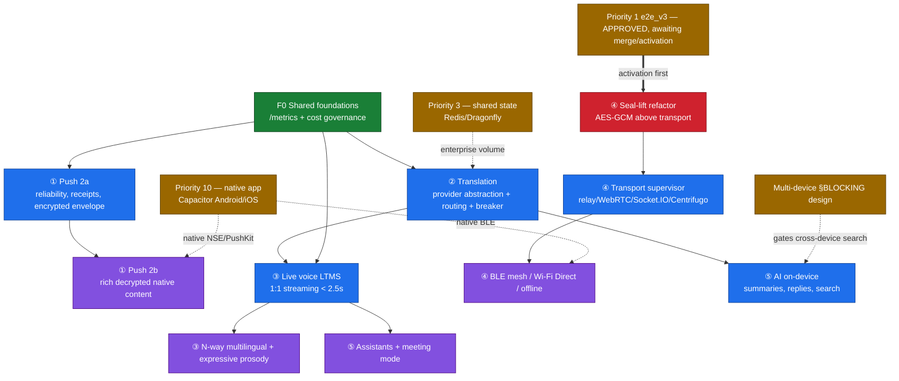

# Priority 2 — Implementation Order, Dependency Graph & Backlog

**Planning only. Priority 1 frozen.** This sequences the five workstream designs
into an executable plan. It adds no scope beyond the workstream docs; it orders
what they already specify and names the gates between phases.

## 1. Ordering principles

1. **Honor the Owner-Amendment order** (① push → ② translation → ③ live voice →
   ④ adaptive → ⑤ AI) unless a hard dependency forces otherwise.
2. **Pull shared foundations early** when ≥2 workstreams block on them (observability, cost governance, provider abstraction).
3. **Sequence crypto-adjacent work with/after Priority-1 activation**, never before.
4. **Ship the reliable core of a workstream before its native-app-coupled or
   most-uncertain extensions** (push 2a before 2b; live-voice 1:1 before N-way;
   transport relay/WebRTC before BLE mesh; AI on-device before assistants).

## 2. Dependency graph

Legend: green = shared foundation; blue = workstream MVP; purple = extension;
red = crypto-adjacent (must sequence with/after P1 activation); amber = external
gate (another priority / owner decision).

## 3. Phased backlog

Phases are dependency-ordered, not calendar-bound. Each epic ships behind a
per-feature flag defaulting **OFF**, with the rollback named in its workstream doc.

### Phase F0 — Shared foundations (before anything at scale)
- **F0-1 Observability floor.** Wire `prom-client` → `/metrics`; counters/histograms
  for send/deliver/fail, translation quality/latency/cost, LTMS per-stage latency.
  (Minimal now; full OTel = Priority 9.)
- **F0-2 Cost governance.** Per-provider budget counters + policy hook
  (alert / degrade-to-cheaper / hard-block). Consumed by ②③⑤.
- **F0-3 Dead-dep hygiene.** Remove `@parse/node-apn`, `bullmq`, `ioredis`; keep the
  change additive and reviewed.

### Phase 1 — ① Push notifications (2a, reliability-first)
- **1-1** Notification catalog + Postgres outbox (`FOR UPDATE SKIP LOCKED`, cron shape).
- **1-2** `INotificationTransport` abstraction (FCM, FCM→APNs relay, Web Push).
- **1-3** Per-device X25519 **notification wrapping key** (public half registered;
  isolated keyspace) + sealed envelope; content-less fallback as the floor.
- **1-4** Delivery semantics: at-least-once + client dedup, full-jitter backoff,
  batching, keyed-HMAC collapse pseudonym (fixes the cleartext `tag:roomId` leak).
- **1-5** Server-side quiet-hours / mute / priority evaluation; `PresencePort`
  unifies the socket + HTTP publish notify paths.
- **1-6** Receipts + analytics + `/metrics`; benchmark plan B1–B9.
- **Gate → 2b:** requires the Priority-10 native app (Android `FirebaseMessagingService`,
  iOS Notification Service Extension) — deferred with it.

### Phase 2 — ② Translation platform
- **2-1** `TranslationProvider` interface; register existing legs (OpenAI/Gemini/
  Azure/Sarvam/ElevenLabs/Google) with no behavior change.
- **2-2** Capability matrix + language/script detection pipeline (English-guard →
  script → provider detect).
- **2-3** Routing engine: `score()` formula, weight profiles, circuit breaker,
  enterprise fallback chains, `RoutingDecision` logging (no plaintext).
- **2-4** Confidence/quality scoring (EWMA feedback from adjudicator verdicts);
  cross-provider verification + LLM adjudication behind a worth-it predicate.
- **2-5** Cache: session-scoped by default; **server cache tier is owner-gated (C1)**.
- **2-6** Observability + benchmark harness (COMET/BLEU/chrF + faithfulness eval +
  shadow/replay/canary).

### Phase 3 — ③ Live voice translation (flagship)
- **3-1** LTMS service skeleton + WebRTC↔LTMS media transport (reuse Cloudflare TURN).
- **3-2** Streaming adapter interfaces (STT / MT / TTS) + mid-utterance failover.
- **3-3** Pipelined path (partial-hypothesis MT, TTS input-streaming, foldable LLM
  correction) to hit the <2.5 s p50 budget; 5-tier "never-silence" degradation ladder.
- **3-4** Voice/emotion/prosody preservation (Tier 0–2, adaptive TTS model select).
- **3-5** 1:1 first; **N-way multilingual is the extension (owner scope decision C-1)**.
- **3-6** Metrics-only session tables (no audio/transcript persisted); 4-axis benchmark.

### Phase 4 — ④ Adaptive communication network
- **4-1 (crypto-adjacent, gated on P1 activation)** Seal-lift: AES-GCM seal/open
  above the transport; e2e-version negotiation + visible v2 fallback; full ADR-002
  test battery; the six encryption invariants (INV-1…6) as tests.
- **4-2** Transport supervisor over `transport/room.js`: adapter registry, scoring
  formula with hysteresis, make-before-break migration; `localStorage` override → test-only.
- **4-3** Universal `SealedEnvelope.envelopeId` dedup + 3-tier `OrderingToken`
  (server-seq → ratchet position → sender-clock) for exactly-once across transports.
- **4-4** Offline: durable outbox + per-recipient opaque server mailbox
  (retention/caps/anti-spam — owner policy).
- **4-5 (extension, native + own ADR)** BLE mesh (seen-set + TTL + hopcount) /
  Wi-Fi Direct — **Priority-10 native; iOS constrained; needs a mesh trust ADR**.

### Phase 5 — ⑤ AI communication platform
- **5-1** Extend ②'s provider abstraction (`chat`/`complete`/`embed`/`summarize` +
  on-device model kind); type `search` as **on-device-only** (server search = compile error).
- **5-2** On-device summaries / smart replies (Tier 0, zero egress).
- **5-3** Client-side **encrypted** conversation index (lexical + small on-device
  embeddings); server sees nothing; joins the wipe path + TTLs.
- **5-4** Local-inference roadmap (WebGPU/WASM; **feasibility UNPROVEN — spike first**).
- **5-5 (extensions, heavily gated)** Assistants (prompt-injection surface),
  meeting mode (downstream ③ + group calls); cross-device search **gated on multi-device**.

## 4. Production-readiness checklist (every workstream passes before ship)

- [ ] **Flag OFF by default**, with the named rollback exercised in staging.
- [ ] **E2EE invariant statement**: what content crosses which trust boundary, and
      the consented exception if any is explicit and owner-ratified.
- [ ] **No new server-side plaintext memory of message content** unless owner-approved.
- [ ] **`/metrics` wired** for the feature's core counters (F0-1) — no blind rollout.
- [ ] **Cost caps** attached for any metered provider path (F0-2).
- [ ] **Additive, reversible DB migrations**; rollback documented; no destructive change.
- [ ] **Security review** for any crypto-adjacent change (esp. ④ seal-lift, ① wrapping key).
- [ ] **Tests**: unit + integration + the workstream's named invariants; CI green
      incl. the Priority-1 not-shipped fences where relevant.
- [ ] **Benchmark gate met** (latency/quality/cost targets from the workstream doc).
- [ ] **Client storage** (if any) added to `wipeDevice` and honors disappearing-message TTLs.
- [ ] **Native-app dependencies** (P10) identified and either satisfied or the
      feature scoped to the web-deliverable subset.
- [ ] **Owner decisions** for the workstream (see `91-…`) closed, not assumed.

## 5. Sequencing summary

`F0 → ① (2a) → ② → ③ (1:1) → ④ (after P1 activation: seal-lift → supervisor) → ⑤ (on-device)`
with the extensions (push 2b, live-voice N-way, BLE mesh, AI assistants/meeting)
trailing their MVPs and their external gates (P10 native, multi-device, mesh ADR).
The two cheapest, highest-leverage moves are **F0 (shared foundations)** and **②
(the provider abstraction)** — both unblock multiple downstream workstreams.
